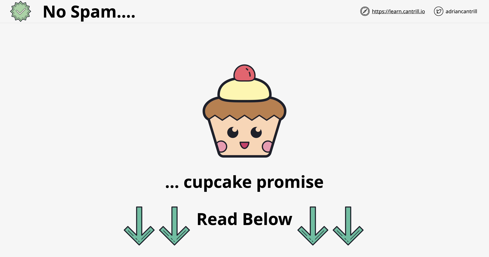
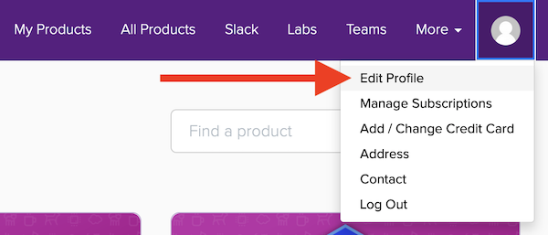
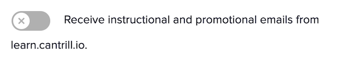
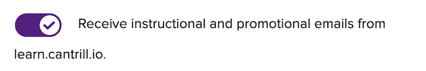

# 🚨 READ ME 🚨 - ENABLE EMAIL UPDATES (IT'S WORTH IT)

## Why Enable Email Updates?

Occasionally, I send out special offers and updates about new content on the [Learn Cantrill.io](https://learn.cantrill.io) platform. These emails are infrequent—usually just a few per month—and your email address will never be shared with other platforms.

To ensure you receive these updates and take advantage of special offers, follow the simple steps below. It only takes 30 seconds and is definitely worth it!

## How to Enable Email Updates

### Step 1

Click the user icon at the top right of the page and select **"Edit profile."**

### Step 2

Look for the option to enable email updates.

### Step 3

Make sure the email updates option is **enabled**.

By enabling these updates, you'll stay informed about the latest offers and developments on the platform!

