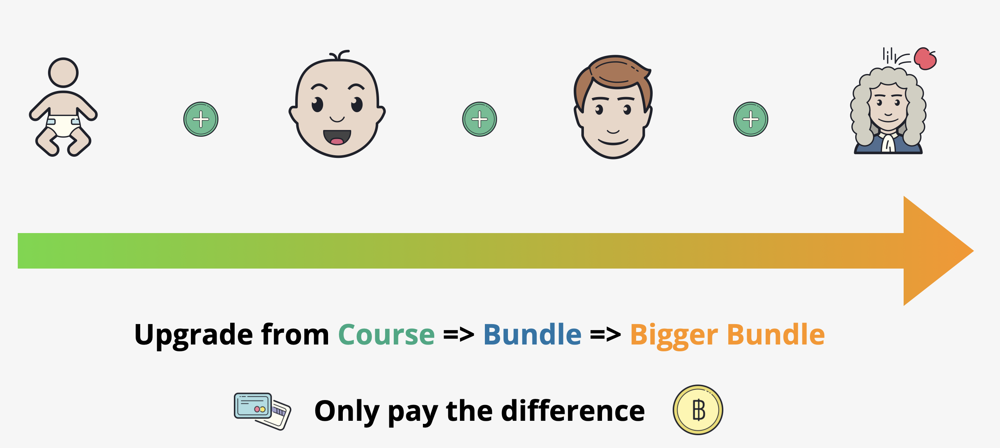

# Course Upgrades: Save Money by Expanding Your Course Collection

## Expand Your Course Library and Save

If you're considering adding more courses to your collection, you can often save money by upgrading to a larger bundle instead of purchasing each course individually. Here’s a detailed guide on how this works:

## Upgrade Process

### How It Works

Instead of buying courses separately, you can upgrade to a bundle that includes the courses you already own and those you want to add. You only pay the difference in price, which can be significantly cheaper. Note:

- **You can’t upgrade to a bundle that doesn’t include any of your current courses.**
- **Custom bundles are not available.**

### Examples of Upgrades

#### Example 1: Alice's "Pro" Upgrade

- **Current Status**: Alice completed the Solutions Architect Associate course for $40.
- **Next Goal**: She wants to advance to the Solutions Architect Professional course, typically priced at $80.
- **Upgrade Option**: Alice can move to the Solutions Architect bundle, which usually costs $100. After accounting for her previous $40 payment, she only pays $60 for the upgrade.

#### Example 2: Bob’s Specialization

- **Current Status**: Bob passed both SA Associate and Pro using the Solutions Architect Bundle ($100).
- **Next Goal**: Add Security ($80) and Networking Specialty ($80) courses.
- **Upgrade Options**:
  - **Security Architect Bundle**: Pay an additional $20 (instead of the usual $80).
  - **Network Architect Bundle**: Pay an additional $70 (instead of the usual $80).
  - **Network Security Architect Bundle**: Pay an additional $90 (instead of the usual $160 for both courses).

#### Example 3: Tim’s Knowledge Expansion

- **Current Status**: Tim completed the SysOps Associate exam.
- **Next Goal**: Add architecture and development tooling knowledge, reducing the cost of new courses ($40 + $40).
- **Upgrade Option**: The Associate Bundle, which typically costs $100, includes the additional courses Tim wants. He pays $60, after accounting for his previous $40 payment.

#### Example 4: Janice’s Long-Term Learning Plans

- **Current Status**: Janice completed all three associate exams using the existing content.
- **Next Goal**: Access all current and future content.
- **Upgrade Option**: The "ALL THE THINGS" bundle usually costs $400. Janice pays $300 by deducting her $100 spent on the associate bundle.

#### Example 5: Jess’s Multi-Platform Aspirations

- **Current Status**: Jess owns the "ALL THE THINGS" bundle ($400) and wants more content.
- **Next Goal**: Upgrade to the "ALL THE THINGS PLUS" bundle, typically priced at $600.
- **Upgrade Option**: Jess pays only $200, as she has already invested in the "ALL THE THINGS" bundle.

## How to Upgrade

1. **Choose a Bundle**: Select a bundle that includes the courses you already own and the ones you want to add.
2. **Request an Upgrade**:
   - Log a ticket [HERE](#) with details of the courses you want.
   - We will respond with an upgrade payment link or further questions if needed.
   - Note: Upgrade links are valid for two weeks. If not used within this period, you will need to request a new link.
3. **Payment Options**:
   - For "ALL THE THINGS" or "ALL THE THINGS PLUS" bundles, you can pay in full or in installments.
   - Installment payments are subject to a minimal admin fee, which increases with the number of months you choose for payment.

By following these steps, you can efficiently expand your course collection while saving money.
