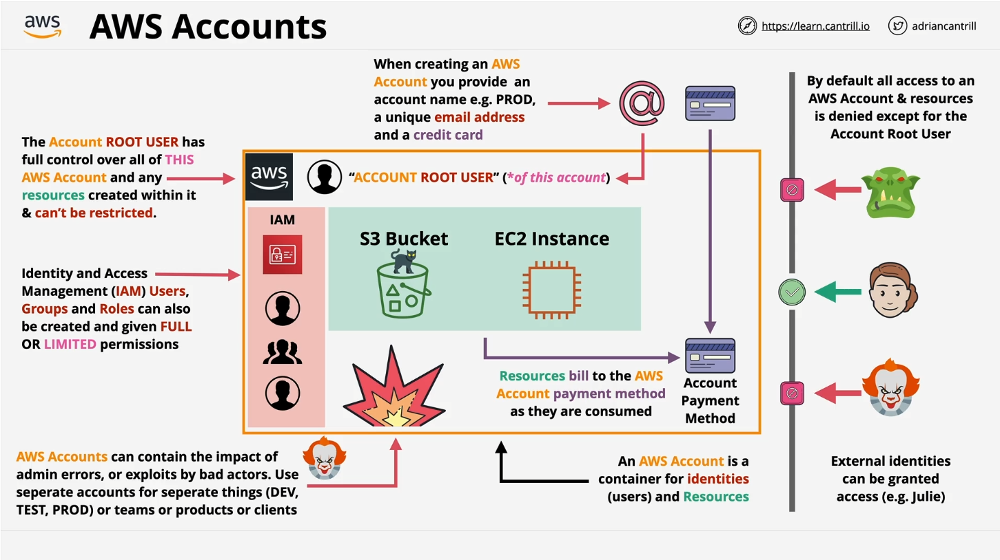

# Introduction to AWS Accounts

Welcome back! In this lesson, we're diving into one of the most fundamental concepts in AWS: **AWS Accounts**. Whether you're a solutions architect, developer, or engineer, understanding AWS accounts deeply is crucial for working with AWS at any scale.

## The Importance of AWS Accounts

Many students, especially beginners, often confuse **AWS accounts** with **users** within those accounts. It’s essential to be 100% clear on the difference.

While simple systems may operate within a single AWS account, larger projects or enterprises often use **tens or even hundreds of AWS accounts**. So, having a thorough understanding of the **features and benefits** provided by AWS accounts is vital for operating at a production scale.

### What is an AWS Account?

Think of an AWS account as a **container** for both identities (like users) and AWS resources (like EC2 instances, S3 buckets, etc.). This container-like concept is crucial as you progress through the course and work with multiple AWS accounts.

For example:

- **Identities**: AWS accounts contain users, who log in and manage the account.
- **Resources**: AWS accounts also contain the infrastructure you build inside the cloud.

## Creating AWS Accounts

When creating an AWS account, you’ll need to:

- **Name the account**: e.g., "prod" for production.
- **Provide a unique email address**: Each AWS account requires a unique email.
- **Add a payment method**: Typically, a credit card. One credit card can be used for multiple AWS accounts, but each account needs a unique email address.

Once you create the AWS account, a **root user** is created using the email provided. This root user has **full control** over the AWS account and cannot be restricted.

> **Important:** Always safeguard the credentials for the root user as it has the power to delete everything within the AWS account.

## AWS Billing

The payment method (credit card) you provide is used to pay for **billable usage** within the AWS account. Most services follow a **pay-as-you-go model**, meaning you pay for what you use, usually by the minute. There are also free tier services that we'll leverage throughout the course to minimize costs.

## AWS Security: Root Users and IAM

### Root User

- **Full Control**: The root user has **unrestricted access** to everything within the AWS account.
- **Be Careful**: If root user credentials are compromised, it could lead to a complete loss of resources.

### IAM (Identity and Access Management)

IAM allows you to create **additional identities** (e.g., users, groups, roles) within your AWS account. Unlike the root user, IAM identities start with **no permissions** by default. Permissions must be explicitly granted, which adds an extra layer of security.

### Cross-Account Permissions

While IAM identities generally operate within the account they’re created, **cross-account permissions** can allow access to resources across AWS accounts. We’ll cover this in more detail later in the course.

## AWS Account Boundaries

Consider the boundaries of an AWS account as a **security wall**:

- **Keeps things inside**: Any damage (e.g., accidental deletion) is generally contained within that specific AWS account.
- **Keeps things outside**: By default, no external identity can access the account unless explicitly allowed.

> Creating separate accounts for **development, test, and production** environments helps limit potential damage and maintain security across your AWS infrastructure.

## Why Use Separate Accounts?

- **Isolate potential damage**: Mistakes or security breaches are contained within specific accounts.
- **Better management**: Separate accounts for different teams or products enable better resource and security management.

## Recommendations for the Course

For this course, **create brand new AWS accounts**. Don’t reuse existing ones, as they might be misconfigured from previous use. Starting fresh will help you learn AWS the right way, using best practices.

## Next Steps

In the next lesson, you’ll create the AWS accounts needed for the course. I’ll even show you a **trick to create multiple accounts using a single email address**.

---

Now that you understand the significance of AWS accounts, you’re ready to create your own and continue learning how to manage them effectively.

> Let’s jump into the next lesson and get started with creating the AWS accounts you'll use throughout this course!
