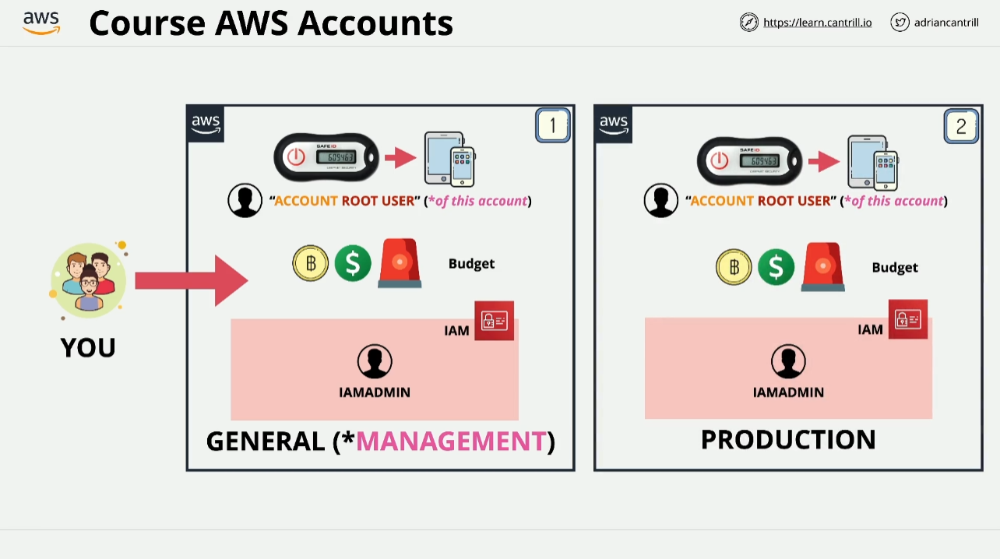

# Creating Your AWS Account (Step-by-Step)

Welcome to the demo lesson on setting up your AWS account! We'll walk through the process of creating and securing your **General AWS Account**. This is an essential foundation for the course as you'll use this account for most of your activities and later link it with other accounts in multi-account management.

### Why Multiple Accounts?

In this course, you'll create and work with more than one AWS account. This is standard in real-world scenarios for better security, isolation, and organization. The first account you'll create is the **General AWS Account** (later referred to as the **Management Account**). Once you create this account, you'll configure it with best practices such as enabling MFA, setting up budgets, and creating IAM users.

## Step 1: Overview of the General AWS Account Setup

- **Root User Creation**: Automatically created with the AWS account and has full control over the account.
- **Security Setup (MFA)**: Add Multi-Factor Authentication (MFA) for extra security to protect the root user account from unauthorized access.
- **Budget Setup**: Set up a budget to monitor potential charges. This helps prevent unexpected costs, especially when working outside the free tier.

## Step 2: AWS Account Creation

1. **Email Address Setup**:
   - Use a unique email address for your account. If you’re using Gmail, create dynamic aliases by adding a `+` after your username to create multiple email addresses from a single account (e.g., `yourname+aws1@gmail.com`).
2. **Choose a Unique Account Name**:
   - Select a name that helps you identify the account, such as `YourInitials-Training-AWS-General`.
3. **Set a Strong Password**:
   - Use a password manager to create a strong password for the root user.
4. **Personal Information**:
   - Enter your details, including your name and address.
5. **Billing Information**:
   - Add your credit/debit card for verification purposes. While you'll use the free tier, this step is necessary for account setup. Pending charges may appear temporarily but will disappear once verification is complete.
6. **Identity Verification**:
   - Choose either SMS or voice call to verify your identity. Enter the code you receive to complete this step.
7. **Support Plan Selection**:
   - Select the **Basic Support Plan** (free option) unless you require additional support features.

## Step 3: Activating the Account

- **Account Activation**: AWS may take a few minutes to activate your account. Once complete, you’ll receive an email confirmation, after which you can log in using the root user credentials.

## Step 4: Additional Configuration

Once you’re logged in, configure your account further by performing these steps:

1. **IAM Access to Billing Information**:
   - Navigate to the **Account Settings** page, scroll down to **IAM User and Role Access to Billing Information**, and activate IAM access. This is essential so that IAM users with appropriate permissions can manage billing tasks.
2. **Alternate Contacts**:
   - Optionally, set up billing, operations, and security contacts in your account settings. This is useful for distinguishing roles in a real-world business setting.

## Step 5: Securing Your Root User

- **Multi-Factor Authentication (MFA)**: Secure the root user by enabling MFA. Use an app like Google Authenticator or a hardware security key to set up MFA. This ensures that even if your password is compromised, your account remains protected by an additional layer of security.

## Step 6: Creating IAM Users

To avoid using the root user for daily tasks, create an **IAM Admin User** with full administrative access:

- Go to the **IAM Console**.
- Create a user named `IAM Admin` and assign administrative permissions.
- Set up MFA for this IAM user as well for added security.

You'll now use this IAM Admin user for all subsequent work instead of the root user.

## Step 7: Region Selection

- **Choose the Right Region**: Ensure you’re operating in the **US East (N. Virginia) Region** (US East 1). This will be the default region for the course. AWS services and configurations often vary by region, so keeping consistency is essential.

## Next Steps: Preparing for Multi-Account Management

Once you’ve created and secured your **General AWS Account**, you'll repeat this process to create a **Production AWS Account**. Later in the course, you’ll link these accounts together using **AWS Organizations**. This sets the stage for learning about multi-account management, which is vital for real-world AWS usage.

# Key Takeaways

- **Root User Security**: Avoid using the root user after initial setup. Use IAM Admin users for day-to-day tasks.
- **MFA**: Always secure your accounts with MFA to prevent unauthorized access.
- **Budgeting**: Keep track of costs by setting up budgets and monitoring usage regularly.
- **Multi-Account Structure**: Create multiple accounts for different environments (e.g., General, Production) for better management and isolation.

Now that your General AWS account is set up and configured, you’re ready to move on to the next part of the course!
