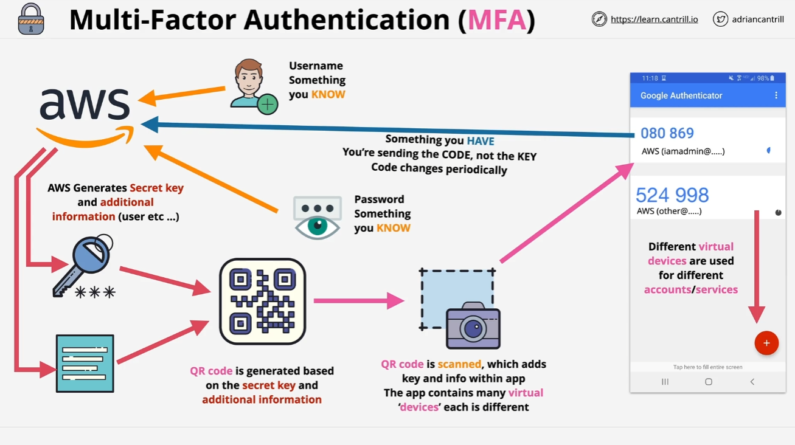

# Lesson: Introduction to Multi-Factor Authentication (MFA)

In this fundamental lesson, we’ll cover an essential security topic you’ll encounter throughout this course and in the real world: **Multi-Factor Authentication (MFA)**. This lesson explains why MFA is important, how it works, and how it’s implemented within AWS.

## Why MFA is Needed?

Consider how you typically log in to any web application—usually with a **username and password**. But what happens if those credentials are compromised? If both are leaked, anyone can impersonate you and gain unauthorized access to your accounts. MFA helps mitigate this risk by adding additional layers of security beyond just a username and password.

## What is a Factor?

A **factor** is a piece of evidence used to prove your identity. There are different types of factors, and depending on how many are used in the authentication process, it can be classified as either:

- **Single-factor authentication**: Uses only one type of factor (e.g., username and password).
- **Multi-factor authentication (MFA)**: Uses multiple factors, making it significantly harder for an unauthorized party to impersonate you.

## Types of Authentication Factors

There are four common types of authentication factors used in security:

1. **Knowledge (Something You Know)**:

   - Examples: **Usernames**, **passwords**, **PINs**, or **security questions**.

2. **Possession (Something You Have)**:

   - Examples: A **bank card**, **MFA device** (e.g., key fob), or a **smartphone app** like Google Authenticator.

3. **Inherence (Something You Are)**:

   - Examples: **Biometrics** such as **fingerprints**, **facial recognition**, **voice recognition**, or **iris scans**.

4. **Location (Somewhere You Are)**:
   - Authentication based on location, such as being in a specific **geographic area** or connected to a particular **network** (e.g., corporate or home network).

## Why MFA Enhances Security

MFA improves security by requiring a combination of multiple factors. For example:

- When using an **ATM**, you need both **something you have** (your bank card) and **something you know** (your PIN). This combination makes it much harder for someone to impersonate you compared to using only a password.

In general, the more factors involved, the more secure the process. However, this added security often comes at the cost of convenience, so a balance must be maintained between security and usability.

## How MFA Works in AWS

### Default Single-Factor Authentication

By default, AWS uses **single-factor authentication**: you log in with a **username and password**, both of which are things you know. However, if these credentials are compromised, the system is vulnerable.

### Adding MFA for Enhanced Security

MFA adds an additional layer by requiring **something you have**, such as a **physical MFA device** or a **virtual MFA app** (e.g., Google Authenticator). Here’s how it works:

1. **Activate MFA**:

   - For a specific AWS identity (e.g., root user or IAM user), you activate MFA. AWS generates a **secret key** associated with your identity.

2. **Configure the MFA Device**:

   - AWS provides a **QR code** containing the secret key and other necessary details. You scan this code using an MFA app, which stores a **virtual MFA** for your AWS account.

3. **Time-Based Code Generation**:

   - The MFA app generates a **time-based code** that refreshes periodically (e.g., every 30 seconds). These codes are unique and temporary.

4. **Using MFA for Login**:
   - When logging into AWS, you’ll provide your **username** and **password**, along with the **current MFA code** from your app. This requires both **something you know** (username and password) and **something you have** (the MFA code).

### What Happens if You Lose Your MFA Device?

If you lose your MFA device, don’t worry—AWS has account recovery procedures in place. However, you should safeguard your MFA device and store recovery codes securely. Without both the username/password and the MFA code, unauthorized access to your account is significantly more difficult.

## Why MFA is Essential for AWS and Beyond

MFA drastically reduces the risk of unauthorized access to your AWS accounts, even if your password is compromised. Furthermore, many MFA apps themselves are protected by additional security measures (e.g., PIN codes or biometric verification), adding even more layers of protection.

## Key Takeaways

- **MFA** combines multiple factors to verify identity, enhancing security.
- AWS supports both **physical MFA devices** and **virtual MFA apps** (e.g., Google Authenticator).
- Configuring MFA protects your AWS identity by requiring both **something you know** and **something you have**.
- You'll be using MFA frequently throughout this course and in real-world AWS environments.

MFA is not just a best practice—it’s essential for safeguarding your cloud infrastructure. Proceed to the next lesson when you’re ready!
