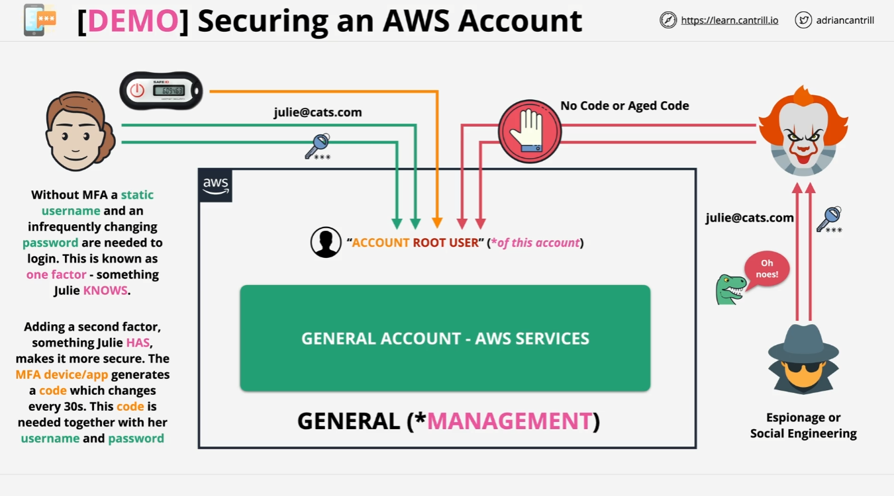

# Securing an AWS Account with a Virtual MFA Device

In this lesson, you'll learn how to add an extra layer of security to an AWS account by attaching a virtual MFA device to the account root user. This process enhances security by requiring a second factor in addition to the password.

## Overview

We’ll be working on the general AWS account with the account root user. For this example, let's assume the account already has some resources, though for now, our accounts are clean.

### Why Add MFA?

Currently, logging into the general AWS account requires only a username and password. This method, known as **single-factor authentication**, uses only one type of secret (the password).

The problem is, if the account root user credentials are leaked (e.g., through espionage or social engineering), an attacker could easily gain access to the account and potentially delete resources or incur costs by creating new ones.

To prevent this, we'll implement **multi-factor authentication (MFA)**, which requires a second factor beyond the password. This additional factor could be a physical or virtual MFA device.

## Configuring MFA for the Account Root User

### Steps to Configure MFA

1. **Log in to AWS Console**:

   - Go to the AWS Management Console and log in as the account root user.

2. **Access Security Credentials**:

   - Click on the dropdown menu and select **Security Credentials**.
   - You will be redirected to a different section of the console for configuring security credentials. This section is under **Identity and Access Management (IAM)**.

3. **Assign MFA Device**:

   - Scroll down to the **Multi-Factor Authentication (MFA)** section and click on **Assign MFA Device**.

4. **Choose MFA Device Type**:

   - Enter a name for the MFA device. Choose a name that makes sense to you.
   - Select **Authenticator App** as the MFA device type and click **Next**.

5. **Set Up Virtual MFA**:

   - Click on **Show QR Code**.
   - Open your virtual MFA application (e.g., Google Authenticator, 1Password, or any other compatible app) on your mobile phone or desktop.
   - Scan the QR code with your MFA application. This will create an entry for the AWS account root user.

6. **Complete MFA Setup**:

   - The MFA application will generate a code that changes every 30 seconds. Enter two consecutive codes from your MFA application into the provided fields.
   - Click **Next**.

7. **Verify MFA Setup**:

   - Once successful, you should see a confirmation message stating that the virtual MFA has been successfully assigned.

8. **Test MFA**:
   - To ensure everything is working correctly, sign out of the console.
   - Attempt to log in again using the account root user email address and password.
   - You will be prompted to enter the MFA code from your application. Enter the current code and log in.

### Post-Setup Considerations

- **Multiple Entries**: For future AWS accounts, you'll need to set up additional MFA entries in your application. By the end of this course, you should have four MFA entries:

  - One for the account root user of the general AWS account.
  - One for the account root user of the production AWS account.
  - One for the IAM admin user of the general AWS account.
  - One for the IAM admin user of the production AWS account.

- **Additional Security**: While virtual MFA is adequate for training accounts, consider using a hardware MFA token for production environments for added security.

## Conclusion

You’ve now secured the AWS account root user with a virtual MFA device, enhancing its protection. Ensure you repeat this process for other AWS accounts and users as you proceed through the course.

Complete this lesson and proceed to the next. I look forward to seeing you there!
