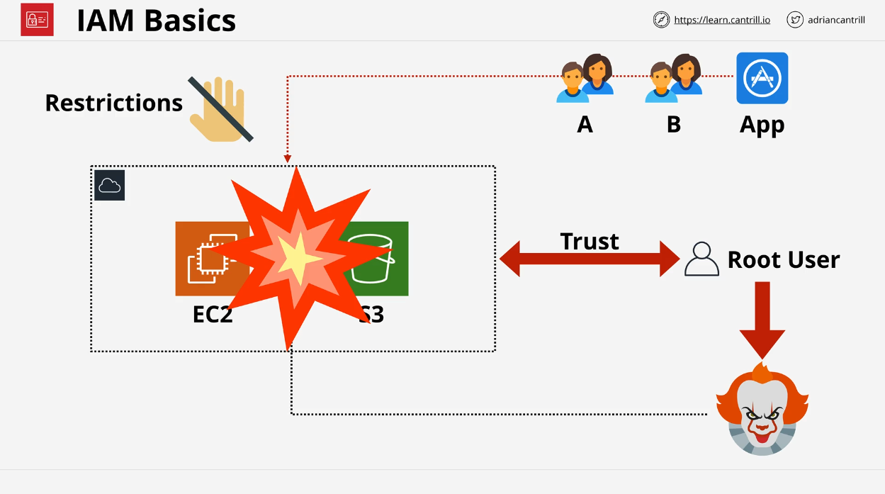
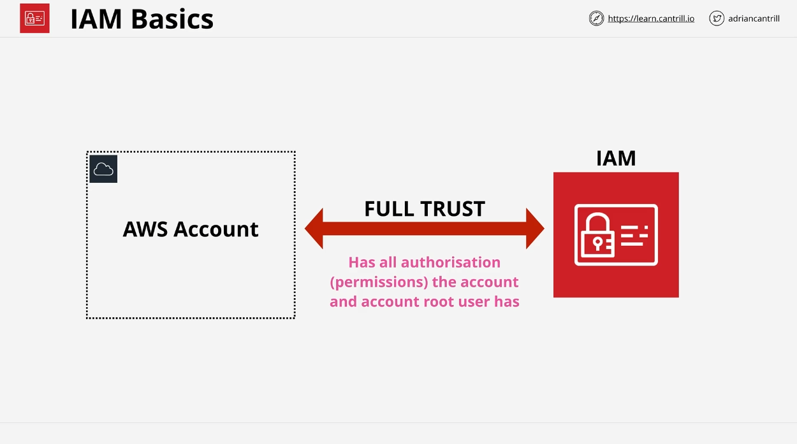
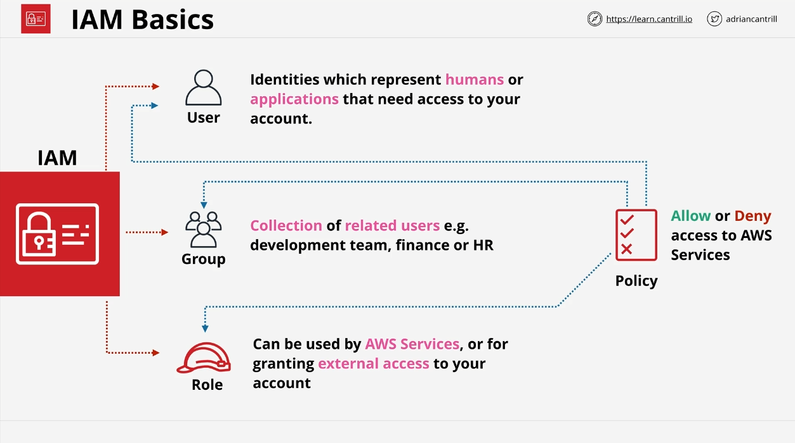

# Introduction to AWS Identity and Access Management (IAM)

Welcome back! In this lesson, we’ll introduce a critical AWS service—**Identity and Access Management** (IAM). While we’ll dive deeper into IAM later in the course, today’s goal is to give you a basic understanding of what IAM does and why it’s essential.

## Why IAM?

To understand IAM, let’s first look at the current state of your AWS accounts.

### Root User Privileges

- Each AWS account you’ve created so far has an **account root user**.
- The root user has **full, unrestricted access** to everything in your AWS account.
- In real-world scenarios, you often need to give other users, teams, or applications access to your AWS account, but with **restricted permissions**—allowing them to perform only the tasks necessary for their role. This is known as **least privileged access**.

### The Problem with Root User

- **Single Point of Failure**: If the credentials of the root user are compromised, an attacker can access all regions and all services in your account.
- **No Restriction**: The root user cannot be restricted in any way, making it a high-risk account to rely on for day-to-day tasks.

## What is IAM?

**IAM** is a service that helps control **who** can access your AWS account and **what** they are allowed to do. It enables you to create multiple identities and assign permissions to them, allowing granular control over your AWS account.

- **IAM** is globally resilient and secure across all AWS regions.
- Each AWS account has its own **dedicated instance of IAM**, independent of other AWS accounts.

### IAM Concepts

- **IAM Users**: Represent individuals or applications that need access to your AWS account. For example, a user like "Bob from Accounting" or an application that performs backups might need an IAM user.
- **IAM Groups**: Collections of users with similar permissions. For instance, you could create a "Development Team" group and add all the developers' IAM users to it.
- **IAM Roles**: Often used when the number of users or entities needing access is uncertain. Roles are useful for granting temporary access or allowing AWS services (like EC2 instances) to access other services on your behalf.

### Policies

- **IAM Policies**: These are documents that define which actions are allowed or denied for IAM users, groups, or roles. Policies only take effect when attached to these identities.
- **Policy Use**: IAM policies are the primary mechanism to enforce permissions in AWS, following the principle of least privilege.

### Key Features of IAM

1. **Identity Provider (IDP)**: IAM is an identity provider that lets you create and manage user identities. It also authenticates users and roles when they attempt to access AWS resources.
2. **Authentication**: Users prove their identity using credentials, such as a username and password.
3. **Authorization**: After authenticating, IAM checks if the user is authorized to perform specific actions based on the policies attached to their identity.
4. **Federation and Multi-Factor Authentication (MFA)**: IAM also supports federating external identities (like Google or Active Directory) and adding additional security layers through MFA.

### Important Points to Remember

- **Free Service**: IAM is free of charge, though there are limits on how many users, groups, and roles you can create.
- **Global Service**: IAM operates globally and is resilient across AWS regions.
- **Local Control**: IAM controls only what happens within your account. It doesn’t govern external users from other AWS accounts unless explicitly configured.

## Demo Overview: Setting Up an IAM Admin User

### Why Create an IAM Admin User?

Now that you understand the basics, it’s time for a hands-on demo where we’ll create an **IAM admin user**. This admin user will have full permissions on the account, similar to the root user, but managed through IAM. We’ll do this because:

1. **Best Practice**: The root user should be used only for initial account setup and not for daily tasks.
2. **Secure Access**: By creating an IAM admin user, you can stop relying on the root user and minimize security risks.

### Steps:

- We will create an IAM admin user in each of your AWS accounts.
- This admin user will have full access, allowing you to manage other identities and tasks.
- Throughout the course, you will use this IAM admin user to create other identities with **restricted permissions** based on the principle of least privilege.

Once you’ve completed this video, we’ll jump into the demo, where I’ll walk you through setting up the IAM admin user in your AWS accounts.

---

### Coming Up Next

In the next lesson, we’ll demonstrate how to create and configure your IAM admin user. Join me when you’re ready, and we’ll continue securing your AWS accounts for the course!
