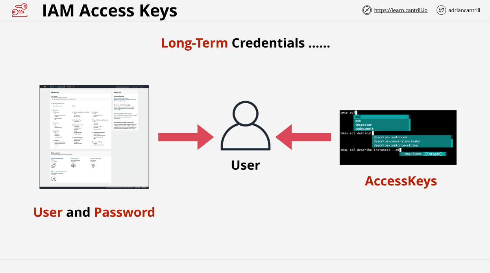
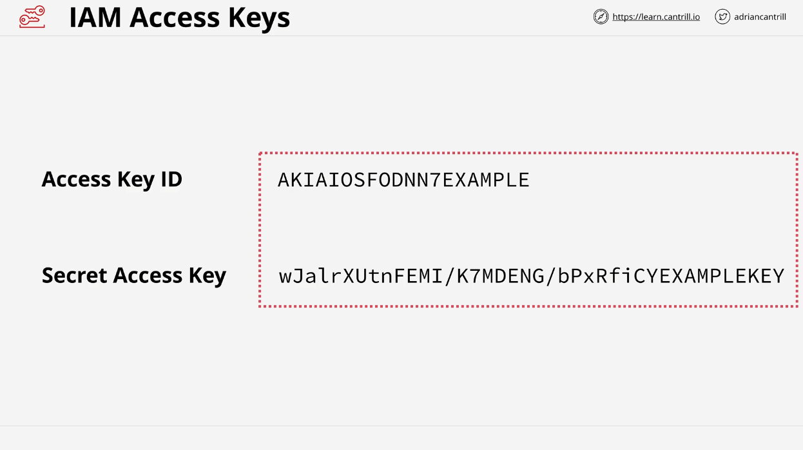

# AWS Security and Access Management: Understanding Access Keys

In this section of the course, we'll be diving into AWS Access Keys. By now, you’ve already set up your AWS accounts, configured security settings, enabled billing alarms, set up Identity and Access Management (IAM), created an IAM admin user, and secured the account with multi-factor authentication (MFA). So far, you’ve interacted with AWS using the Console UI in a web browser. Now, let’s explore how to access AWS using the command line interface (CLI) through Access Keys.

## Introduction to AWS Access Keys

Access Keys are long-term credentials used for accessing AWS via CLI or APIs instead of the console UI. Unlike passwords and MFA which are used for console access, Access Keys allow you to authenticate programmatically.

### Key Points:

- **Access Keys** consist of two parts: an **Access Key ID** (public part) and a **Secret Access Key** (private part).
- These credentials are associated with IAM users.
- **Access Keys** are long-term credentials but are **not auto-rotated**. Users need to manage their lifecycle.
- **IAM Users** can have **two sets of Access Keys** at any given time (0, 1, or 2). This is useful for rotating keys without disrupting service.

## Key Differences Between Access Keys and Passwords

Access Keys and passwords share similarities but have distinct differences:

- **Username/Password**: Used for console UI access. An IAM user can only have one password at a time.
- **Access Keys**: Used for CLI or API access. An IAM user can have up to two active Access Keys.

The critical difference is that **Access Keys** consist of an Access Key ID and a Secret Access Key. Once generated, AWS allows the user to view and download both parts only once. After that, only the **Access Key ID** remains visible.

## Managing Access Keys

Managing Access Keys involves various actions:

- **Creation**: When created, Access Keys are **active** by default.
- **Deletion**: If compromised or no longer needed, they should be deleted. This removes both the Access Key ID and Secret Access Key.
- **Rotating Keys**: To rotate keys, you create a second Access Key, update your applications or CLI with the new key, and delete the old key.
- **Security**: Protect the Secret Access Key, as its exposure is equivalent to exposing your password. If you suspect a leak, the only option is to delete and recreate the key.

### Important Considerations:

- If the Secret Access Key is lost, you **cannot retrieve it** again. You must delete the existing key and create a new one.
- Inactive keys prevent command-line tools or applications from working until they are reactivated or new keys are configured.

## Working with Access Keys in Different AWS Accounts

In this lesson, you’ll practice creating Access Keys in both a general AWS account and a production AWS account. After creating them, you’ll configure the AWS CLI to use these keys for connecting to your accounts programmatically.

### Demo Overview:

1. **Create Access Keys**: In both your general and production AWS accounts.
2. **Download and Configure AWS CLI**: Use the keys created to configure the CLI.
3. **Test Connections**: Ensure the CLI is properly configured to access both accounts.

Once you have completed these steps, you’ll be ready to securely manage your AWS environment via the command line.

## Conclusion

Access Keys are essential when managing AWS programmatically, providing an alternative to the web console with flexibility for automation and scripting. They require careful management to ensure security. In the next lesson, you’ll delve deeper into configuring AWS CLI and performing tasks programmatically.

Now that you've got the theory down, it’s time to experiment with creating and managing Access Keys. Once you’re ready, proceed to the next lesson for the hands-on demo.
