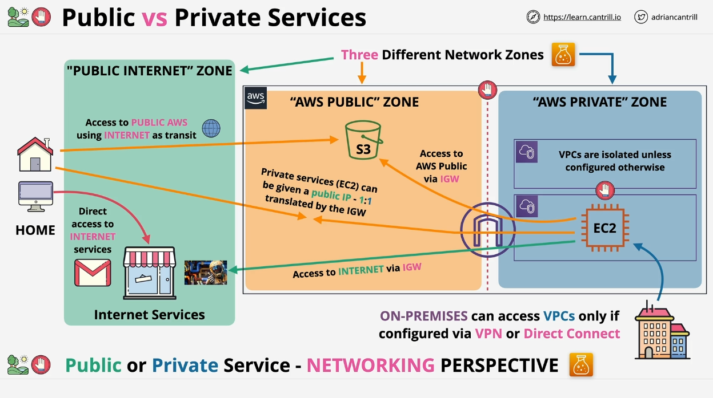

# Understanding AWS Public and Private Services Architecture

This lesson covers the architecture of **public AWS services** and **private AWS services**, which is foundational for understanding how AWS operates from both a **networking** and **security** perspective. The distinctions might seem subtle, but understanding these concepts is crucial as they form the basis for more complex AWS services and architectures.

## AWS Services: Public vs. Private

AWS services are categorized into two types:

1. **Public Services**: Accessed via **public endpoints** and available over the **internet** (e.g., **S3**).
2. **Private Services**: Run within a **Virtual Private Cloud (VPC)**, which means they can only be accessed by resources within that VPC or those connected to it.

> **Important Note**: The terms "public" and "private" refer to the networking layer, not the permissions or access control. For example, while S3 is a public service, access is restricted by default unless proper permissions are granted.

## Key Concepts: Permissions vs. Networking

When discussing **access to services**, it is important to separate **permissions** from **networking**:

- **Permissions**: Control who is allowed to access a resource.
- **Networking**: Determines how a service can be accessed.

Even though **S3** is considered a public service, by default, only the **root user** has access unless permissions are explicitly set for other users or services.

## Network Zones in AWS

To understand AWS architecture, it’s important to recognize the different **network zones** that exist in any **cloud environment**:

### 1. **The Public Internet**

- This zone includes services such as online stores, Gmail, and games, where communication is done over the public internet via an Internet Service Provider (ISP).

### 2. **The Private Network**

- A private network, such as your home Wi-Fi network, is only accessible by those connected directly to it or those who have its access credentials.

### 3. **AWS Private Zone (VPC)**

- **Virtual Private Clouds (VPCs)** in AWS are isolated network environments where resources such as **EC2 instances** reside.
- These networks are completely private and cannot communicate with each other unless explicitly configured (e.g., via **VPC peering**).
- Internet access is restricted unless you configure it (e.g., attaching an **internet gateway**).

### 4. **AWS Public Zone**

- This is the **third zone** that sits between the public internet and AWS VPCs.
- Services in the **AWS Public Zone** (like **S3**) can be accessed via public endpoints, but they operate within this separate network zone, **not directly on the public internet**.

This distinction may seem trivial, but it’s critical when dealing with advanced AWS networking concepts. For example, when you access AWS public services, your data travels through the public internet to the **AWS Public Zone**, where the service resides.

## Interaction Between the Zones

1. **Accessing Public AWS Services**:
   - If you're connecting to a **public AWS service** from anywhere with internet access, your data moves through the **public internet** and then into the **AWS Public Zone**.
2. **Connecting Private Resources to Public Internet**:
   - You can attach an **Internet Gateway** to a VPC, enabling private resources like **EC2 instances** to access the public internet.
   - This also allows these instances to access public AWS services (like S3) through the **AWS Public Zone**, ensuring the communication remains internal to AWS's infrastructure and never touches the public internet.

### Example: EC2 Instance with Public IP

If you assign a **public IP address** to an EC2 instance, the architecture projects the instance into the **public zone** so that it can be accessed via the public internet.

## Summary

There are **three critical network zones** to understand in AWS:

1. **Public Internet**: Where internet services operate and users connect via ISPs.
2. **AWS Public Zone**: Where public AWS services (like S3) run, accessible via public endpoints but within AWS's own network.
3. **AWS Private Zone**: Where VPCs run, isolated from both the public internet and other VPCs, unless configured otherwise.

Understanding the interaction between these zones is essential for mastering AWS networking and security architectures, especially when dealing with more advanced features in future lessons.

---

Continue with the course to deepen your knowledge of how to configure and use these zones in real-world scenarios and for certification exams.
