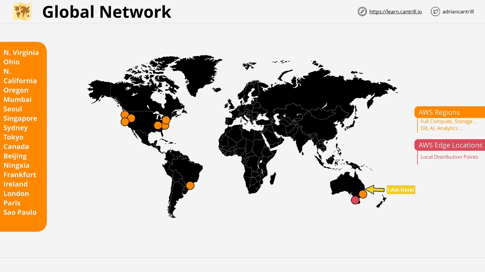
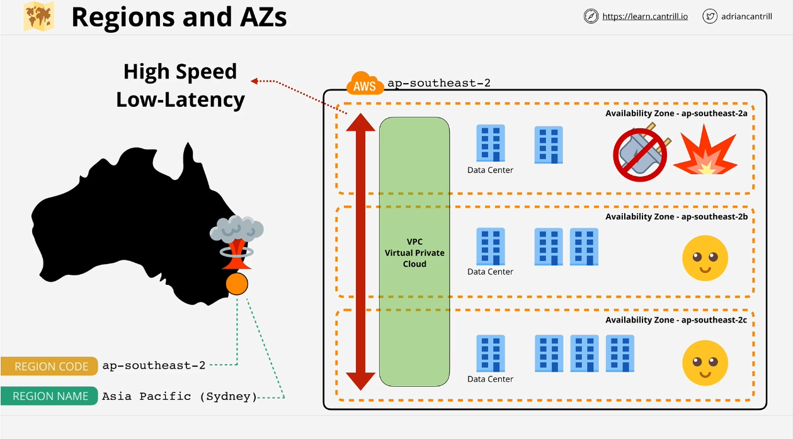
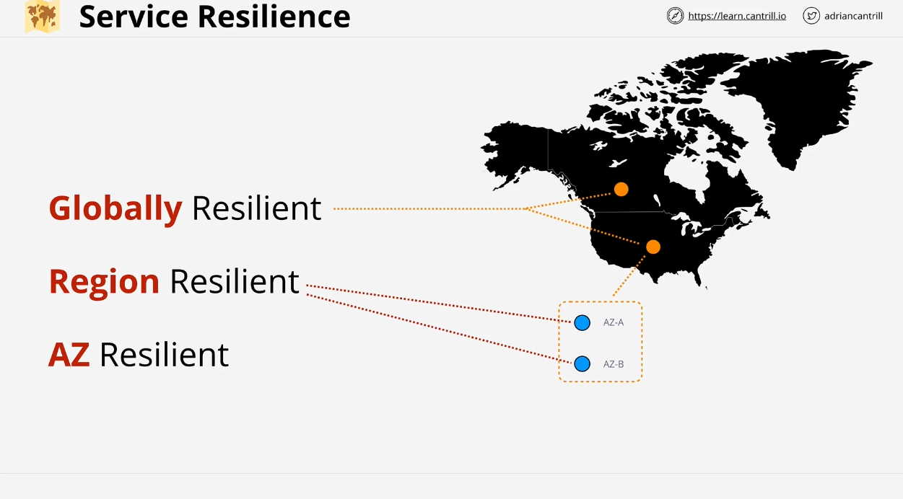

# AWS Global Infrastructure: Regions, Edge Locations, and Availability Zones

In this lesson, we'll explore how AWS has designed its global infrastructure and how we, as Solutions Architects, can leverage this design for **resiliency** and **high availability**. Specifically, we will cover the concepts of **AWS regions**, **edge locations**, **availability zones**, and the varying levels of service resilience.

## AWS Global Infrastructure Overview

Though AWS operates globally, its infrastructure is a collection of smaller, interconnected groups of infrastructure that span the globe. AWS provides a **global high-speed network** that links regions and edge locations to offer various levels of **resiliency** and **availability**.

### Key Global Infrastructure Concepts:

- **AWS Regions**
- **AWS Edge Locations**
- **AWS Availability Zones**
- **Resiliency Levels**: Global, Regional, and Zone Resilience

By the end of this lesson, you’ll understand how each of these components works together to provide a resilient and scalable architecture.

---

## AWS Regions

### What is a Region?

An **AWS region** is a defined geographic area that contains a full deployment of AWS services, including **compute**, **storage**, **database**, **AI**, **analytics**, and more. Each region operates independently and is fully isolated from other regions. AWS continues to add new regions regularly.

#### Examples of AWS Regions:

- **Northern Virginia (US-East-1)**
- **Sydney (AP-Southeast-2)**
- **Frankfurt (EU-Central-1)**

AWS regions are distributed globally, allowing architects to design systems that can withstand failures at a **global level**. When interacting with AWS services, you're often working within a specific region, such as **EC2** in **Northern Virginia**, which is distinct from **EC2** in **Sydney**.

### Benefits of AWS Regions

1. **Geographic Isolation**:

   - Each region is separate from others. For example, a disaster in **Sydney** won’t affect **Northern Virginia**.
   - This isolation provides **fault tolerance** and **stability**.

2. **Geopolitical Separation**:

   - Regions are subject to the laws and governance of their physical location. Selecting a region provides certainty regarding data privacy and regulatory compliance.

3. **Location Control**:
   - Placing infrastructure close to your customers minimizes latency and can enhance performance. Services can even be duplicated in multiple regions for higher availability.

Regions are designed to be **100% isolated**, which helps AWS ensure fault tolerance and high availability.

---

## AWS Edge Locations

### What is an Edge Location?

**Edge locations** are smaller than regions and primarily serve **content distribution** services (e.g., **CloudFront**) and **edge computing**. These locations are geographically closer to end users, reducing latency and improving the speed of content delivery.

#### Use Case: Netflix

A service like Netflix may store its video content in multiple edge locations to stream shows like “The Man in the High Castle” closer to its customers, providing a faster and smoother viewing experience.

---

## AWS Availability Zones (AZ)

### What is an Availability Zone?

An **availability zone (AZ)** is an isolated location within an AWS region. Each region typically has two or more availability zones (e.g., **ap-southeast-2a**, **ap-southeast-2b**, and **ap-southeast-2c** in the Sydney region). These zones are isolated from one another, with independent power, networking, and facilities.

### Availability Zones and Resiliency

Availability zones allow you to design systems that are **resilient to localized failures**. For example, you can distribute resources like **EC2 instances** across multiple availability zones. If one AZ experiences an issue (e.g., a power outage), the other AZs in the region can continue to operate without disruption.

#### Example:

If you deploy six virtual servers in Sydney across three AZs, placing two servers in each AZ, a failure in **AZ 2a** will still leave four operational servers across **AZ 2b** and **AZ 2c**.

### Misconception: Availability Zones are Data Centers

While some might think of AZs as individual data centers, they are often composed of **multiple** data centers or parts of data centers, all connected by **high-speed, redundant networking**.

---

## Service Resilience Levels

AWS services can be categorized based on their **resilience level**. Understanding the resilience of AWS services is critical for designing fault-tolerant architectures and for answering exam questions.

### 1. **Globally Resilient Services**

- These services operate across multiple regions, offering resilience at a **global level**. Data is replicated across regions, allowing the service to remain operational even if a region fails.
- **Examples**:
  - **IAM**
  - **Route 53**

### 2. **Regionally Resilient Services**

- Regionally resilient services operate within a single region, with their data replicated across multiple availability zones. If an **AZ** fails, the service remains operational within the region, but a full **region failure** would result in a service outage.
- **Examples**:
  - **RDS** (Relational Database Service)

### 3. **Zone Resilient Services**

- These services are confined to a single **availability zone**. If the AZ fails, the service will go down. Some hardware failures can be tolerated, but generally, AZ-resilient services are more vulnerable to outages.
- **Examples**:
  - Services that aren’t replicated across AZs, such as a specific **EC2 instance** deployed in one AZ.

---

## Summary

By understanding the components of AWS’s global infrastructure—**regions**, **edge locations**, and **availability zones**—you can design systems that are not only **resilient** but also **highly available**. Additionally, knowing whether a service offers **global**, **regional**, or **zone-level** resilience is key to building robust solutions and passing AWS certification exams.

If needed, feel free to review the video again to solidify these concepts before proceeding with the next lesson.
