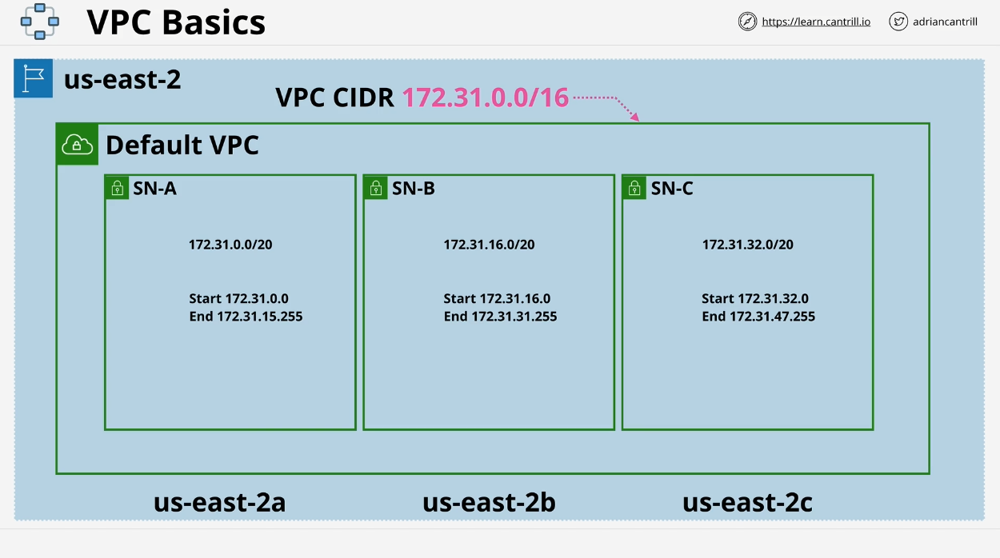

# Introduction to Virtual Private Clouds (VPC) - Learn Cantrill AWS SA C03

In this lesson, we introduce **Virtual Private Clouds (VPC)**, a fundamental AWS service for creating isolated networks inside AWS. Understanding VPCs is essential for both **AWS Certified Solutions Architect (SA)** exam preparation and practical AWS deployments. This overview covers key concepts, the architecture of VPCs, differences between default and custom VPCs, and the importance of VPCs in hybrid and multi-cloud environments.

---

## What is a VPC?

A **Virtual Private Cloud (VPC)** is a **virtual network** inside AWS, offering the ability to create private networks where other AWS services run. Key uses of VPCs include:

- **Private Network**: VPCs create isolated networks for running AWS services privately.
- **Hybrid Cloud**: VPCs connect on-premises networks to AWS in hybrid environments.
- **Multi-Cloud**: VPCs enable interconnections with other cloud platforms for multi-cloud deployments.

VPCs are **region-specific** and operate across multiple availability zones (AZs), providing **regional resilience**. This means that a VPC, once created, is bound to the specific AWS region where it was set up.

---

## Key Features of VPCs

- **Private and Isolated**: VPCs are private by default. Communication between services inside the same VPC is allowed, but external communication (public internet or other VPCs) must be explicitly configured.
- **Regional Service**: VPCs operate within the scope of a single AWS region but span multiple availability zones for resilience.

### VPC Types

There are two types of VPCs in each AWS region:

1. **Default VPC**:

   - Each region has one default VPC.
   - AWS creates it automatically with pre-configured settings.
   - Its **CIDR range** is always `172.31.0.0/16`.
   - It has a fixed structure that cannot be customized, making it less suitable for production workloads.
   - By default, services in the default VPC are assigned public IPv4 addresses, making them publicly accessible unless configured otherwise.

2. **Custom VPC**:
   - Can have multiple custom VPCs in a region.
   - Fully customizable in terms of CIDR ranges, subnets, and connectivity.
   - Used for production-level AWS deployments where fine-tuned networking is required.
   - Custom VPCs are also private by default, but they offer flexibility in size, subnets, and the ability to connect to other networks or cloud platforms.

---

## VPC Architecture Overview

Each VPC has a **CIDR block** (Classless Inter-Domain Routing), which defines the range of IP addresses available for the VPC. The **CIDR range** allows control over the IP addresses assigned to resources inside the VPC.

### Availability Zones and Subnets

- A VPC is deployed across multiple **availability zones** (AZs) within a region.
- Each AZ has **subnets**. Subnets are subdivisions of the VPC’s CIDR range, ensuring IP addresses do not overlap.
- Each subnet is associated with one availability zone and cannot be changed after creation.
- This design ensures that even if one AZ fails, other subnets in different AZs remain operational.

### Default VPC Setup

- **Pre-configured Subnets**: For each availability zone in a region, the default VPC creates one subnet. For instance, in **US East 2**, there are three availability zones (2A, 2B, and 2C), so the default VPC creates three subnets, one per AZ.
- **Security Features**: The default VPC comes with built-in security mechanisms such as:
  - **Internet Gateway**: Allows communication with the internet.
  - **Default Security Group**: Manages traffic into and out of the VPC.
  - **Network ACL (NACL)**: Provides additional control over inbound and outbound traffic.

---

## Default vs. Custom VPCs

| **Feature**              | **Default VPC**                             | **Custom VPC**                            |
| ------------------------ | ------------------------------------------- | ----------------------------------------- |
| **Created by AWS**       | Yes, one per region.                        | No, user-defined.                         |
| **CIDR Block**           | Fixed (`172.31.0.0/16`).                    | Customizable.                             |
| **Pre-configured**       | Yes, static configuration.                  | No, must configure end-to-end.            |
| **Flexibility**          | Limited, not recommended for production.    | High, can be optimized for any workload.  |
| **Public IP by Default** | Yes, public IPs assigned to services.       | No, private by default unless configured. |
| **Resilience**           | Spread across multiple AZs.                 | Spread across multiple AZs.               |
| **Use Case**             | Quick setups for testing or non-production. | Production-grade deployments.             |

---

## Default VPC: Key Points for the Exam

- **One Default VPC per Region**: Each AWS region can only have one default VPC. However, it can be deleted and recreated using the AWS console.
- **Consistent Structure**: The default VPC always uses the `172.31.0.0/16` CIDR block, providing a predictable environment across all regions.
- **Not Ideal for Production**: Default VPCs are too rigid for production workloads. It is better to use custom VPCs for serious deployments due to their flexibility.

---

## Conclusion

VPCs are a foundational AWS service, providing isolated, secure environments for running AWS services. The **default VPC** offers a quick and easy setup, while **custom VPCs** offer the flexibility required for production-level workloads. Understanding the differences between these VPC types is crucial for both exam preparation and real-world AWS deployments.

In the next lessons, we will dive deeper into **custom VPCs**, covering how to set them up and configure them for more complex network environments. Stay tuned for the demo and practical sections that follow.

---
