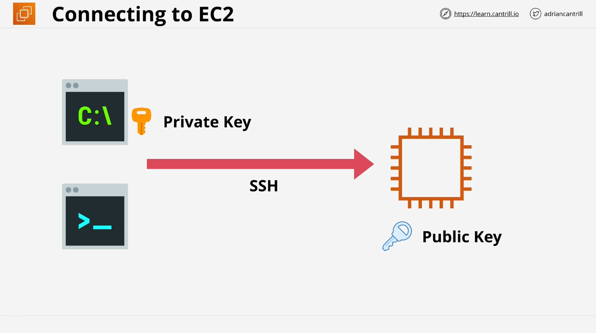

# Learn Cantrill.io AWS SA-C03: Elastic Compute Cloud (EC2) Overview

## Introduction to EC2

Welcome back! In this lesson, we introduce **Elastic Compute Cloud (EC2)**, one of the most essential services in AWS, which is crucial for both the **AWS Solutions Architect exam** and real-world AWS solutions. EC2 provides access to **virtual machines (VMs)** called **instances** and serves as the default compute service within AWS. If you need to manage **operating systems, runtime environments, databases, and applications**, EC2 is typically the go-to service.

## EC2 Overview

### Key Features of EC2:

1. **Infrastructure as a Service (IaaS)**: EC2 operates as IaaS, where users manage **operating systems and above** in the infrastructure stack, while AWS manages **virtualization, hardware, networking, and storage**.
2. **Private by Default**: EC2 instances launch into **private subnets** by default within a **Virtual Private Cloud (VPC)**. Public access must be explicitly configured.
3. **Availability Zone (AZ) Resilient**: EC2 instances are tied to specific **subnets and AZs**. If an AZ fails, instances in that AZ will likely fail too.
4. **Instance Types**: EC2 offers a range of **instance types** based on the resources required (CPU, memory, GPUs, storage) and their intended use.

## EC2 Instance Management

### Billing and Instance States

- **On-Demand Billing**: Instances are billed **per second or hour**, depending on the OS or software used.
- **Instance Costs**: Composed of **CPU, memory, storage, and additional software** used.
- **Instance States**:

  - **Running**: CPU, memory, disk, and networking charges apply.
  - **Stopped**: Only **storage charges** remain.
  - **Terminated**: All charges stop, but this action is **irreversible**.

  

### Storage Options

1. **Local Storage**: Storage on the EC2 host where the instance runs.
2. **Elastic Block Store (EBS)**: Persistent, network-attached storage.

## EC2 and Amazon Machine Image (AMI)

An **Amazon Machine Image (AMI)** is a pre-configured template that can be used to create EC2 instances. Think of it as similar to a **server image** in traditional on-premise setups.

### AMI Features:

1. **Permissions**:
   - **Private AMI**: Only the owner can use it.
   - **Public AMI**: Anyone can use it.
   - **Explicit Permissions**: Specific AWS accounts can be granted access.
2. **Volumes and Block Device Mapping**:
   - **Boot Volume**: The main drive that boots the OS (e.g., C: in Windows).
   - **Block Device Mapping**: Defines how volumes are presented to the OS.

## Connecting to EC2 Instances

### Protocols for Connection:

1. **Windows**: Connect using **RDP (Remote Desktop Protocol)** on port **3389**.
2. **Linux**: Connect using **SSH (Secure Shell)** on port **22**.

### SSH Key Pairs:

When connecting to a Linux instance, AWS requires an **SSH key pair**:

- **Private Key**: Downloaded once and stored securely.
- **Public Key**: Stored by AWS and placed on the instance.

The private key is used to authenticate your connection.

### Windows Connection Process:

For Windows, use the **private key** to retrieve the **administrator password**, then connect via **RDP** using this password.

## Upcoming Demo

In the next lesson, we will:

1. **Launch an EC2 Instance** in the **default VPC**.
2. Assign it a **public IPv4 address**.
3. **Connect to the Instance** using the methods discussed.

---

That's it for the theory portion! Proceed to the next demo lesson for a hands-on experience in creating and managing EC2 instances.
