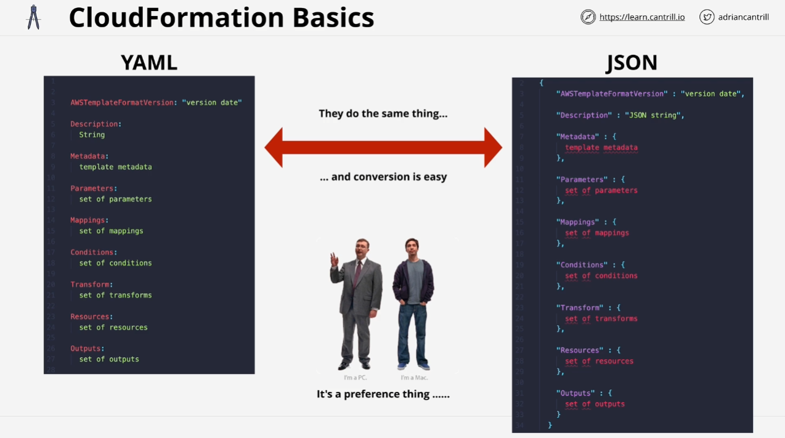
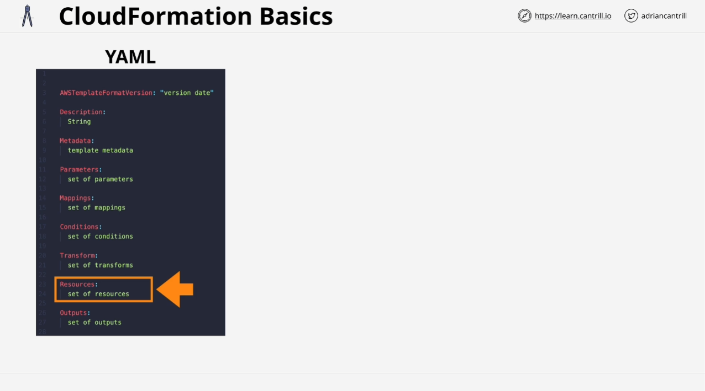
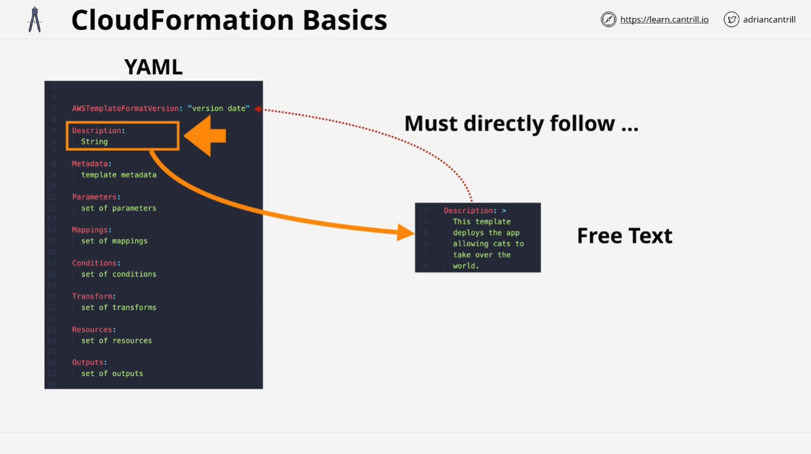
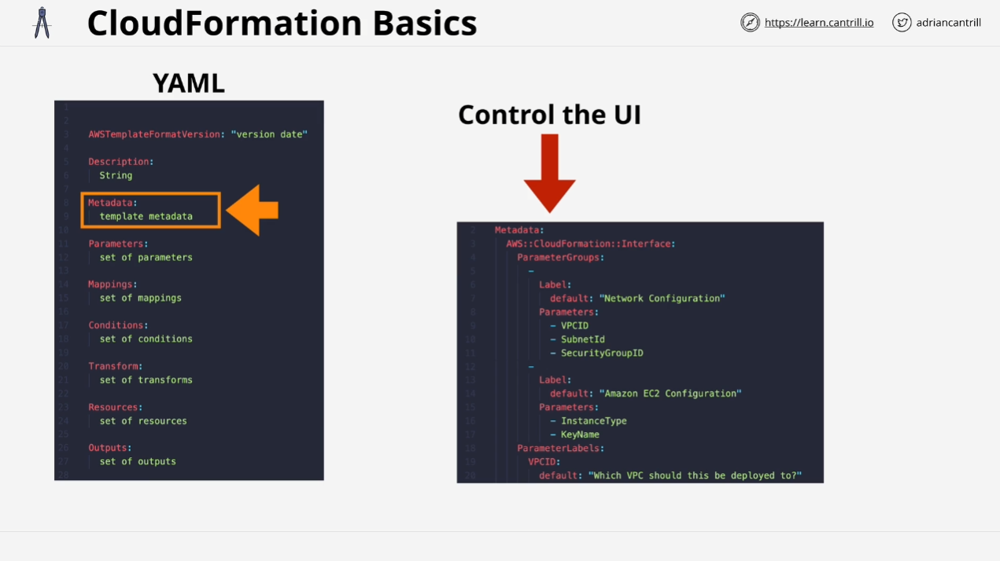
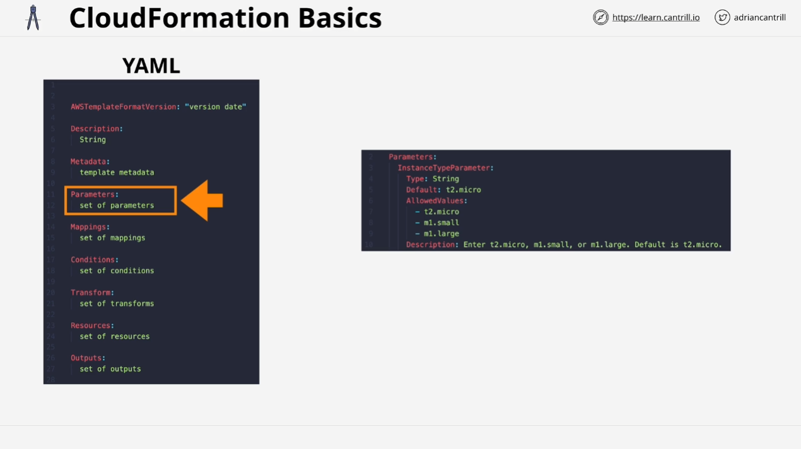
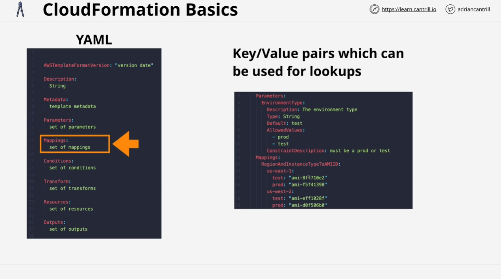
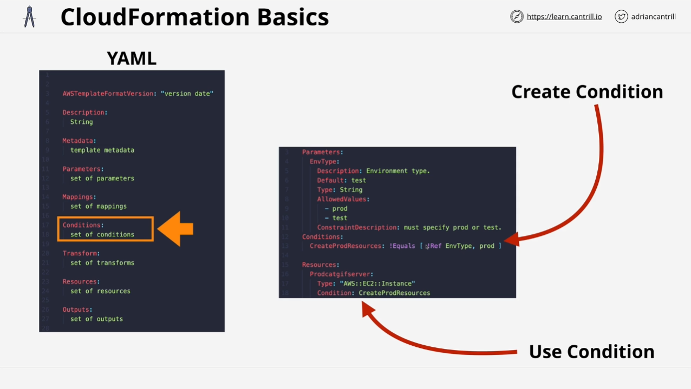
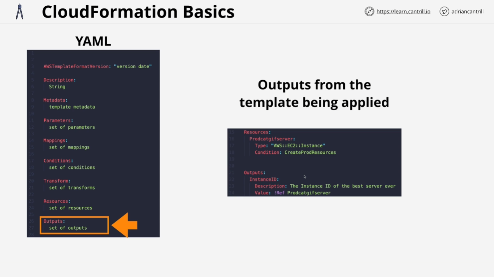
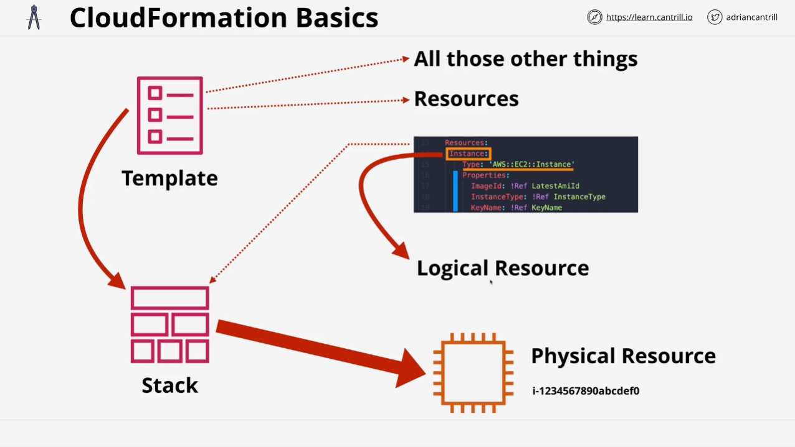
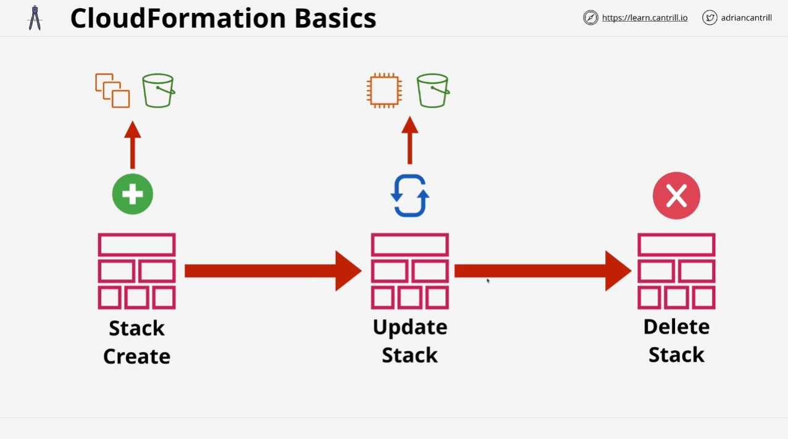

# AWS CloudFormation Overview

## Introduction

AWS CloudFormation is an Infrastructure as Code (IaC) tool that enables the creation, update, and deletion of AWS infrastructure in a consistent and repeatable manner using templates. Throughout this course, CloudFormation will be used to automate tasks in various lessons. This introduction covers the fundamental concepts and practical example.

## What is CloudFormation?

CloudFormation allows you to automate infrastructure creation, updates, and deletion in AWS by using templates. These templates, written in **YAML** or **JSON**, define the AWS resources and their configurations, replacing the need for manual intervention.

### Key Features:

- **Consistency**: Automates resource management to prevent manual errors.
- **Repeatability**: Templates can be reused across different environments.
- **Template Types**: Written in **YAML** or **JSON** (choice depends on user preference or business requirement).

## CloudFormation Template Structure

A CloudFormation template has various components that define how resources are created and managed. The most important parts of the template include:

### 1. **Resources**

- The only mandatory section in a template.
- Defines the AWS resources to be created, updated, or deleted.
- Without this section, the template will not perform any actions.

### 2. **Description**

- A free-text field for documenting what the template does.
- Can include information such as resources created, potential costs, and other details for users.
- If included alongside **AWS template format version**, the **description** must immediately follow it.

### 3. **Template Format Version**

- Optional field that defines the version of the CloudFormation standard the template uses.
- If omitted, AWS assumes a default version.

### 4. **Metadata**

- Optional section to provide extra information.
- Used to control the display of CloudFormation resources in the AWS Console UI, such as groupings, labels, and descriptions.

### 5. **Parameters**

- Enables customization by prompting users to input information during template execution.
- Examples: instance types, availability zones, names, etc.
- Can define validation criteria and default values.

### 6. **Mappings**

- Optional section that acts as a lookup table.
- Example use case: selecting Amazon Machine Images (AMIs) based on region and environment type (e.g., test or production).

### 7. **Conditions**

- Allow decision-making in templates.
- A condition is created based on specific parameters (e.g., if an environment is production).
- Used to control whether certain resources are created or not depending on the condition's evaluation.

### 8. **Outputs**

- Presents key information after the template execution.
- Example: Returning the EC2 instance ID or the admin address of a deployed WordPress blog.

## How CloudFormation Works

### Template to Stack Conversion

- **Templates**: Define resources and configurations.
- **Stacks**: When a template is submitted to CloudFormation, it creates a **stack** containing all the defined resources (logical resources).
- **Logical vs Physical Resources**:
  - **Logical resources**: Defined in the template (e.g., an EC2 instance).
  - **Physical resources**: Actual resources created in the AWS account (e.g., the real EC2 instance).

### Stack Lifecycle

- A stack represents a "live" template.
- Updates to a template lead to updates in the stack (add, modify, or delete resources).
- Deleting a stack results in the removal of the corresponding physical resources.

## CloudFormation Use Cases

- **Automation**: Easily spin up complex infrastructure (e.g., hosting multiple WordPress sites).
- **Change Management**: Store templates in version-controlled repositories for tracking changes and approvals.
- **Rapid Deployment**: Use templates to quickly create or modify resources in AWS environments.

## Course Relevance

CloudFormation will be utilized throughout the course to simplify demos and infrastructure management:

- Create base infrastructure for demonstrations.
- Quickly deploy and tear down resources.

The next lesson will cover a hands-on demo, where CloudFormation will be used to create an EC2 instance, illustrating the speed and ease of automating infrastructure with CloudFormation.
