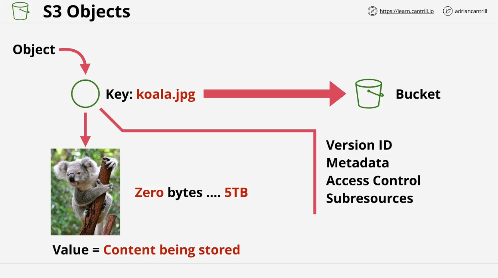
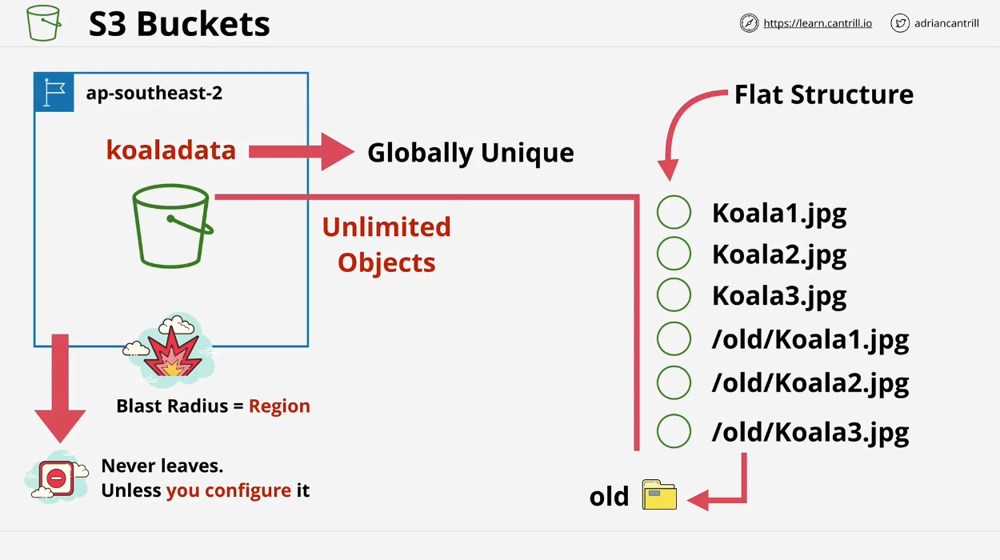

# Introduction to AWS S3

Welcome back! In this lesson, we'll dive into Amazon S3 (Simple Storage Service), a core AWS service essential for data storage and management. This overview provides the basics, with a more detailed exploration of S3 coming later in the course.

## Overview of S3

Amazon S3 is a global storage platform designed for high availability and durability. Key characteristics include:

- **Global Access:** S3 is available from all AWS regions and can be accessed from anywhere with an internet connection.
- **Regional Storage:** Data is stored in a specific AWS region at rest and remains in that region unless explicitly configured otherwise.
- **Regional Resilience:** Data is replicated across Availability Zones (AZs) within the region and can be configured for cross-region replication.

## Key Concepts

### Objects

Objects are the fundamental entities stored in S3. They consist of:

- **Object Key:** The identifier for the object, akin to a file name.
- **Object Value:** The data or content of the object. Sizes can range from 0 bytes to 5 terabytes.

Other components include:

- **Version ID**
- **Metadata**
- **Access Control**
- **Sub-resources**

### Buckets

Buckets are containers for objects and have the following features:

- **Region-Specific:** Created in a specific AWS region, and data remains in that region unless configured to move.
- **Global Uniqueness:** Bucket names must be globally unique across all AWS accounts and regions.
- **Capacity:** Buckets can store an unlimited number of objects, with each object ranging from 0 bytes to 5 terabytes in size.
- **Flat Structure:** S3 uses a flat storage structure. Objects appear to be in folders due to naming conventions, but S3 does not have a true directory hierarchy.

## Important Points

### Bucket Naming

- **Globally Unique:** Bucket names must be unique across all AWS accounts.
- **Restrictions:** Names must be between 3 and 63 characters, lowercase, no underscores, start with a lowercase letter or number, and cannot be formatted like IP addresses.

### Bucket Limits

- **Soft Limit:** 100 buckets per AWS account.
- **Hard Limit:** 1,000 buckets per AWS account (can be increased with a support request).

### Object Structure

- **Key:** The name of the object.
- **Value:** The data contained within the object.

## Use Cases and Limitations

- **Not a File System or Block Storage:** S3 is an object storage system and is not suitable for file-based or block storage needs. It is ideal for large-scale data storage and distribution, such as:

  - Movies and audio files
  - Large photo storage
  - Big data sets
  - IoT device data

- **Offloading Data:** S3 is useful for offloading data from expensive compute instances. For example, storing blog images or audio files on S3 and configuring the blog to reference these files directly.

## Summary

- **S3 is the default storage solution** for AWS, especially when dealing with large volumes of data.
- **Buckets are containers** for objects and are region-specific.
- **Objects consist of a key and a value**, with sizes ranging from 0 bytes to 5 terabytes.

## Next Steps

In the upcoming demo, we'll create a simple S3 bucket, upload objects, and explore how folder functionality and permissions work within S3.

Feel free to review this lesson and prepare for the practical application in the next session.

---

**References:**

- [Putty Documentation](https://docs.aws.amazon.com/AWSEC2/latest/UserGuide/putty.html?icmpid=docs_ec2_console)
- [Accessing Instances on Linux](https://docs.aws.amazon.com/AWSEC2/latest/UserGuide/AccessingInstancesLinux.html)
- [Connection Prerequisites](https://docs.aws.amazon.com/AWSEC2/latest/UserGuide/connection-prereqs.html#connection-prereqs-private-key)
