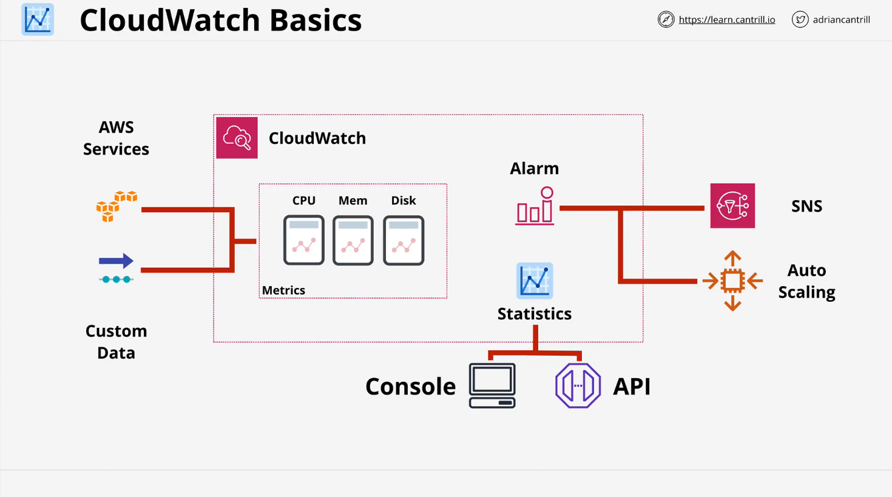
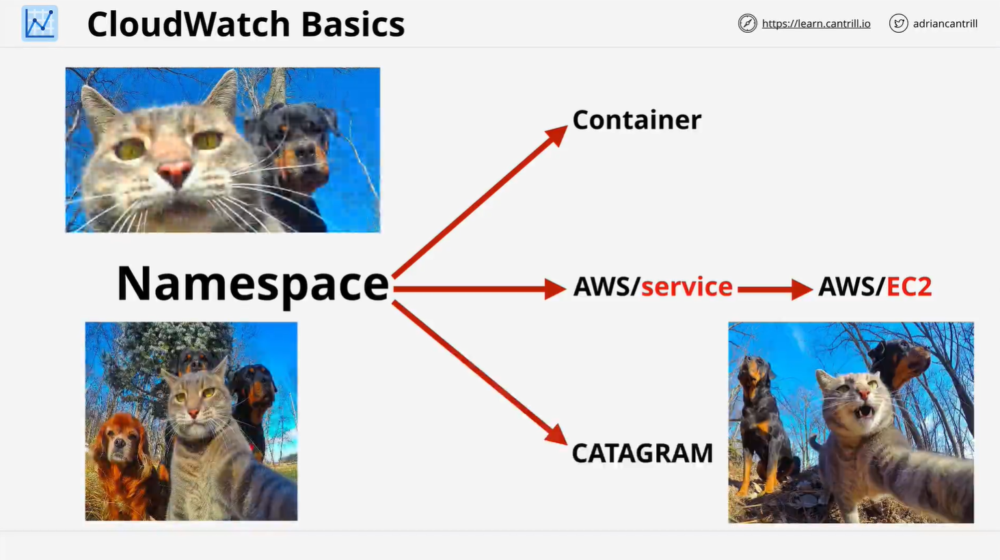
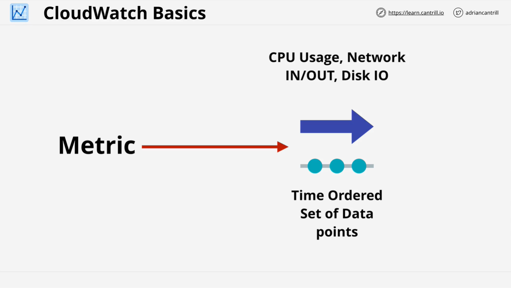
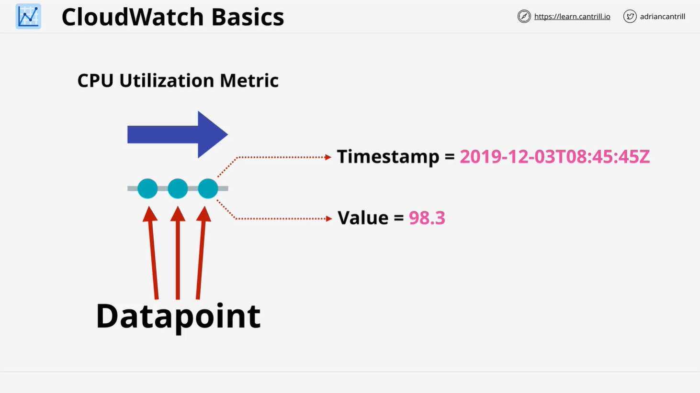
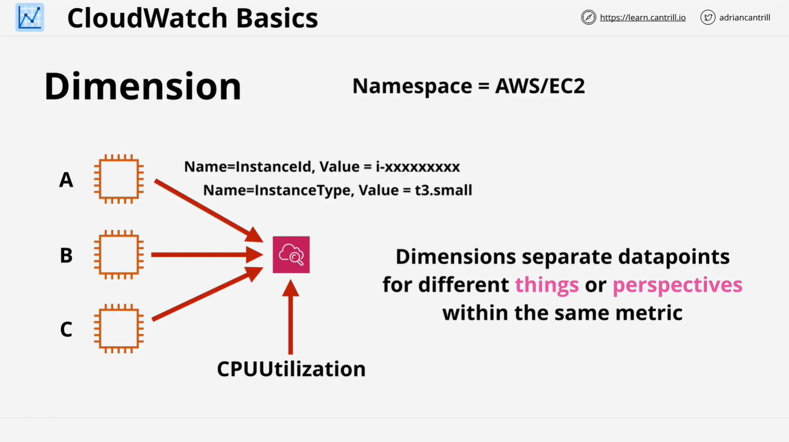
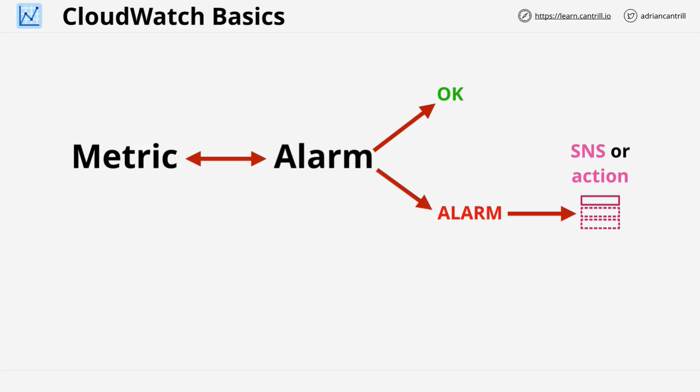

# CloudWatch Overview - LearnCantrill.io AWS SA C03

## Introduction to CloudWatch

CloudWatch is a core AWS product that supports operational management, monitoring, and logging across other AWS services. It plays a vital role in AWS architectures by gathering, managing, and visualizing performance data and events, making it essential for keeping track of metrics, logs, and events.

CloudWatch's primary functions are:

1. **Metrics**: Collection, monitoring, and acting on performance data.
2. **Logs**: Collecting and analyzing logs from various sources.
3. **Events**: Triggering actions based on events in AWS or scheduled times.

This lesson provides an introduction to CloudWatch's architecture and core concepts.

## Core Functions of CloudWatch

### 1. **CloudWatch Metrics**

CloudWatch Metrics is used to gather and monitor operational data, including performance metrics from AWS services, on-premises systems, or even other cloud platforms. Metrics are data points that represent operational health, such as:

- **CPU Utilization**
- **Disk Space Usage**
- **Website Traffic**

#### Key Aspects:

- **Native Metrics**: Certain AWS services, like EC2, provide metrics natively (e.g., CPU utilization of an EC2 instance).
- **CloudWatch Agent**: Required for more advanced monitoring, like tracking on-premises metrics or gathering specific process data from EC2 instances.

CloudWatch can trigger automated actions based on metric thresholds, such as scaling EC2 instances or sending notifications via AWS SNS.

### 2. **CloudWatch Logs**

CloudWatch Logs allow you to collect and analyze logs from various sources, including:

- **Windows Event Logs**
- **Web Server Logs**
- **Firewall Logs**
- **Linux Server Logs**

You can configure alarms and actions based on log data. The CloudWatch Agent is needed to collect logs from custom sources, on-premises environments, or services outside AWS.

### 3. **CloudWatch Events**

CloudWatch Events act as an event hub, capable of:

1. **Reacting to AWS Service Events**: For example, triggering actions when an EC2 instance is started, stopped, or terminated.
2. **Scheduled Actions**: Automating tasks based on specific times or intervals.

## CloudWatch Architecture

CloudWatch integrates with multiple data sources to gather and manage metrics and logs. These sources can include AWS services, custom applications, or on-premises systems. The data is stored in CloudWatch and can be accessed through the AWS Console, CLI, or API.

### Diagram Explanation

CloudWatch gathers data from:

- **AWS Services**
- **On-Premises Systems**
- **Other Cloud Platforms**

This data is then processed and presented as metrics, which can trigger alarms and actions based on predefined thresholds.

## Key Concepts in CloudWatch

### 1. **Namespaces**

Namespaces in CloudWatch act as containers for organizing related metrics and preventing conflicts between data from different systems.

- AWS has predefined namespaces for its services (e.g., `AWS/EC2` for EC2 instance metrics).
- Custom namespaces can be defined for non-AWS metrics (e.g., a namespace for a custom application).

### 2. **Metrics**

Metrics in CloudWatch are time-ordered collections of data points. Each data point consists of:

- **Timestamp**: The exact time when the measurement was taken.
- **Value**: The value of the metric (e.g., CPU utilization percentage).

Metrics are not specific to individual resources but represent the performance of a broader system.

### 3. **Data Points**

A data point is a single measurement sent to CloudWatch, containing:

- **Timestamp**: Date and time of the measurement.
- **Value**: The actual performance data, such as CPU utilization.

### 4. **Dimensions**

Dimensions allow you to filter and organize metrics. For example, you can track multiple EC2 instances' CPU utilization within the same metric, differentiating them using the `InstanceID` dimension.

## Alarms in CloudWatch

### 1. **Alarm States**

CloudWatch alarms monitor metrics and take actions based on thresholds. Alarms have three possible states:

- **OK**: The metric is within acceptable limits.
- **Alarm**: The metric exceeds the threshold, triggering an action.
- **Insufficient Data**: Not enough data to evaluate the alarm.

### 2. **Triggering Actions**

Alarms can trigger various actions:

- Sending notifications through Amazon SNS.
- Scaling EC2 instances or adjusting auto-scaling groups.
- Running Lambda functions or other automated tasks.

You have already experienced this through the **billing alarm** configured at the start of the course.

## Demo Overview

In the next lesson, you will:

- Create an EC2 instance.
- Set up a CloudWatch alarm that triggers when CPU utilization exceeds 25%.
- Use the `stress` tool to artificially generate high CPU load and observe the alarm's behavior.

## Conclusion

This lesson introduced the core functionality of CloudWatch, including its ability to monitor metrics, logs, and events. CloudWatch is a foundational tool in AWS for operational visibility, allowing users to automate actions based on real-time data. In the upcoming lessons, you will gain hands-on experience configuring and using CloudWatch to manage your AWS environments.
