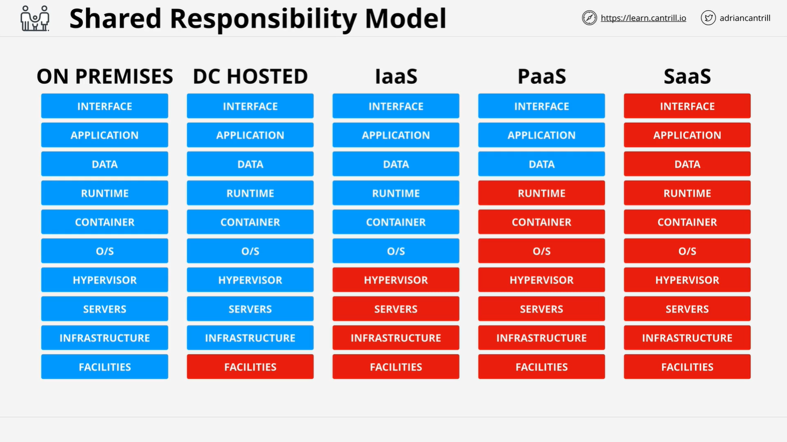
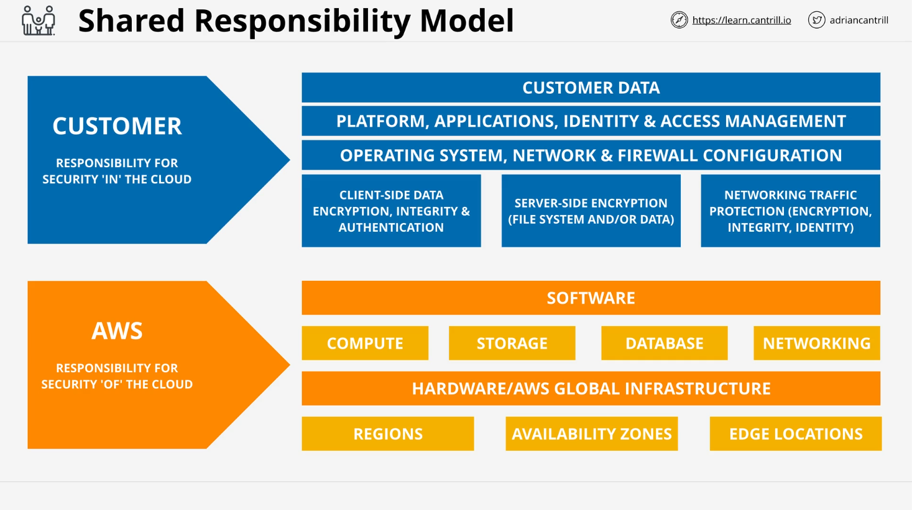

# Shared Responsibility Model - AWS SA C03 Summary

## Overview

The **Shared Responsibility Model** is a key framework provided by AWS that defines which aspects of system security are managed by AWS and which are the customer's responsibility. This model is critical for understanding AWS services and their security implications.

## AWS Responsibilities: "Security **of** the Cloud"

AWS is responsible for the security of the foundational services and infrastructure that supports their cloud offerings. This includes:

- **Global Infrastructure**

  - AWS regions, availability zones, and edge locations.
  - Hardware security and global network security.

- **Core Services**

  - Compute, storage, databases, and networking services.
  - Security of services such as EC2, RDS, S3, etc.

- **Software & Hypervisor**
  - Security of any AWS-managed software, including the hypervisor, which allows the creation of virtual machines.
  - Provisioning and security of the interface and backend infrastructure.

## Customer Responsibilities: "Security **in** the Cloud"

Customers are responsible for the security of their applications, data, and configurations within AWS-managed environments. These include:

- **Data Management**

  - Client-side encryption and integrity checks.
  - Server-side encryption, data protection, and secure network traffic management.

- **Operating System and Application Security**

  - OS updates, patches, and configurations.
  - Management of firewalls and network access rules.

- **Access Control & Identity Management**

  - Implementing **IAM** roles and permissions for secure access.
  - Managing SSL certificates and encryption protocols for server-to-server communications.

- **Customer Data**
  - Protecting and securing any customer data running within AWS services.
  - Ensuring data is properly backed up and managed.

## Use Cases and Practical Application

### Example: EC2 Instance in AWS

When deploying an EC2 instance, AWS handles:

- **Physical Hardware & Network**
  - The physical host machine, network infrastructure, and the region/availability zone.
  - The hypervisor that partitions physical resources into virtual instances.

The customer is responsible for:

- **Operating System & Applications**

  - Installing, configuring, and updating the operating system.
  - Managing applications, security patches, and firewall rules.

- **Data & Encryption**
  - Configuring encryption for both client-side and server-side.
  - Ensuring secure network communications using SSL certificates.

### Example: RDS in AWS

For RDS (Relational Database Service), AWS manages:

- **Database Infrastructure**
  - Provisioning, scaling, and securing the underlying database infrastructure.
  - Backup, maintenance, and failover configuration.

The customer’s responsibility includes:

- **Database Access & Data Management**
  - Controlling who can access the database through IAM roles and user permissions.
  - Encrypting and managing the data within the database.

## Importance for the AWS Exam

Understanding the Shared Responsibility Model is crucial for the AWS Certified Solutions Architect exam, as it helps clarify which aspects of security and infrastructure you need to focus on. By grasping these concepts early, you can better answer exam questions and architect secure cloud solutions.

## Summary

The AWS Shared Responsibility Model divides security and management tasks between AWS and the customer, ensuring clarity and proper security implementation. AWS handles the security **of** the cloud, while customers manage security **in** the cloud. Keep this model in mind as you progress through AWS services, as it will frequently help you distinguish between AWS-managed and customer-managed aspects of cloud services.
