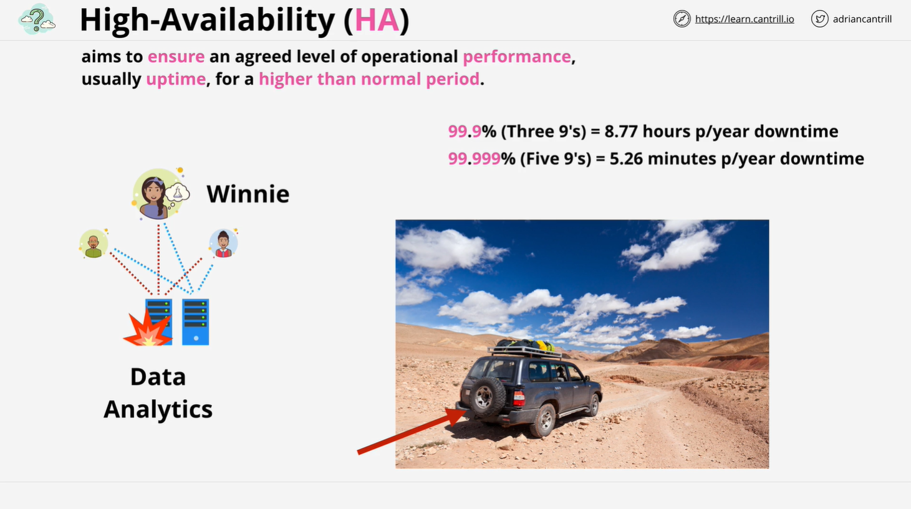
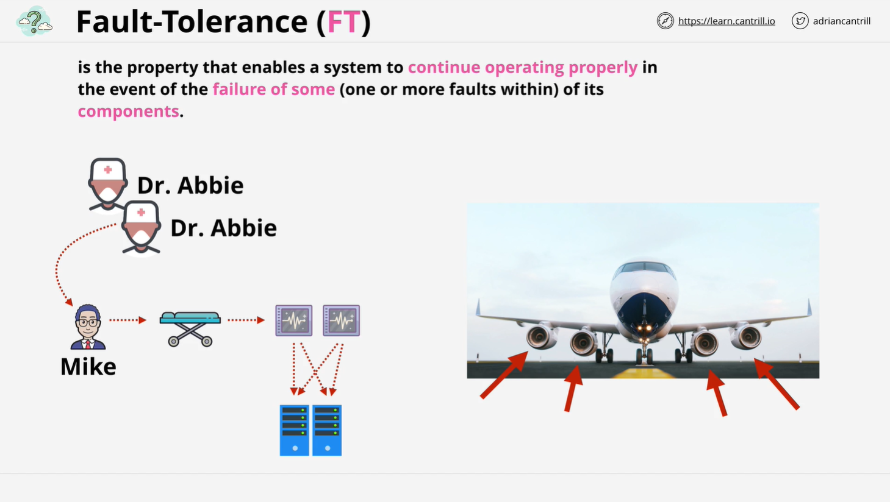
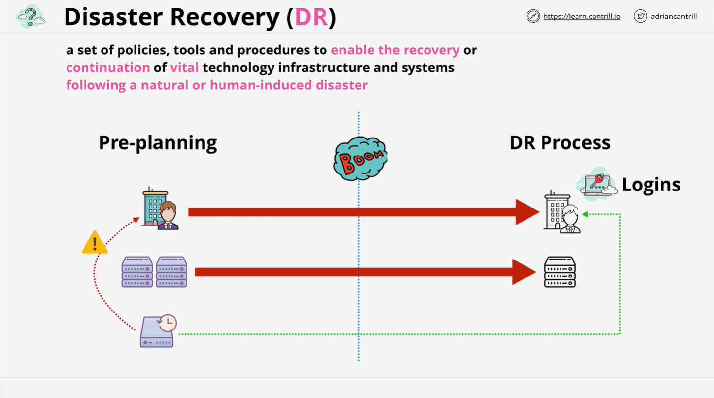

# High Availability (HA), Fault Tolerance (FT), and Disaster Recovery (DR)

In this lesson, we explore three critical concepts for any AWS Solutions Architect: High Availability (HA), Fault Tolerance (FT), and Disaster Recovery (DR). Understanding the differences between these terms is essential for effective system design and business continuity. Misunderstanding these terms can result in wasted resources, project risk, or even endanger lives.

## 1. **High Availability (HA)**

### Definition

High Availability (HA) refers to designing a system to ensure an agreed level of operational performance (typically uptime) for a higher-than-normal period. The goal is to maximize uptime, **not to eliminate system failures** entirely.

### Key Points

- **HA does not mean zero downtime**. There can still be brief outages or disruptions, but the system is designed to recover quickly.
- It focuses on minimizing downtime and ensuring the system is operational as much as possible, typically using automated processes to restore services.
- **Uptime Percentage**: HA systems are often measured in terms of availability (e.g., 99.9% or 99.999%). The higher the availability, the more stringent the limits on allowable downtime.

### Example:

- Imagine a system used by a data scientist named Winnie. If the system fails, recovery might involve quickly swapping out a virtual server. In a highly available system, **recovery happens fast**, but there might still be minor disruptions (like re-login requirements for users).

### Analogy:

- A **4x4 vehicle** in the desert with a spare tire. In case of a flat tire, there is a disruption (time spent replacing the tire), but the vehicle can be brought back into service quickly, minimizing downtime.

## 2. **Fault Tolerance (FT)**

### Definition

Fault Tolerance is the property that enables a system to **continue operating** properly in the event of a failure of some of its components. It ensures **zero disruption** during the failure.

### Key Points

- FT goes beyond HA by allowing the system to operate **through failures**, without noticeable impact on the end-user.
- FT systems typically have **redundant components** that continue functioning even when others fail.
- **Active-Active Configuration**: In a fault-tolerant system, multiple components (servers, etc.) operate simultaneously. If one fails, the other takes over without interruption.

### Example:

- A hospital monitoring system for a patient under anesthesia must function without disruption. If one system fails, another must immediately take over without impacting the patient’s safety. This requires **fault tolerance**, not just high availability.

### Analogy:

- An **airplane** with multiple redundant systems. If an engine fails, the plane continues flying with the remaining engines. The failure is tolerated without affecting the plane’s operation.

## 3. **Disaster Recovery (DR)**

### Definition

Disaster Recovery (DR) is a set of policies, tools, and procedures that enable the **recovery** or continuation of essential technology systems after a disaster, such as a natural disaster or system-wide failure.

### Key Points

- DR comes into play when both HA and FT systems **fail** or are compromised.
- It involves **pre-planning** and **post-disaster processes** to ensure the restoration of services.
- Key elements of a good DR plan include off-site backups, well-documented procedures, and periodic testing.

### Example:

- A business might have a **standby office** or use a cloud provider like AWS as a backup. Regular backups stored off-site ensure critical data can be restored in case of an emergency.

### Analogy:

- A **plane's ejection seat** system. When everything else fails, DR processes ensure the safety of critical components and personnel, allowing recovery and rebuilding after a disaster.

## 4. **Differences Between HA, FT, and DR**

### High Availability (HA)

- **Goal**: Minimize downtime.
- **Disruptions**: Brief user disruptions are acceptable.
- **Cost**: Lower implementation cost compared to FT.

### Fault Tolerance (FT)

- **Goal**: Continue operating through failures.
- **Disruptions**: No user disruption during failure.
- **Cost**: More expensive and complex than HA.

### Disaster Recovery (DR)

- **Goal**: Recover from a major disaster when HA and FT fail.
- **Disruptions**: Recovery after failure; may require human intervention.
- **Cost**: Can vary based on the level of preparedness and automation.

## 5. **Importance for Solutions Architects**

As an AWS Solutions Architect, it is essential to **understand the differences** between HA, FT, and DR to design the appropriate solutions for your customers:

- **HA**: Suitable when brief user disruptions are acceptable, and the focus is on minimizing downtime.
- **FT**: Needed for critical systems that must operate without interruption, even in the face of component failures.
- **DR**: Necessary for **recovery planning** when major disasters occur, ensuring business continuity.

## 6. **AWS and These Concepts**

AWS offers various services and products to support HA, FT, and DR:

- **HA**: Services like Elastic Load Balancing, Auto Scaling, and Multi-AZ deployments.
- **FT**: Features such as AWS's multi-region deployments and fault-tolerant architectures.
- **DR**: Services like AWS Backup, S3 Cross-Region Replication, and Elastic Disaster Recovery.

These features and services help ensure that you can design for different levels of availability and recovery as needed.

### Conclusion

- **High Availability**: Maximizes uptime but can tolerate some disruption.
- **Fault Tolerance**: Operates through failures with zero disruption.
- **Disaster Recovery**: Recovers systems after major failures or disasters.

AWS provides tools to support all three, and as you continue with the course, these concepts will be reinforced in practical AWS contexts. Understanding these distinctions is crucial for designing cost-effective, reliable systems tailored to customer needs.
