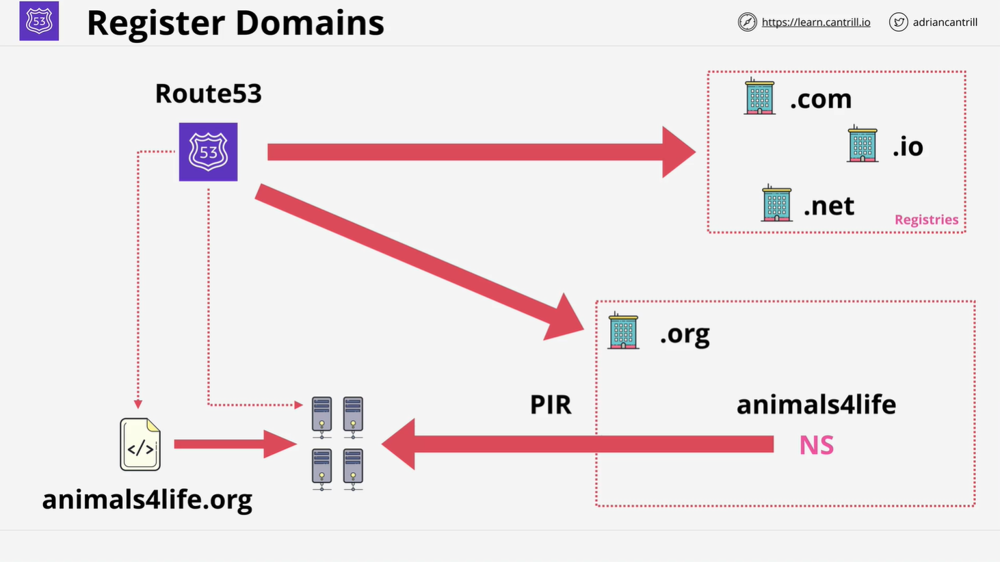
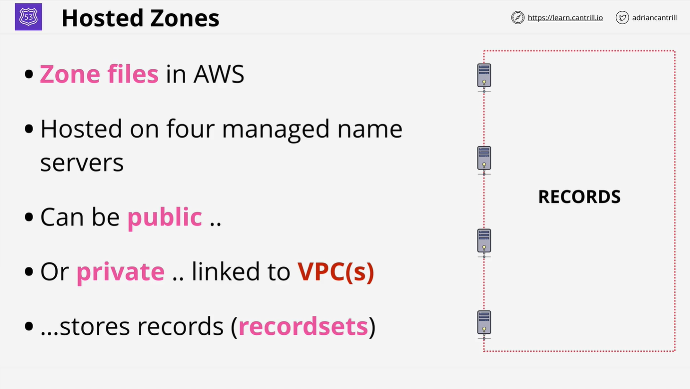

# AWS Route 53 Overview and Domain Registration

This section of the course introduces Route 53, AWS's managed DNS (Domain Name System) service. It covers how Route 53 operates globally, its services, and how to register domains using it. Below is a detailed breakdown of the content.

## Overview of AWS Route 53

Route 53 provides two primary services:

1. **Domain Registration**: Allows you to register domains through AWS.
2. **DNS Hosting**: Hosts zone files on AWS-managed name servers.

Key features:

- **Global Service**: Route 53 is one of the few AWS services that operate globally, meaning there’s no need to select a region when using the service.
- **Single Global Database**: The data managed by Route 53 is globally distributed and resilient to regional failures.
- **High Availability and Fault Tolerance**: Route 53 is designed to be reliable, scalable, and resilient even in the event of region failures.

## Domain Registration with Route 53

Route 53 handles domain registration by working directly with domain registries, the organizations responsible for managing top-level domains (TLDs). Here’s an overview of how domain registration works:

1. **Check Domain Availability**: Route 53 checks with the relevant registry (e.g., PIR for `.org` domains) to see if the domain is available for registration.
2. **Create Zone File**: Once the domain is available, Route 53 creates a **zone file**. A zone file is essentially a database containing all DNS information for a particular domain. In this case, the domain being registered is `AnimalsForLife.org`.

3. **Assign Name Servers**: After the zone file is created, Route 53 assigns four globally distributed managed name servers to host the zone file.

4. **Liaise with Registry**: Route 53 then communicates with the TLD registry (e.g., PIR for `.org`), adding name server records to the top-level domain zone file. These records point to the newly assigned name servers, making them **authoritative** for the domain.

### Key Terms:

- **Zone File**: A database that holds DNS records for a domain.
- **Name Servers**: Servers that hold the zone file and respond to DNS queries.
- **Authoritative**: Indicates that these name servers have the final say on DNS records for the domain.

## DNS Zones in Route 53

Route 53 enables you to create and manage DNS zones as part of its DNS hosting service. These zones, known as **hosted zones**, are hosted on AWS-managed name servers. Hosted zones can be either public or private.

- **Public Hosted Zone**:
  - Data is accessible on the public internet.
  - Name servers live in the public AWS zone and are part of the public DNS system.
- **Private Hosted Zone**:
  - Linked to one or more VPCs (Virtual Private Clouds).
  - Only accessible from within the VPCs, used for sensitive DNS records.

### DNS Records

Each hosted zone contains DNS records (also known as **record sets** in Route 53 terminology). These records store information like the IP addresses associated with domain names.

## Demo: Domain Registration

In the next lesson, you will see a demonstration of registering a domain (`AnimalsForLife.org`) using Route 53. This domain will be used in the course scenario.

When you're ready, proceed to the demo to see the domain registration in action.

---

This section has laid the groundwork for understanding how Route 53 operates and its role in managing DNS and domain registration. Stay tuned for a more in-depth look at DNS records and additional features of Route 53.
