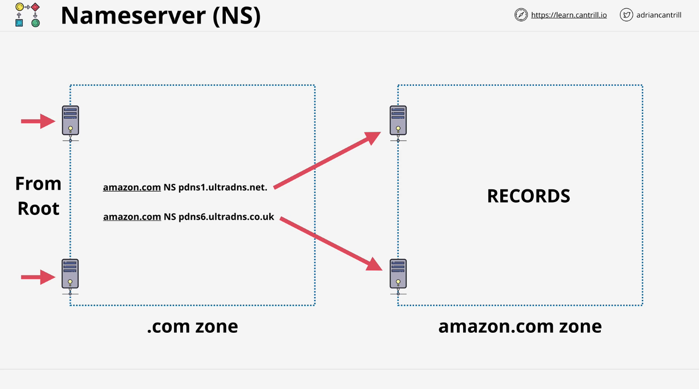
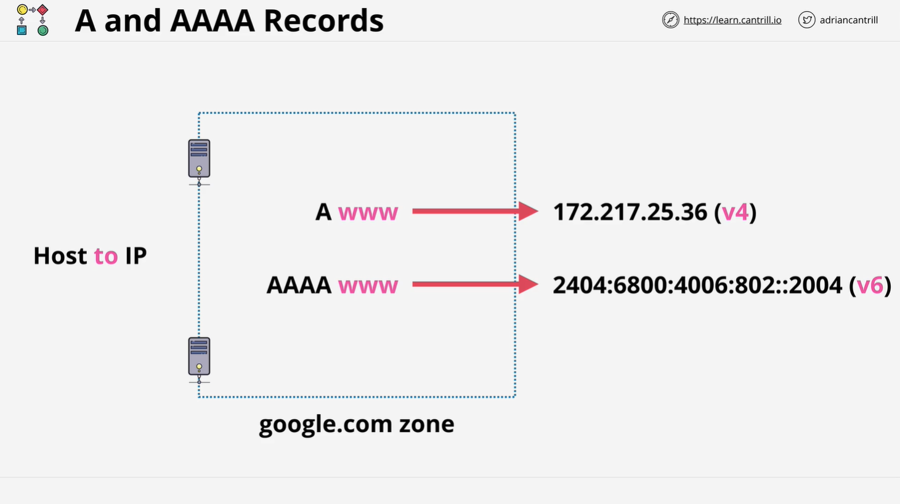
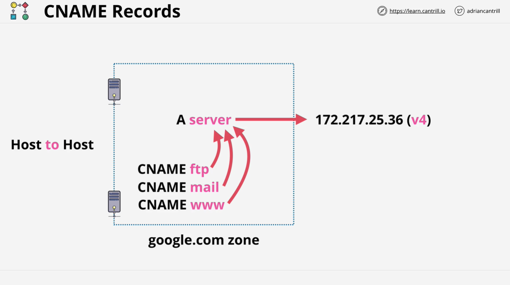
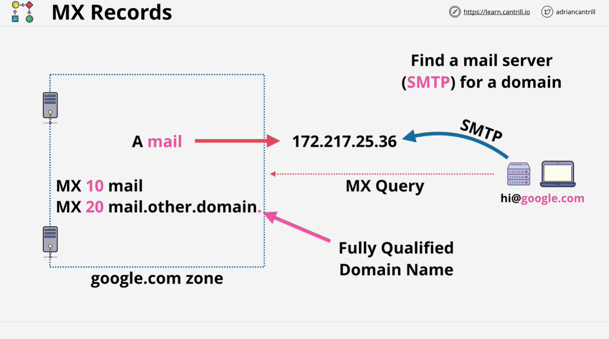
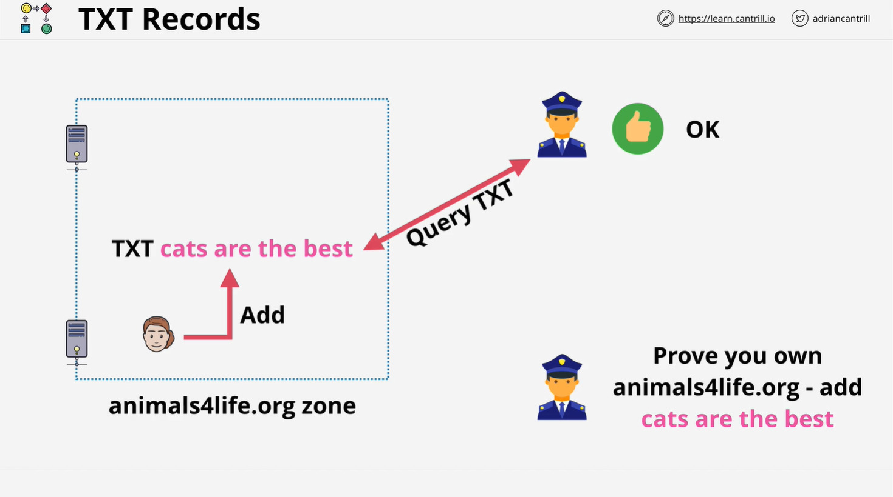
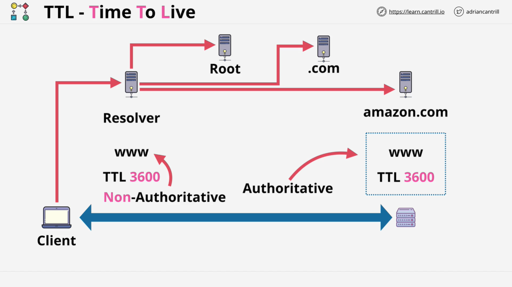

# AWS Solutions Architect - DNS Record Types Overview

In this lesson, we will cover the different types of DNS records, their use cases, and the concept of **Time to Live (TTL)**. Understanding these record types is essential to working with DNS effectively, particularly when architecting solutions in AWS.

## **1. NS Records (Name Server Records)**

**NS (Name Server) records** allow delegation within the DNS system. Here's how they work:

- **Delegation Example**:
  - The `.com` zone is managed by Verisign, which has name server records for domains like Amazon.com.
  - These name servers delegate the responsibility of managing the DNS records of Amazon.com to Amazon's own servers.
  - This delegation process starts from the root zone, which has name server records pointing to `.com`, and the `.com` zone points to Amazon.com.

**Importance**: NS records are essential for DNS delegation from one zone to another, enabling distributed management of DNS.

## **2. A and AAAA Records**

These are the most common DNS records used to map domain names to IP addresses:

- **A Record**: Maps a domain to an **IPv4** address.
- **AAAA Record**: Maps a domain to an **IPv6** address.

### **Usage**:

Typically, both an **A** and **AAAA** record are created for the same domain, allowing clients to select the appropriate IP version.

## **3. CNAME Records (Canonical Name Records)**

**CNAME records** create DNS aliases, mapping one domain name to another. For instance:

- You have a server with an **A record** named `server.domain.com`.
- You want to create aliases like `ftp.domain.com`, `mail.domain.com`, and `www.domain.com` pointing to the same server. Instead of updating multiple records, create **CNAME** records pointing to `server.domain.com`.

### **Key Points**:

- CNAME records cannot point directly to IP addresses, only to other domain names.
- They simplify DNS management by centralizing the IP address in a single **A record**.

## **4. MX Records (Mail Exchange Records)**

**MX records** are critical for handling email delivery. They define the mail servers responsible for receiving email for a domain:

- Example: The `google.com` zone might have an **A record** called `mail`, and several **MX records** pointing to it.

### **Components**:

- **Priority**: MX records have a priority field; lower numbers represent higher priority.
- **Host**: The actual mail server. It can be an internal host (e.g., `mail.google.com`) or an external provider like Office 365.

### **How It Works**:

When an email is sent, the sender's email server looks up the MX records for the recipient domain, then uses the priority field to decide which server to contact first.

## **5. TXT Records (Text Records)**

**TXT records** allow adding arbitrary text data to a DNS zone. They have a variety of use cases, including:

- **Domain ownership verification**: External services (like email providers) may ask you to add a specific TXT record to prove that you control the domain.
- **Anti-spam measures**: They can specify which mail servers are authorized to send email for your domain, helping to reduce spam by validating legitimate email sources.

### **Example**:

If you want to prove ownership of the domain `animalsforlife.com`, you might add a TXT record with the value `"cats are the best"` to your DNS zone. The external service will check that value to verify ownership.

## **6. DNS TTL (Time to Live)**

**TTL** represents the duration (in seconds) that a DNS record can be cached by clients or DNS resolvers. It balances between reducing query load and ensuring changes to DNS records propagate quickly.

### **How TTL Works**:

1. A client requests `www.amazon.com`.
2. The DNS resolver contacts the authoritative DNS servers to retrieve the IP address and caches it based on the TTL value.
3. Subsequent queries during the TTL period return the cached value instead of querying the authoritative server.

### List of Root Servers (13 Root Servers)

The 13 root servers are essential components of the Domain Name System (DNS), which is the hierarchical system that translates human-readable domain names (like www.example.com) into machine-readable IP addresses (like 192.0.2.1). Here’s a breakdown of their purposes:

1. **Domain Name Resolution**: Root servers respond to DNS queries and provide the addresses of the top-level domain (TLD) servers (like .com, .org, .net), allowing users to reach websites.

2. **Global Accessibility**: They ensure that the DNS system is decentralized and globally accessible, so that users worldwide can resolve domain names reliably.

3. **Redundancy and Reliability**: With 13 root servers, distributed across various locations and operated by different organizations, the system offers redundancy. If one server is unavailable, others can respond to queries.

4. **Root Zone Management**: They serve as authoritative sources for the root zone file, which contains information about the top-level domains and their respective TLD servers.

5. **Security**: Root servers help maintain the integrity of the DNS by providing a foundation for DNSSEC (Domain Name System Security Extensions), which enhances security by enabling the verification of DNS responses.

6. **Performance**: By distributing the load across multiple servers, they improve response times and reduce latency for DNS queries.

7. **Protocol Support**: They support various protocols, including IPv4 and IPv6, ensuring compatibility with modern internet technologies.

8. **Load Balancing**: The structure allows for load balancing of DNS queries, which is vital during periods of high traffic or cyber attacks.

9. **Supporting New TLDs**: As new TLDs are introduced, root servers are updated to include them, maintaining the evolution of the internet.

10. **Promoting Stability**: They help ensure the stability of the global internet infrastructure, preventing disruptions in domain name resolution.

11. **Research and Development**: Operators often engage in research to improve the DNS and address emerging challenges.

12. **Public Trust**: They are operated by reputable organizations, fostering public confidence in the DNS system.

13. **Educational Resource**: They serve as a resource for understanding internet infrastructure and DNS operation, helping to educate the public and professionals about internet technologies.

| Hostname           | IP Addresses                      | Operator                                                          |
| ------------------ | --------------------------------- | ----------------------------------------------------------------- |
| a.root-servers.net | 198.41.0.4, 2001:503:ba3e::2:30   | Verisign, Inc.                                                    |
| b.root-servers.net | 170.247.170.2, 2801:1b8:10::b     | University of Southern California, Information Sciences Institute |
| c.root-servers.net | 192.33.4.12, 2001:500:2::c        | Cogent Communications                                             |
| d.root-servers.net | 199.7.91.13, 2001:500:2d::d       | University of Maryland                                            |
| e.root-servers.net | 192.203.230.10, 2001:500:a8::e    | NASA (Ames Research Center)                                       |
| f.root-servers.net | 192.5.5.241, 2001:500:2f::f       | Internet Systems Consortium, Inc.                                 |
| g.root-servers.net | 192.112.36.4, 2001:500:12::d0d    | US Department of Defense (NIC)                                    |
| h.root-servers.net | 198.97.190.53, 2001:500:1::53     | US Army (Research Lab)                                            |
| i.root-servers.net | 192.36.148.17, 2001:7fe::53       | Netnod                                                            |
| j.root-servers.net | 192.58.128.30, 2001:503:c27::2:30 | Verisign, Inc.                                                    |
| k.root-servers.net | 193.0.14.129, 2001:7fd::1         | RIPE NCC                                                          |
| l.root-servers.net | 199.7.83.42, 2001:500:9f::42      | ICANN                                                             |
| m.root-servers.net | 202.12.27.33, 2001:dc3::35        | WIDE Project                                                      |

### **Key Points**:

- **Authoritative Answer**: The result from querying an authoritative DNS server directly.
- **Non-Authoritative Answer**: A cached response returned by a DNS resolver.
- **TTL and DNS Changes**: When making changes to DNS (e.g., switching email servers), low TTL values ensure that changes propagate quickly. It's common to lower TTL values before planned DNS changes to minimize issues caused by outdated caches.

## **Conclusion**

Understanding DNS record types and TTL is crucial for managing DNS effectively. These concepts play a significant role in ensuring efficient domain resolution, email delivery, and controlling caching behavior. As you progress through the course, you'll encounter practical scenarios where you'll use these DNS record types in various AWS services.

**Next Steps**: Continue with the next lesson to explore how these DNS concepts are applied in real-world AWS architecture and management tasks.
