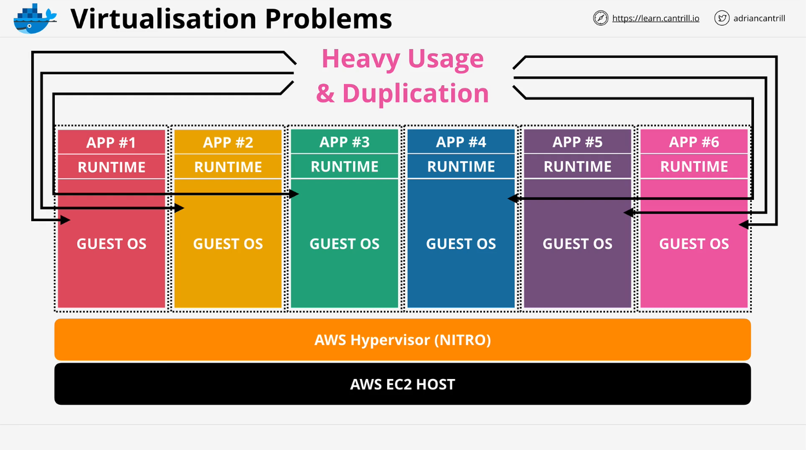
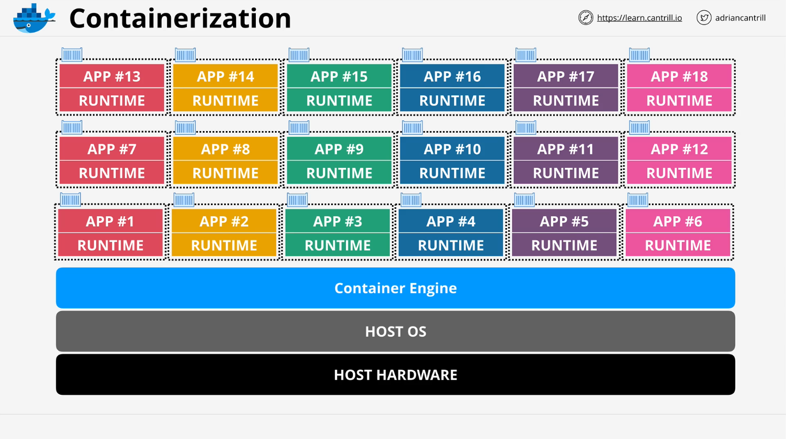
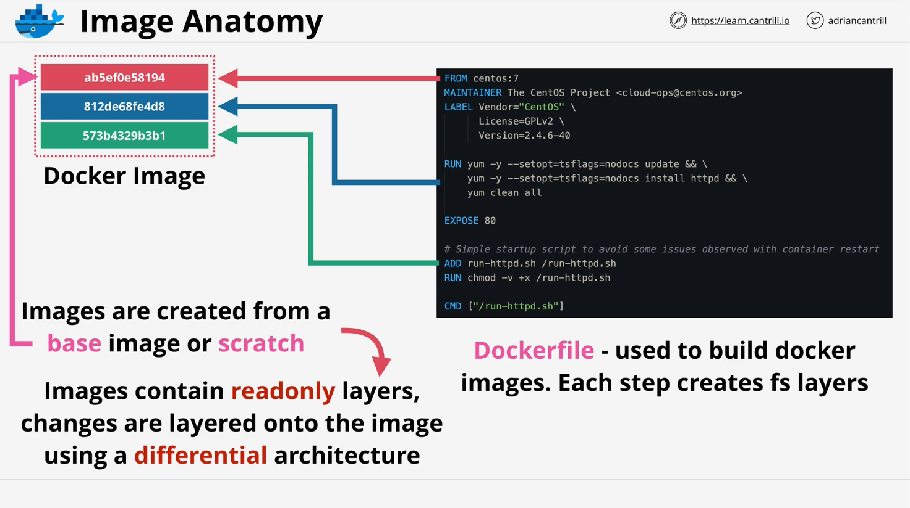
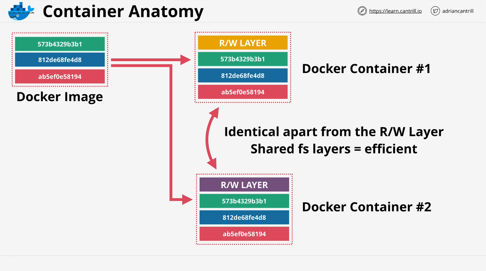
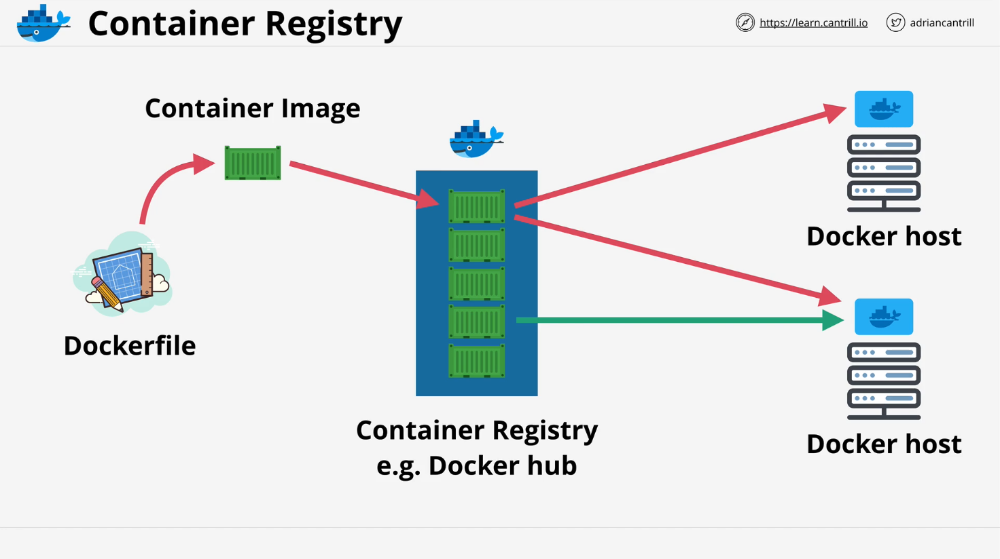
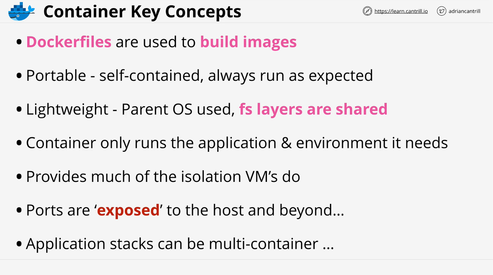

# Container Computing

## Introduction

This section focuses on **container computing**, an essential part of AWS compute services. The objective is to understand what containers are, their benefits, and how they differ from traditional **operating system (OS) virtualization**.

The lesson starts with theory, followed by a hands-on demo where you will create your own container.

## Virtualization vs. Containerization

### **Operating System Virtualization**

- **Traditional virtualization** uses a **hypervisor** (e.g., Nitro Hypervisor in AWS EC2) to run multiple virtual machines (VMs) on the same physical hardware.
- Each VM has a **full OS**, consuming significant **memory (RAM)** and **disk space**.
- Example: A VM with **4GB RAM** and a **40GB disk** could have **60-70% of disk space occupied by the OS**, leaving little for applications.

### **Problems with Virtual Machines (VMs)**



1. **Resource Waste**:

   - Running multiple VMs with the **same OS** duplicates system resources.
   - Each VM consumes CPU, memory, and storage just to maintain the OS.

2. **Performance Overhead**:

   - Every VM operation (start, stop, restart) involves manipulating the entire OS.

3. **Duplication**:
   - Many businesses run multiple copies of the **same OS version**, increasing resource consumption.

## What Are Containers?

**Containers provide an isolated environment for applications without the overhead of running an entire OS.**

### **How Containers Work**



- Instead of running multiple **guest OSs**, containers share the **host OS kernel** using a **container engine** (e.g., **Docker**).
- **A container runs as a process** in the host OS but is isolated from other processes.
- Example:
  - If the host OS is **Linux**, it runs **Docker** as the container engine.
  - The **container runs as a single process** within this OS but has its own **isolated file system** and **dependencies**.

### **Comparison: VMs vs. Containers**

| Feature              | Virtual Machines (VMs)   | Containers                           |
| -------------------- | ------------------------ | ------------------------------------ |
| OS per Instance      | Yes (full OS per VM)     | No (shared OS kernel)                |
| Boot Time            | Minutes                  | Seconds                              |
| Performance Overhead | High (full OS overhead)  | Low (only app + dependencies)        |
| Resource Efficiency  | Lower (wasted resources) | Higher (more containers per machine) |
| Isolation Level      | High (full OS isolation) | Medium (process isolation)           |

## Understanding Docker Images and Containers

### **What is a Docker Image?**

- A **Docker Image** is a **read-only template** used to create containers.
- **Images are made up of multiple layers** (stacked filesystem layers).
- **Docker images are built using a Dockerfile** (a set of instructions for creating the image).

### **Dockerfile Example & Explanation**

```dockerfile
# Use CentOS 7 as the base image
FROM centos:7

# Install Apache web server
RUN yum -y update && yum -y install httpd

# Copy website files into the container
COPY ./website /var/www/html

# Set the command to run Apache when the container starts
CMD ["httpd", "-D", "FOREGROUND"]
```

#### **Line-by-line Explanation**



1. `FROM centos:7`

   - Defines the **base image** (CentOS 7).
   - The first layer in the Docker image.

2. `RUN yum -y update && yum -y install httpd`

   - Updates the package manager (`yum`).
   - Installs **Apache HTTP Server** (`httpd`).
   - Adds a **new layer** containing the installed software.

3. `COPY ./website /var/www/html`

   - Copies website files from the **host machine** to `/var/www/html` in the container.
   - Creates another **file system layer**.

4. `CMD ["httpd", "-D", "FOREGROUND"]`
   - Specifies the **command** that runs when the container starts.
   - Runs **Apache in the foreground**, so the container stays alive.

### **How Docker Images Work**



1. Images are built **layer by layer**, with each line in the Dockerfile adding a new **read-only layer**.
2. **Layers are shared across multiple containers**, saving storage space.
3. Images can be **stored and retrieved from a container registry** (e.g., **Docker Hub** or AWS Elastic Container Registry - ECR).

## Running Containers

### **What is a Docker Container?**



- A **running instance** of a **Docker image**.
- It is **isolated** but **shares the host OS kernel**.
- Containers have an **extra writable layer** for logs, configurations, and application runtime data.

### **Docker Image vs. Docker Container**

| Feature | Docker Image              | Docker Container                       |
| ------- | ------------------------- | -------------------------------------- |
| Type    | Read-only template        | Running instance of an image           |
| Storage | Immutable                 | Mutable (writes to a temporary layer)  |
| State   | Static (does not change)  | Dynamic (can store logs, runtime data) |
| Purpose | Used to create containers | Runs applications                      |

### **Creating and Running a Container**

```sh
# Build a Docker image from the Dockerfile
docker build -t my-web-app .

# Run a container from the image
docker run -d -p 80:80 --name web-container my-web-app
```

#### **Command Explanation**

1. `docker build -t my-web-app .`

   - Builds a Docker image and names it `my-web-app`.

2. `docker run -d -p 80:80 --name web-container my-web-app`
   - `-d`: Runs the container in the background.
   - `-p 80:80`: Maps container port **80** to host port **80** (for HTTP access).
   - `--name web-container`: Names the container `web-container`.
   - `my-web-app`: Specifies which image to use.

## **Container Registries**

- A **container registry** stores Docker images.
- Popular container registries:
  - **Docker Hub** (public registry)
  - **AWS Elastic Container Registry (ECR)** (private, managed by AWS)

### **Pushing an Image to Docker Hub**

```sh
# Log in to Docker Hub
docker login

# Tag the image before pushing
docker tag my-web-app username/my-web-app:v1

# Push the image to Docker Hub
docker push username/my-web-app:v1
```

## **Key Benefits of Containers**



1. **Portability**

   - Containers can run on **any OS** with a **container engine**.
   - Applications run **consistently across different environments**.

2. **Efficiency**

   - Uses **less memory and storage** than VMs.
   - Allows for **higher density** (more applications on the same hardware).

3. **Fast Deployment**

   - Containers start **within seconds** compared to VMs that take minutes.

4. **Scalability**

   - Easily **scale up/down** by running **multiple containers**.
   - Works well with **orchestration tools** (e.g., **Kubernetes, AWS ECS**).

5. **Isolation**
   - Containers run in **separate environments**, preventing conflicts.

## **Conclusion**

- **Containers are a lightweight alternative to VMs**, sharing the host OS kernel but providing **process-level isolation**.
- They are **portable, efficient, scalable, and fast**.
- **Docker is a popular containerization tool**, and **Docker Hub** allows image sharing.
- Next, a **demo lesson** will provide hands-on experience in building and running containers.
