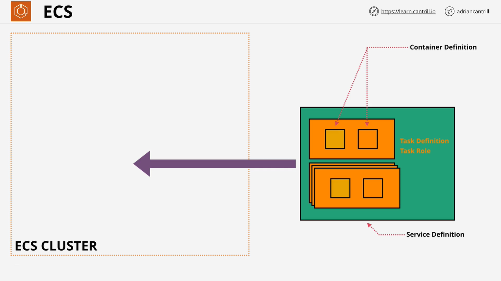
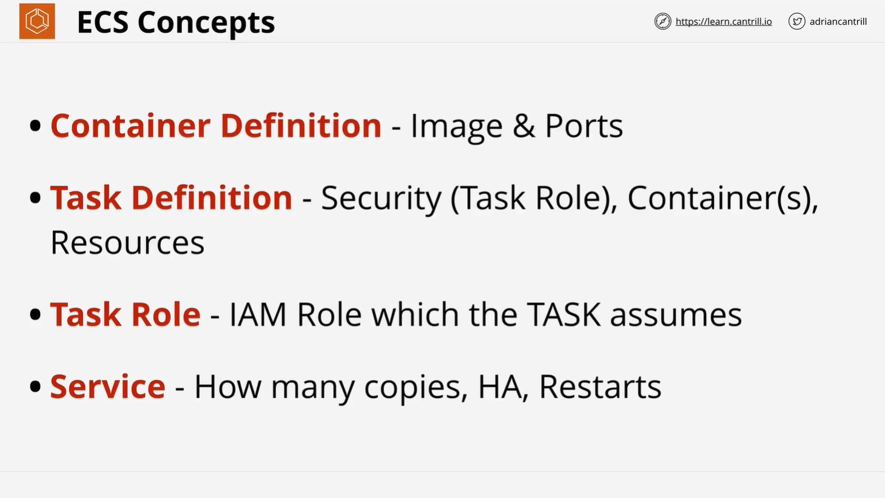

# AWS Elastic Container Service (ECS) Overview

## Introduction to ECS

AWS Elastic Container Service (ECS) is a fully managed container orchestration service that enables the deployment, management, and scaling of containerized applications. ECS can operate in two modes:

1. **EC2 Mode**: Uses Amazon EC2 instances as container hosts.
2. **Fargate Mode**: A serverless approach where AWS manages the infrastructure.

## How ECS Works



ECS is responsible for orchestrating where and how to run containers. It functions similarly to EC2 for virtual machines but for containerized workloads.

### ECS Components

### 1. **Container Registry**

- Containers are based on images stored in a **container registry**.
- AWS provides **Elastic Container Registry (ECR)** for storing and managing container images.
- Other registries like **Docker Hub** can also be used.

### 2. **Container Definition**

- Specifies **container image**, **ports**, and other essential runtime configurations.
- Example:
  ```json
  {
    "image": "myrepo/myimage:latest",
    "memory": 512,
    "cpu": 256,
    "portMappings": [{ "containerPort": 80, "hostPort": 80 }]
  }
  ```

### 3. **Task Definition**

- Defines how a container or group of containers should run within ECS.
- Stores **container configurations**, **resources (CPU, memory)**, **networking mode**, and **IAM role permissions**.
- Task definitions can include multiple containers.
- Includes **task role** to provide AWS service access.

### 4. **Task**

- A **running instance** of a **task definition**.
- Tasks **do not scale automatically** and are **not highly available** by default.

### 5. **Service**

- Ensures a specified number of tasks are running at all times.
- Provides **scalability** and **high availability**.
- Can use **load balancers** to distribute traffic among multiple running tasks.
- Example Service Configuration:
  ```json
  {
    "serviceName": "my-service",
    "taskDefinition": "my-task:1",
    "desiredCount": 3,
    "loadBalancers": [{ "targetGroupArn": "my-target-group", "containerPort": 80 }]
  }
  ```

### 6. **Cluster**

- Logical grouping of **EC2 instances** (for EC2 mode) or **Fargate tasks**.
- ECS places **tasks and services** into clusters based on resource availability.

## ECS Task Definition Parameters

### Core Parameters

- `image`: Specifies the container image.
- `name`: Name of the container.
- `command`: Command to run inside the container.
- `essential`: Defines if container failure stops the task.

### Resource Management

- `cpu`: CPU units (1 vCPU = 1,024 units).
- `memory`: Hard memory limit (in MiB).
- `memoryReservation`: Soft memory limit.

### Networking

- `portMappings`: Defines port mappings.
- `hostname`: Container hostname.
- `dnsServers`: Custom DNS settings.

### Security

- `privileged`: Grants elevated privileges.
- `user`: Specifies the user running inside the container.
- `secrets`: Provides sensitive data securely.

### Logging & Monitoring

- `logConfiguration`: Defines logging setup.
- `healthCheck`: Configures health check parameters.

## Scaling & High Availability

### Scaling ECS Tasks

ECS supports auto-scaling through **AWS Application Auto Scaling**:

- **CPU-based scaling**: Increase/decrease tasks based on CPU utilization.
- **Memory-based scaling**: Scale tasks based on memory usage.
- **Scheduled scaling**: Adjust tasks based on predefined schedules.

### Load Balancing

ECS integrates with **Elastic Load Balancer (ELB)**:

- **Application Load Balancer (ALB)** for HTTP-based routing.
- **Network Load Balancer (NLB)** for high-performance workloads.

## Summary



1. **ECS is a managed container orchestration service** that simplifies container deployments.
2. **ECS can run in EC2 or Fargate mode**, where EC2 requires managing hosts, while Fargate is serverless.
3. **Container definitions** specify how containers should run.
4. **Task definitions** define resource allocations, container configurations, and IAM permissions.
5. **Services manage scaling and availability** by maintaining task counts and distributing traffic.
6. **Clusters are logical groups** where ECS deploys tasks and services.

With this understanding, the next step is to implement an ECS cluster and deploy a task to gain hands-on experience.
