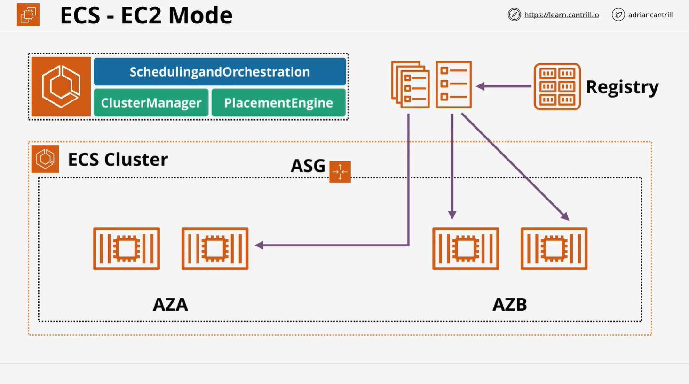
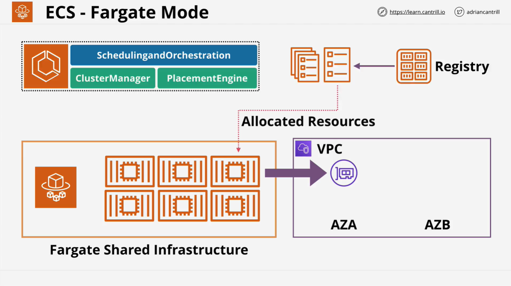
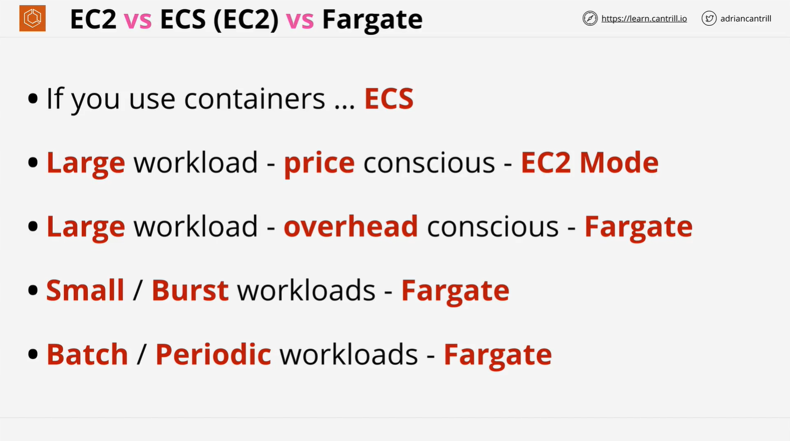

# ECS EC2 vs. Fargate Mode

## Overview

In this lesson, we explore the two different modes available for running containers in Amazon ECS (Elastic Container Service): **EC2 Mode** and **Fargate Mode**. These modes define how much administrative overhead is handled by AWS versus what you need to manage yourself.

- **EC2 Mode**: You manage container hosts as EC2 instances.
- **Fargate Mode**: AWS handles infrastructure, providing a more serverless experience.

## ECS EC2 Mode

### Architecture

- ECS management components handle scheduling, orchestration, and cluster management.
- The ECS cluster runs within a **VPC**, leveraging multiple **Availability Zones (AZs)**.
- You specify an initial **EC2 instance size**, managed by an **Auto Scaling Group**.
- **EC2 instances** act as container hosts.
- **Container registries** store container images, e.g., AWS **ECR** or **DockerHub**.

### Key Characteristics

- ECS handles **task deployment** but does not manage cluster capacity.
- Requires **manual scaling** of EC2 instances.
- Allows usage of **Reserved Instances** and **Spot Instances** for cost optimization.
- You pay for EC2 instances **even when no containers are running**.

### Use Cases

- Suitable when **cost optimization** is a priority.
- Ideal for **large, predictable workloads**.
- Beneficial for organizations already using **EC2 Reserved Instances**.
- Requires **manual management of container hosts**.

## ECS Fargate Mode

### Architecture

- AWS manages a **shared Fargate infrastructure platform**.
- **No EC2 instances** to manage.
- Uses the same **ECS task and service definitions**.
- Containers are deployed into your **VPC** and assigned **Elastic Network Interfaces (ENI)**.

### Key Characteristics

- AWS manages **scaling, availability, and capacity**.
- You only pay for the **compute resources used by containers**.
- **No exposure to underlying EC2 hosts**.
- Tasks and services are **injected into your VPC**.

### Use Cases

- Best for organizations that prioritize **low operational overhead**.
- Suitable for **small, burstable workloads** where demand varies.
- Ideal for **batch processing or periodic workloads**.
- Ensures **automatic scaling** without managing infrastructure.

## Choosing Between EC2 Mode and Fargate Mode

| Criteria            | EC2 Mode                | Fargate Mode                |
| ------------------- | ----------------------- | --------------------------- |
| Cost Control        | Lower (if managed well) | Higher but pay-per-use      |
| Management Overhead | High                    | Low                         |
| Scalability         | Manual                  | Automatic                   |
| Reserved Instances  | Can be used             | Not applicable              |
| Spot Pricing        | Available               | Not available               |
| Use Case            | Large, stable workloads | Small or variable workloads |

## Practical Example - Running a Container in Fargate Mode

In the next lesson, we will implement a **Container of Cats Docker Image** in an **ECS Fargate Cluster**. This practical exercise will reinforce the concepts discussed and prepare you for real-world applications and the AWS certification exam.
