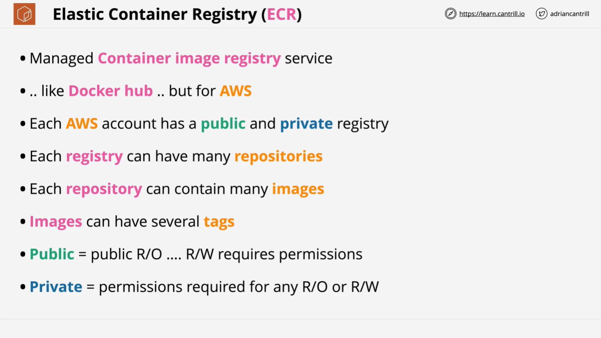
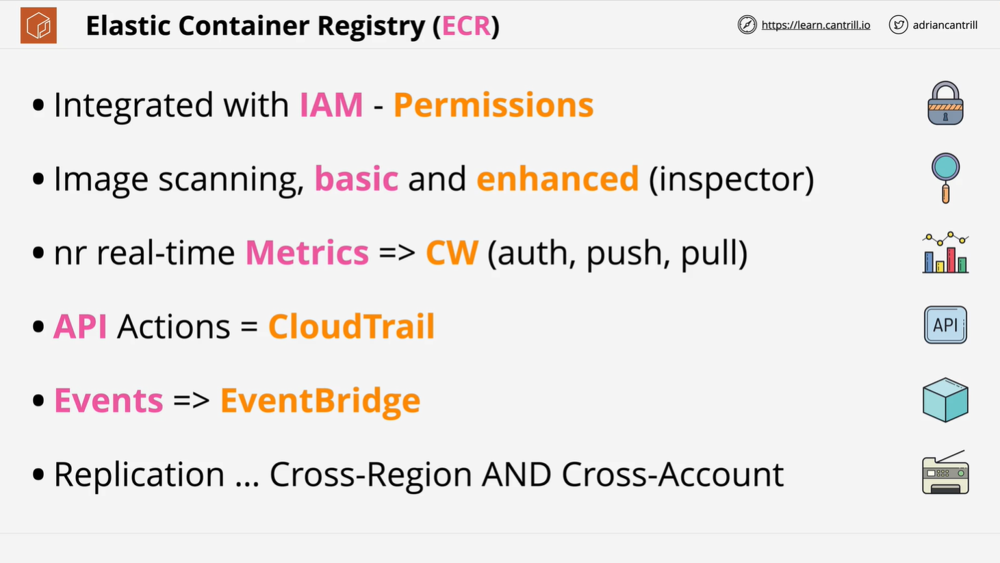

# AWS Elastic Container Registry (ECR) - Summary

## Introduction

This document provides a detailed summary of the AWS Elastic Container Registry (ECR) based on the LearnCantrill.io AWS SA C03 course. The focus is on the theoretical aspects of ECR, its architecture, security, benefits, and integration with other AWS services.

## What is AWS Elastic Container Registry (ECR)?

ECR is a managed container image registry service provided by AWS. It functions similarly to Docker Hub but is specifically designed for AWS environments.

### Key Features:

- Hosts and manages container images for AWS services.
- Supports both **public** and **private** registries.
- Works with container-based services like Amazon ECS and Amazon EKS.

### Structure of ECR:

1. **Registries:** Each AWS account gets one public and one private registry.
2. **Repositories:** Stores container images, similar to repositories in GitHub.
3. **Container Images:** Stored inside repositories and tagged uniquely.

## Public vs. Private Registries

| Feature      | Public Registry                     | Private Registry              |
| ------------ | ----------------------------------- | ----------------------------- |
| Read Access  | Open to everyone                    | Requires permissions          |
| Write Access | Requires permissions                | Requires permissions          |
| Use Case     | Open-source projects, public access | Secure, internal applications |

### Security and Permissions:

- **Public Registry:** Anyone can read (pull) images, but write (push) requires permissions.
- **Private Registry:** Both read and write operations require permissions.
- **IAM Integration:** Access control is managed using AWS IAM.

## Benefits of AWS ECR

### 1. **IAM Integration**

- Uses AWS Identity and Access Management (IAM) for permissions control.
- Granular access policies to restrict or allow access.

### 2. **Security Scanning**

- **Basic Scanning:** Standard vulnerability checks.
- **Enhanced Scanning:** Uses AWS Inspector to scan OS and software package vulnerabilities at a deeper level.

### 3. **Monitoring & Logging**

- **CloudWatch Metrics:** Provides near real-time monitoring.
- **CloudTrail Logs:** Logs all API actions for auditing.
- **EventBridge Integration:** Allows event-driven workflows based on container image actions.

### 4. **Image Replication**

- Supports **cross-region** and **cross-account** replication.
- Useful for global deployments and disaster recovery.

## Practical Usage

- Users will gain hands-on experience with ECR in later sections of the course.
- They will learn to push container images into ECR and pull them for deployments in container-based applications.

## Conclusion

AWS Elastic Container Registry is a powerful tool for managing container images securely within the AWS ecosystem. Its deep integration with IAM, security scanning, logging, and replication features make it a robust choice for both public and private container image storage.
