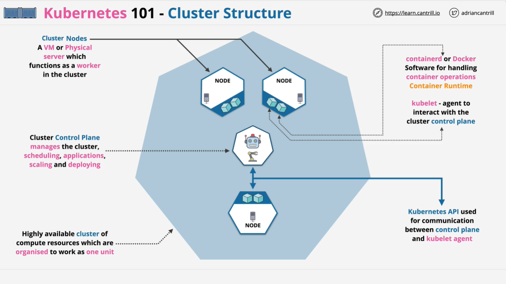
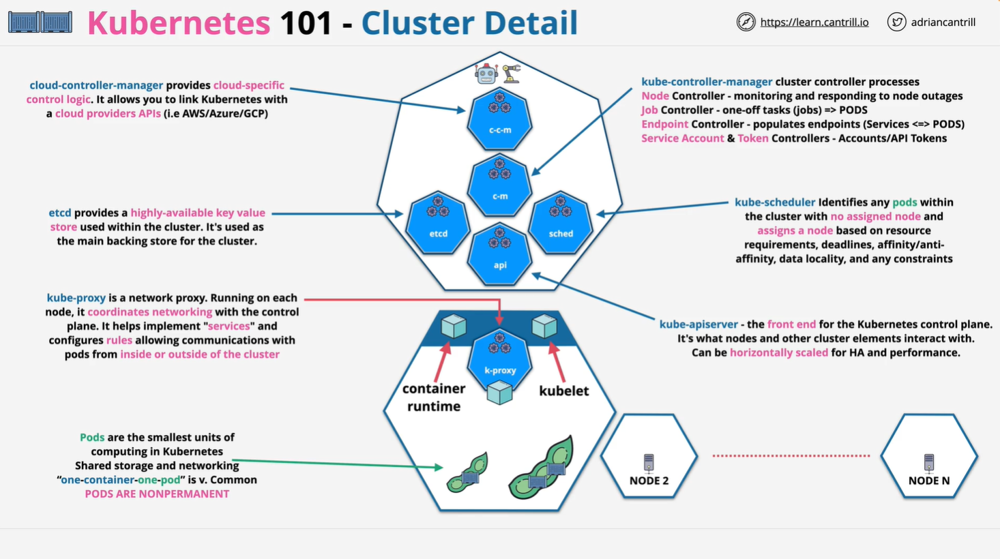
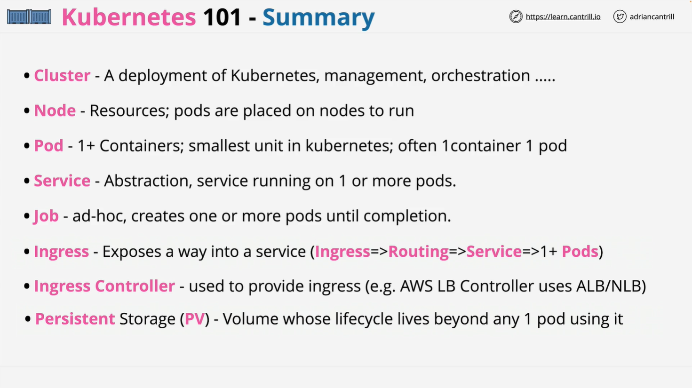

# Kubernetes Fundamentals

## Introduction to Kubernetes

Kubernetes is an open-source container orchestration system designed to automate the deployment, scaling, and management of containerized applications. It ensures efficient resource utilization and exposes applications to the outside world reliably and scalably. Kubernetes is cloud-agnostic, meaning it can run on-premises or within public cloud platforms like AWS, Azure, and GCP.

## Kubernetes Architecture Overview

A **Kubernetes cluster** consists of multiple **compute resources** organized to function as a single unit. The cluster has two primary components:

1. **Control Plane** - Manages the cluster by handling scheduling, scaling, and deployment.
2. **Nodes** - Virtual or physical machines that run containerized applications.

### Core Components of Kubernetes

#### 1. **Nodes**

- Each node contains software such as:
  - **Container Runtime (containerd, Docker, etc.)** - Manages container operations.
  - **Kubelet** - An agent that communicates with the control plane.

#### 2. **Control Plane Components**

- **API Server (kube-apiserver)**: The main control plane interface that handles cluster operations and communication.
- **etcd**: A highly available key-value store that acts as Kubernetes’ primary database.
- **Scheduler (kube-scheduler)**: Assigns pods to available nodes based on constraints like resource needs.
- **Controller Manager (kube-controller-manager)**: Manages various controllers, including:
  - Node Controller - Detects and responds to node failures.
  - Job Controller - Ensures pods complete assigned jobs.
  - Service Account & Token Controller - Manages access control and authentication.
- **Cloud Controller Manager** _(Optional)_: Integrates Kubernetes with cloud providers to manage resources like load balancers.

#### 3. **Pods**

- The **smallest computing unit** in Kubernetes.
- Can contain multiple containers but typically follow a **one-container-per-pod** architecture.
- Pods are **temporary** and can be deleted, evicted, or fail over to another node.

#### 4. **Networking with Kube-Proxy**

- **Kube-Proxy** runs on each node to manage networking and enable communication between services and pods.

## Key Kubernetes Concepts

### **1. Services**

- Services provide a stable endpoint for applications by abstracting the underlying pods.
- They enable communication between different components of an application within the cluster.

### **2. Jobs**

- A **Job** is a one-time task that runs until completion.
- Kubernetes ensures a job executes successfully by retrying if necessary.

### **3. Ingress**

- **Ingress** exposes services to external users.
- It routes external traffic to services within the cluster.
- Requires an **Ingress Controller** to manage traffic rules.

### **4. Persistent Volumes (PVs)**

- By default, Kubernetes storage is **ephemeral**, meaning data is lost if a pod is moved.
- **Persistent Volumes (PVs)** provide long-term storage for applications requiring stateful storage.

## Kubernetes on AWS - Amazon EKS

For AWS users, Kubernetes is implemented via **Elastic Kubernetes Service (EKS)**, a managed Kubernetes service that integrates with AWS services such as IAM, VPC, and CloudWatch.

## Summary

- **Kubernetes orchestrates containerized applications** with automation for deployment, scaling, and management.
- **Clusters consist of a Control Plane and Nodes**, with pods running applications.
- **Pods are the fundamental unit** but are temporary and require additional configurations for persistence.
- **Networking and external access** are managed via Kube-Proxy, Services, and Ingress.
- **Persistent storage** is available through Persistent Volumes.
- **AWS EKS** provides a managed Kubernetes solution for AWS environments.

This summary provides a high-level overview of Kubernetes. More detailed deep-dive videos on AWS EKS and advanced Kubernetes topics may be available in the course.
