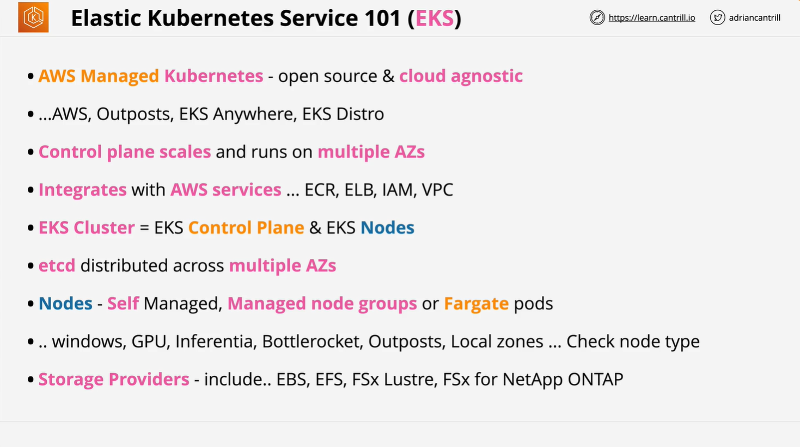
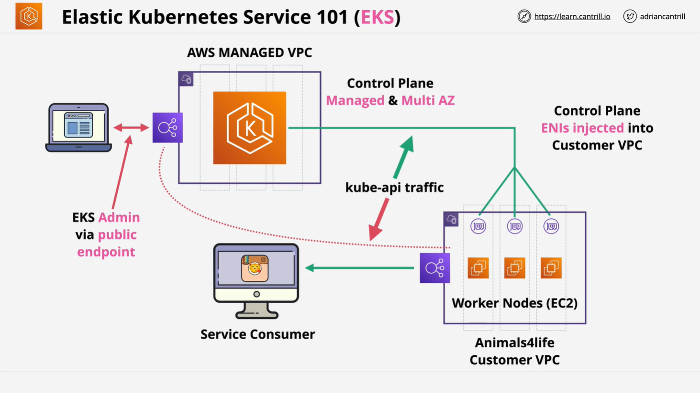

# AWS Certified Solutions Architect - EKS Overview

## Introduction to Amazon Elastic Kubernetes Service (EKS)

Amazon Elastic Kubernetes Service (EKS) is AWS's managed Kubernetes service. It allows users to deploy, manage, and scale Kubernetes clusters without handling the complexities of control plane management.

### Why Use EKS?



- **Managed Kubernetes**: AWS takes care of the Kubernetes control plane.
- **Cloud Agnostic**: Kubernetes remains vendor-neutral, allowing migration across cloud providers.
- **Flexible Deployment**: Run EKS on AWS, AWS Outposts (on-premise), or EKS Anywhere.
- **Integration with AWS Services**:
  - **Elastic Container Registry (ECR)** for storing container images.
  - **Elastic Load Balancers (ELB)** for traffic distribution.
  - **Identity and Access Management (IAM)** for security.
  - **Virtual Private Clouds (VPCs)** for networking.

## EKS Architecture



### Control Plane

- **Managed by AWS**
- **Scales Automatically**
- **Multi-AZ Deployment**
- **Integrated with AWS Networking and Security**

### Nodes

Nodes are the worker machines where Kubernetes runs containerized applications. There are multiple options for deploying nodes:

#### 1. **Self-Managed Nodes**

- Run on EC2 instances.
- Require manual provisioning and lifecycle management.
- Billed based on EC2 pricing.

#### 2. **Managed Node Groups**

- AWS handles provisioning and lifecycle management.
- Still uses EC2 instances but requires less manual maintenance.

#### 3. **AWS Fargate**

- Serverless option where AWS manages compute resources.
- No need to select instance types or handle scaling.
- Uses Fargate profiles to define pod deployment rules.

## Choosing the Right Node Type

| Feature                        | Self-Managed Nodes | Managed Node Groups | AWS Fargate |
| ------------------------------ | ------------------ | ------------------- | ----------- |
| Windows Pods Support           | Yes                | Yes                 | No          |
| GPU Support                    | Yes                | Yes                 | No          |
| Bottlerocket Support           | Yes                | Yes                 | No          |
| Requires Manual EC2 Management | Yes                | No                  | No          |
| Uses AWS Outposts              | Yes                | No                  | No          |
| Serverless                     | No                 | No                  | Yes         |

## Persistent Storage in EKS

By default, Kubernetes storage is ephemeral. To enable persistent storage, EKS supports:

- **Elastic Block Store (EBS)**: High-performance block storage.
- **Elastic File System (EFS)**: Shared, scalable file storage.
- **FSx for Lustre**: High-performance storage for HPC workloads.

## Network & Security Considerations

- **VPC Integration**: Nodes and control plane communicate within a VPC.
- **IAM Policies**: Fine-grained security policies for workloads.
- **Load Balancers**:
  - **Network Load Balancer (NLB)** for high-throughput applications.
  - **Application Load Balancer (ALB)** for HTTP-based routing.

## Fargate Considerations

- **Each pod is isolated**: Separate kernel, CPU, memory, and network resources.
- **Only supports Linux containers**.
- **No support for privileged containers**.
- **Requires private subnets with NAT gateway access**.
- **No support for GPU workloads**.

## Sample Kubernetes Job with TTL Controller

The following YAML defines a Kubernetes job that runs a simple command and gets automatically cleaned up after 60 seconds using the `ttlSecondsAfterFinished` field.

```yaml
apiVersion: batch/v1
kind: Job
metadata:
  name: busybox
spec:
  template:
    spec:
      containers:
        - name: busybox
          image: busybox
          command: ["/bin/sh", "-c", "sleep 10"]
      restartPolicy: Never
  ttlSecondsAfterFinished: 60 # Automatically deletes job after completion
```

### Explanation:

1. **Defines a Kubernetes Job** (`apiVersion: batch/v1`).
2. **Runs a BusyBox container** with a sleep command.
3. **Never restarts pods** (`restartPolicy: Never`).
4. **TTL Controller** ensures job deletion after 60 seconds to avoid unnecessary costs.

## Conclusion

Amazon EKS simplifies Kubernetes deployment and integrates well with AWS services. When selecting a compute option (self-managed, managed nodes, or Fargate), consider factors such as operational overhead, workload requirements, and cost efficiency. Persistent storage options and security configurations must also align with application needs.
