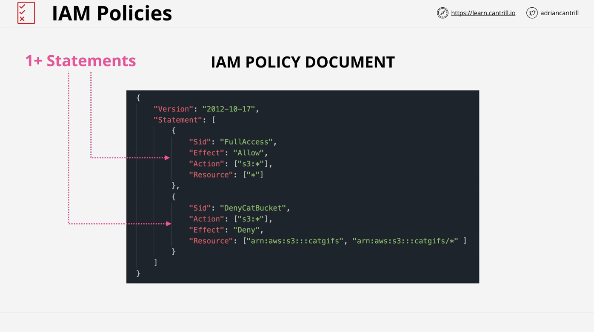
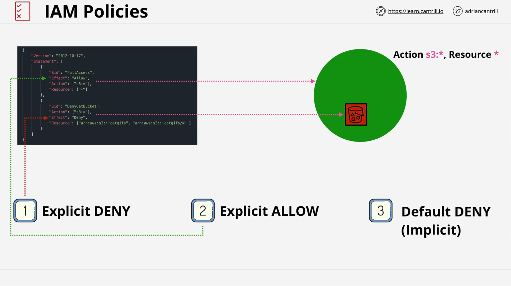
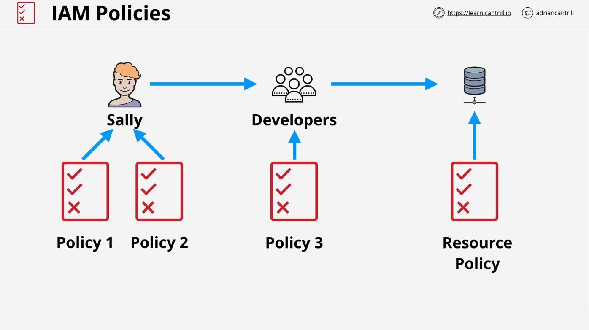
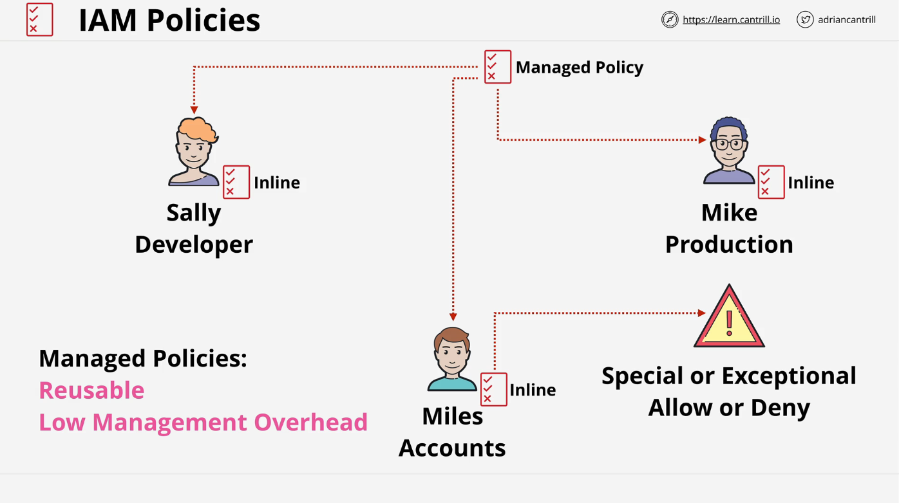

# AWS IAM Policies

Identity Policies in AWS control access to resources by attaching permissions to identities such as IAM users, groups, and roles. These policies either **allow** or **deny** access to AWS services and resources.

In this lesson, we walk through the essential components of IAM policies and how AWS processes these permissions. Understanding IAM policies is crucial for the **AWS Certified Solutions Architect Exam (SA-C03)** and for managing secure AWS environments.

## Understanding IAM Policies

**IAM Policies** are JSON-based documents attached to AWS identities. These policies control access to AWS services and resources through specific rules. To interact with AWS resources, an identity must authenticate and then have policies that explicitly allow or deny specific actions.

**Key Points:**

- IAM policies are attached to users, groups, and roles.
- Policies are written in JSON and contain one or more statements.
- AWS evaluates the policies based on the actions the identity is trying to perform on a resource.

## IAM Policy Architecture

IAM policy documents consist of **statements**, and each statement grants or denies permissions.

### Statement Structure

A policy statement is composed of the following elements:

1. **Statement ID (SID)**: An optional identifier for a policy statement. It describes the action's purpose.
2. **Action**: Defines what actions (operations) are allowed or denied, e.g., `s3:PutObject`. It can specify a single action, a wildcard (`s3:*`), or a list of specific actions.
3. **Resource**: Specifies the AWS resources the policy applies to, using the Amazon Resource Name (ARN) format.
4. **Effect**: Describes whether the action is allowed or denied (`Allow` or `Deny`).

### Effect: Allow or Deny

The **effect** determines the behavior of the policy:

- **Allow**: Grants permission to the action on the specified resource.
- **Deny**: Denies permission, preventing access to the resource.

## Policy Evaluation Order

When an identity attempts to perform an action on an AWS resource, AWS evaluates all the policies attached to that identity. The evaluation follows this order of priority:

1. **Explicit Deny**: If any policy explicitly denies access to a resource, that denial takes precedence over any allows.
2. **Explicit Allow**: If there’s no deny, an explicit allow will grant access to the resource.
3. **Implicit Deny**: If no policy explicitly allows access, the default behavior is to deny.

This priority order is summed up as: **Deny, Allow, Deny**. This rule is crucial for understanding AWS policy behavior in both exams and real-world applications.

## Handling Multiple Policies

An identity can have multiple policies attached, either directly (user policy) or through group memberships. AWS collects all the policies that apply to a user or resource, then evaluates them collectively using the **Deny, Allow, Deny** rule.

### Example:

- Sally is a developer with two policies attached to her identity.
- She is also part of a group with its own policy.
- AWS evaluates all the policies (from the user and group) simultaneously. If an explicit deny exists, it overrides any allows, and if no explicit allow exists, an implicit deny applies.

## Inline vs. Managed Policies

There are two main types of IAM policies: **Inline Policies** and **Managed Policies**.

### Inline Policies

**Inline policies** are directly attached to a specific identity (user, group, or role). These policies are **unique** to that identity. However, using inline policies can result in higher management overhead if policies need to be updated for multiple users.

- **Use case**: Inline policies are typically used for exceptions or special access cases for individual identities.

### Managed Policies

**Managed policies** are reusable policy documents that can be attached to multiple identities. They are highly scalable and lower in management overhead.

Managed policies are preferred for:

- Granting **standard operational access** to many users.
- **Easier management** when policies need to be updated across multiple users.

#### AWS Managed Policies

AWS provides pre-built managed policies that cover common use cases. These are managed by AWS and cannot be modified.

#### Customer Managed Policies

Organizations can create and manage their own policies to tailor access according to business requirements.

### Summary:

In this lesson, we covered the fundamentals of IAM identity policies and how AWS evaluates them. We discussed the structure of policy statements, the evaluation order for allows and denies, and the difference between inline and managed policies. Understanding these principles is key to both passing the AWS Certified Solutions Architect exam and managing secure AWS environments effectively.
