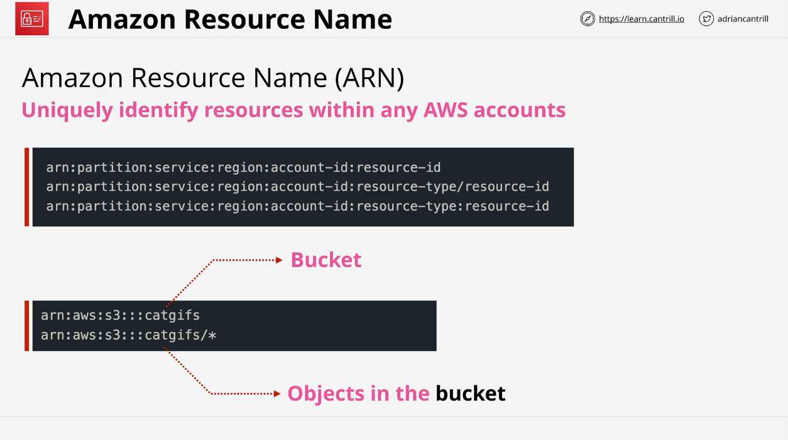

# IAM Users and AWS IAM Architecture (AWS SA-C03)

## Overview

IAM (Identity and Access Management) Users are one of the core identity types available in AWS. They are ideal when you need to assign access to a single individual or entity, such as a person, an application, or a service account. This lesson provides a detailed explanation of IAM users, how they authenticate, and how AWS resources are identified using ARNs (Amazon Resource Names).

## IAM Users Overview

- **Definition**: IAM users represent identities in AWS that require long-term access. These can be used for:
  - **Humans**: People such as James (Accounts), Mike (Architecture), or Miles (Development).
  - **Applications**: For example, a backup application running on a laptop.
  - **Service Accounts**: If a service account needs access to AWS resources.

### Key Concepts:

- **Principle**: An entity (person, computer, or service) trying to access AWS resources. Initially, this is an unidentified entity.
- **Authentication**: The process of verifying that a principle is indeed the identity it claims to be. IAM users authenticate using:
  - **Username and Password**: For console access.
  - **Access Keys**: For programmatic access or command-line tools.
- **Authorization**: After authentication, AWS checks which policies apply to the authenticated identity and whether the identity is authorized to perform the requested action.

## Authentication Process


1. **Principle**: A person or application attempts to access AWS resources.
2. **Authentication**: The principle provides credentials (username/password or access keys) to prove its identity.
3. **Authenticated Identity**: Once AWS verifies the credentials, the principle becomes an authenticated identity.
4. **Authorization**: AWS checks the policies attached to the identity to determine if the action (e.g., uploading to S3 or terminating an EC2 instance) is allowed.

## ARNs (Amazon Resource Names)



ARNs uniquely identify resources in AWS, allowing for unambiguous interaction through the CLI or API.

### Format of ARNs:

An ARN is structured as follows:

```plaintext
arn:partition:service:region:account-id:resource
```

### Example Breakdown:

- **Partition**: The AWS environment (usually `aws`). For example, resources in the China region use `aws-cn`.
- **Service**: The AWS service, such as `s3`, `iam`, or `ec2`.
- **Region**: The region where the resource resides (optional for global resources like S3).
- **Account ID**: The AWS account number that owns the resource (optional for globally unique services like S3).
- **Resource**: The specific resource being referenced (e.g., an S3 bucket or EC2 instance).

### ARN Usage in Policies

ARNs are often used in IAM policies to specify resources that a policy applies to. Policies can allow or deny actions on specific resources.

#### Example:

- **Bucket ARN**: `arn:aws:s3:::cat-gifs-bucket`
  - Refers to the S3 bucket itself.
- **Object ARN**: `arn:aws:s3:::cat-gifs-bucket/*`
  - Refers to all objects inside the bucket, but not the bucket itself.

### Common ARN Mistakes:

- Confusing the bucket ARN with the object ARN. Actions on buckets (e.g., create bucket) require the bucket ARN, while actions on objects (e.g., put object) require the object ARN with the wildcard.

## IAM Users and Limitations

### Key Limits:

- **Maximum 5,000 IAM users per AWS account**.
  - IAM is a global service, so this limit applies across all regions.
- **IAM users can be part of up to 10 IAM groups**.

### Design Considerations:

- If you need more than 5,000 identities, IAM users might not be the right choice. Instead, consider:
  - **IAM Roles**: For applications, service accounts, or other AWS resources.
  - **Identity Federation**: For integrating existing identities from external identity providers.

### Federation vs. IAM Users:

- For large organizations or internet-scale applications, using Federation or IAM roles is often the right solution rather than creating an IAM user for each identity.

## Exam Power-Up


- Remember the **5,000 user limit**: If an exam question discusses more than 5,000 users or an application with millions of users, creating individual IAM users is not the correct answer. Instead, look for answers involving Federation or IAM roles.

---

This lesson covered the architecture of IAM users, authentication and authorization processes, ARNs, and key limitations. Understanding these concepts will help you in the AWS exam and in building scalable, secure solutions in AWS.

### Next Steps:

Proceed to the next video in the course to continue learning about IAM roles, Federation, and other AWS identity management solutions.
