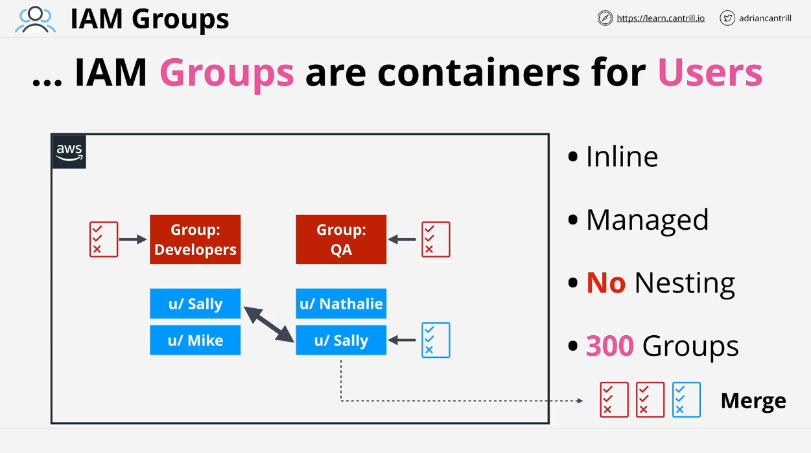

# AWS Certified Solutions Architect - IAM Groups Overview

This section covers **IAM Groups** in AWS, their functions, limitations, and common scenarios that you may encounter in the AWS Certified Solutions Architect Associate (SAA-C03) exam.

## What are IAM Groups?

An **IAM Group** is a container used to organize **IAM Users**. Groups allow for easier management of large sets of users by assigning common permissions to multiple users simultaneously.

### Key Features:

- **No Credentials**: IAM groups do not have credentials of their own, so you cannot log into an IAM group. Exam questions may try to confuse you on this point, but remember that you can only log in as an **IAM user**, not as a group.
- **Multiple Group Membership**: An IAM user can belong to multiple groups. For example, a user can be a member of both a "developers" group and a "QA" group.

### Example:

Imagine an AWS account with the following groups:

- **Developers Group**: Contains users _Sally_ and _Mike_.
- **QA Group**: Contains users _Sally_ and _Natalie_.

In this case, _Sally_ is part of both the **Developers** and **QA** groups. This is a critical concept to remember for the exam.

## Benefits of Using IAM Groups

IAM groups offer two primary benefits:

### 1. **Effective User Management**

- Groups help organize users by teams, roles, or other criteria. You can create groups to represent departments or projects and assign users accordingly. This simplifies the management of permissions.

### 2. **Policy Attachment**

- **Policies** (both **in-line** and **managed**) can be attached to IAM groups.
- When a user is added to a group, they inherit all the permissions associated with that group.
- For example, if _Sally_ is a member of the **Developers Group** (which has a policy attached) and also the **QA Group** (with another policy), she inherits permissions from both groups. In addition, she may have **directly attached policies** as well.

#### Policy Combination Example:

- _Sally_ has three sources of permissions:
  - **Developers Group Policy**
  - **QA Group Policy**
  - **Sally’s Direct Policy**

AWS evaluates all these policies together to determine what actions _Sally_ is allowed or denied.

## Policy Evaluation

When evaluating whether an IAM user can perform an action, AWS considers:

- **Direct Policies** attached to the user.
- **Policies from Group Memberships**.

If an IAM user is part of multiple groups, all policies (including both "allow" and "deny" statements) are collected and evaluated together. The usual **allow-deny** rule applies—denies take precedence over allows.

## IAM Group Limitations

While IAM groups help with user management, there are important limitations:

### 1. **No Nested Groups**

- You **cannot nest IAM groups**. A group can only contain users, not other groups.

### 2. **Group Limits**

- There is a limit of **300 groups per AWS account**, but this can be increased with a support request.
- Users can belong to **up to 10 groups**, and there is a hard limit of **5,000 IAM users** per account.

### 3. **No "All Users" Group**

- Unlike some identity management systems, IAM does not provide a built-in "All Users" group. If needed, you would have to manually create a group and add all users to it.

## Resource Policies and IAM Groups

**Resource Policies** allow access control at the resource level (e.g., for S3 buckets), and they can reference IAM users and roles by using their **Amazon Resource Name (ARN)**.

### Important Limitation:

- **IAM Groups** cannot be referenced in **resource policies**. Resource policies can only grant access to **IAM users** or **IAM roles**—not to IAM groups.

For instance, you cannot attach a policy to an S3 bucket that grants access to the "Developers Group" directly. You would need to grant access to individual IAM users in that group instead.

## Summary of Key Points

- **IAM Groups** help manage permissions for multiple users, but you cannot log into them, and they don’t have credentials.
- Groups allow you to attach policies that are inherited by all users in that group.
- IAM groups cannot be referenced in **resource policies** (e.g., S3 bucket policies).
- There are limits on the number of groups and users in an account.
- IAM groups simplify user management but have strict limitations, such as no nesting and no built-in "all users" group.

This lesson highlights the key details of IAM Groups, their functionality, and limitations, which are essential for both the AWS Solutions Architect certification exam and real-world implementations.
