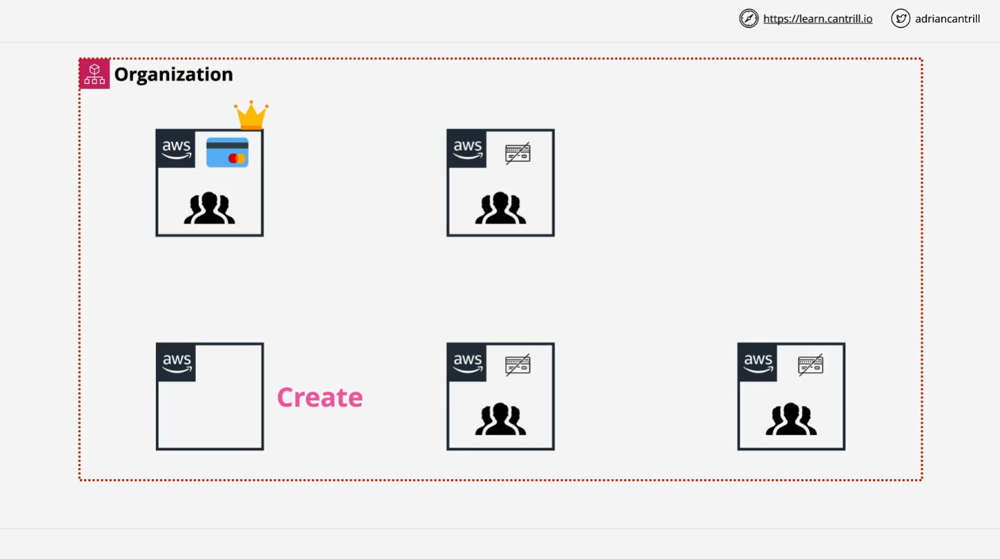

# AWS SA-C03 - AWS Organizations Summary

## Overview

**AWS Organizations** is a tool designed to help larger organizations manage multiple AWS accounts in a scalable, cost-effective way with minimal administrative overhead. It enables the central management of multiple accounts, consolidated billing, and policy enforcement across accounts. This guide provides a detailed overview of AWS Organizations, its features, benefits, and best practices.

## Key Concepts

### 1. Setting Up an AWS Organization

An AWS organization starts with a **standard AWS account** that you use to create the organization. This initial account becomes the **management account** (formerly called the "master account"):

- **Management Account**: The central account with elevated permissions used to manage the organization. It holds financial and administrative control over the organization.
- **Member Accounts**: Standard AWS accounts that join the organization. They have limited control, as the management account handles their billing and permissions.

### 2. Organizational Structure

AWS Organizations enables you to group and structure accounts hierarchically to represent various business units, functions, or stages of development. The structure is organized as an **inverted tree** with the following components:

- **Root**: The top-level container within the organization that can contain accounts and Organizational Units (OUs).
- **Organizational Units (OUs)**: Containers within the organization that help group accounts based on function, department, or application lifecycle. OUs can be nested to create multiple levels for flexible account management.

> **Note**: The organizational root container should not be confused with the root user of an AWS account. It’s simply a container that houses accounts and OUs at the top of the hierarchy.

### 3. Consolidated Billing

One of the primary features of AWS Organizations is **consolidated billing**, which simplifies the financial management of multiple accounts:

- **Single Billing**: All member accounts’ usage and billing details are consolidated into a single monthly bill in the management account, also known as the "payer account."
- **Cost Benefits**: Consolidated billing pools usage across accounts, which can lead to discounts on certain AWS services, such as Reserved Instances, and can reduce overall costs.

### 4. Service Control Policies (SCPs)

AWS Organizations uses **Service Control Policies (SCPs)** to enforce permissions across all accounts within the organization:

- SCPs allow you to **restrict actions** that accounts within an organization can perform, enforcing security and compliance policies.
- SCPs apply at the organizational root, OU, or account level and can be configured in a "deny" list approach, which restricts actions that would otherwise be permitted.

SCPs are a crucial security feature and will be covered in further detail in dedicated lessons.

## Account Management in AWS Organizations

### Inviting and Creating Accounts

1. **Inviting Existing Accounts**:
   - You can invite standard AWS accounts to join your organization. These accounts must accept the invitation to become member accounts.
2. **Creating New Accounts**:
   - Organizations allows you to create new accounts directly, bypassing the invitation process. Each new account requires a unique email address.

### Best Practices for User Management

With AWS Organizations, it is recommended to avoid creating individual IAM users in each account. Instead, use centralized identity management:

1. **Centralized Login Account**:
   - Use a single login account (often the management account) to handle identity management. Larger organizations may choose to dedicate a separate account solely for login purposes.
2. **IAM Roles for Access**:
   - Use IAM roles to enable access to other accounts within the organization. Users log into the centralized account and use role-switching to assume roles in other accounts.
3. **Identity Federation**:
   - AWS Organizations supports identity federation, allowing existing corporate identities to access the centralized login account. This approach uses external identity providers to manage login and permissions.

## Example Workflow: Creating an AWS Organization Structure

In this example, the initial setup involves three accounts:

1. **General Account**: Serves as the management account for the organization.
2. **Production Account**: An existing account invited to join as a member.
3. **Development Account**: A new account created within the organization for development purposes.

This setup allows for the centralized management of multiple environments (e.g., production, development), unified billing, and secure policy enforcement.

## Summary

AWS Organizations is a powerful tool for businesses managing multiple AWS accounts, offering centralized billing, hierarchical structuring, and policy enforcement. Key benefits include:

- **Centralized Billing and Cost Optimization**: Unified billing and pooled usage for discounts.
- **Flexible Account Structure**: Organizational units and hierarchical grouping enable efficient resource management.
- **Security and Compliance with SCPs**: Service control policies provide organization-wide control over permissions and actions.

### Next Steps

The next lesson includes a practical demo where you’ll set up an AWS organization, add accounts, and explore key features like consolidated billing and SCPs. This foundational knowledge will be essential for managing accounts in production environments and for AWS certification preparation.
