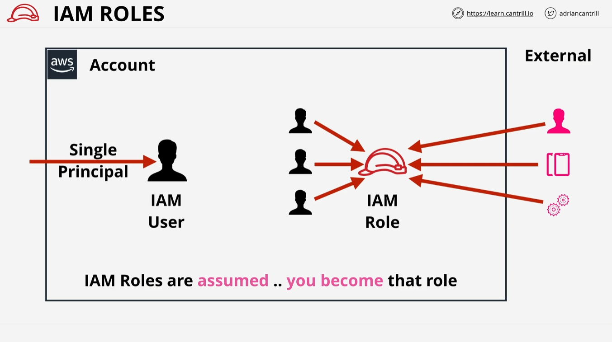
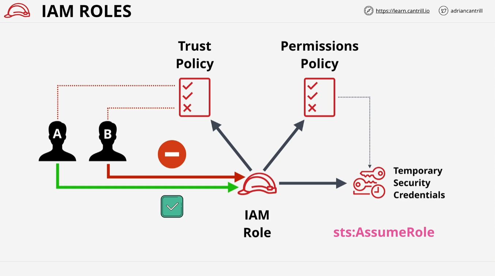

# AWS IAM Roles - LearnCantrill.io AWS SA-C03

## Introduction

Welcome to this lesson on **AWS IAM Roles**, part of the AWS Solutions Architect course by LearnCantrill.io. Over the next two lessons, we will dive deep into one of the more complex identity topics in AWS: **IAM Roles**. This guide will walk through how roles work, their architecture, and how to technically use them.

In the following lesson, we'll compare roles to **IAM users**, providing clarity on when and why you should use an IAM role in specific scenarios. It's recommended to watch both lessons back-to-back for a complete understanding.

## What is an IAM Role?

An **IAM role** is one type of identity that exists within an AWS account. The other identity type, which we’ve already covered, is the **IAM user**. Both users and roles fall under the category of "principals," which represent entities (e.g., people, applications, or processes) that authenticate with AWS.

### Key Differences between IAM Users and IAM Roles

- **IAM Users**: Generally represent a single principal (like one person or application).
- **IAM Roles**: Are designed for situations where multiple or an unknown number of principals may need access.

If you can’t identify the number of principals that need access, or if you have a large number (over 5,000), then an IAM role is more appropriate than an IAM user. Another crucial distinction is that roles are typically used **temporarily**, unlike IAM users who have long-term credentials.

### Use Case for IAM Roles

IAM roles are suited for scenarios where:

- Multiple AWS users or services (inside or outside the account) need access.
- You cannot specify a fixed number of users or applications using the identity.
- Temporary access is required for applications, services, or other AWS accounts.

## How IAM Roles Work

IAM roles do not represent a specific person or entity long-term. Instead, a role represents a **set of permissions** that a principal can assume temporarily. When an identity (human, service, or application) assumes a role, they "become" that role and inherit its permissions for a limited time.

### Assumption of Roles

When an identity assumes an IAM role, they gain access to any permissions the role has. For example, an external mobile app can assume a role in your AWS account and temporarily access resources like an S3 bucket.

### Temporary Credentials

AWS generates **temporary security credentials** for identities that assume a role. These credentials:

- Expire after a set time.
- Must be renewed by re-assuming the role.

Temporary credentials behave similarly to long-term **access keys**, but are only valid for short periods. Every time these temporary credentials are used, they are checked against the **role’s permissions policy**.

## Policies Associated with IAM Roles

IAM roles have two primary policies attached to them:

1. **Trust Policy**: Controls which identities (users, applications, or services) are allowed to assume the role. This can reference:

   - IAM users or roles in the same AWS account.
   - AWS services like EC2.
   - External identities (e.g., users in other AWS accounts, or federated identities such as Google or Facebook users).

   Example: Identity A is allowed to assume the role, while Identity B is denied based on the trust policy configuration.

2. **Permissions Policy**: Dictates what actions the assumed role can perform on AWS resources. This policy grants permissions to resources like S3, EC2, etc.

### Trust and Permissions Flow

Once an identity is permitted by the trust policy to assume a role, AWS issues temporary credentials. These credentials are evaluated against the **permissions policy** to determine which resources and actions the identity can perform. If the permissions policy changes, the temporary credentials’ access to resources also changes.

## Resource Policies and IAM Roles

IAM roles can also be referenced in **resource policies**. For instance, if a resource policy grants a role access to an S3 bucket, then any identity that assumes that role can access that S3 bucket. This is a powerful feature when managing cross-account access and multi-account environments.

## Roles in AWS Organizations

IAM roles play a vital role in **AWS Organizations**, where multiple AWS accounts are managed as a single entity. Roles allow for **cross-account access** without needing to log into each account individually. For example, once logged into one account in an organization, you can assume a role to access resources in another account without needing to re-authenticate.

## Secure Token Service (STS) and IAM Roles

When an identity assumes a role, AWS uses a service called **Secure Token Service (STS)** to generate temporary credentials. The operation involved in assuming a role is known as `sts:AssumeRole`.

## Conclusion

In this lesson, we’ve focused on the technical aspects of IAM roles:

- **What roles are** and how they differ from IAM users.
- **How roles work**, including trust and permissions policies.
- **Temporary credentials** generated by assuming a role and their expiration.

In the next lesson, we will explore specific scenarios where IAM roles are most effectively used, which will help clarify when and when not to use roles in real-world AWS environments.

### Next Steps

Once you complete this lesson, proceed to the next video to deepen your understanding of IAM roles with practical scenarios.
