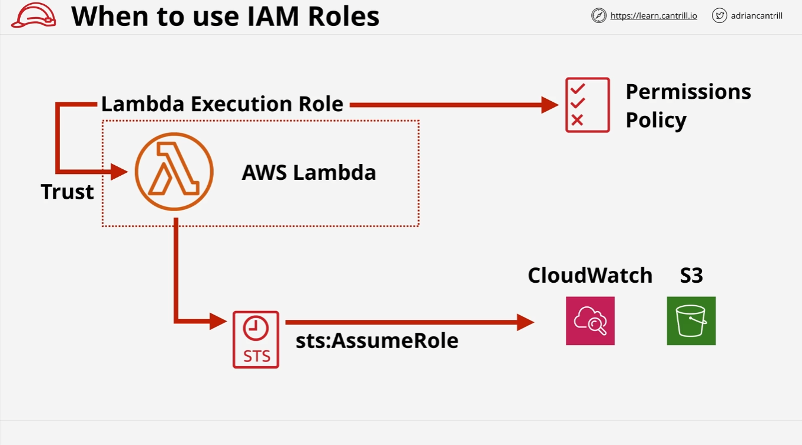
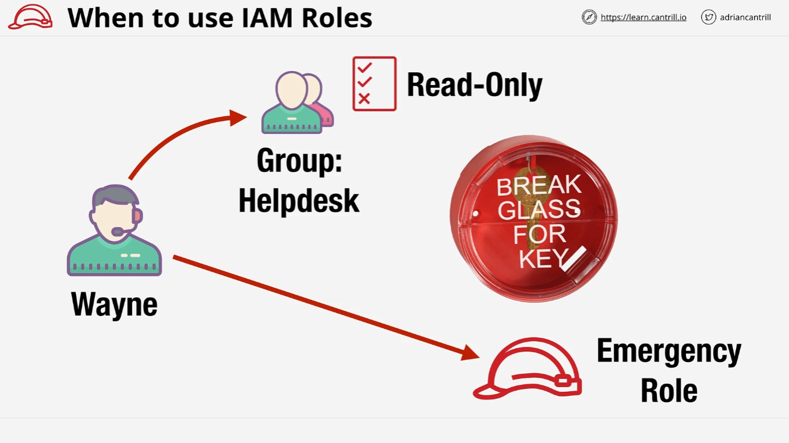
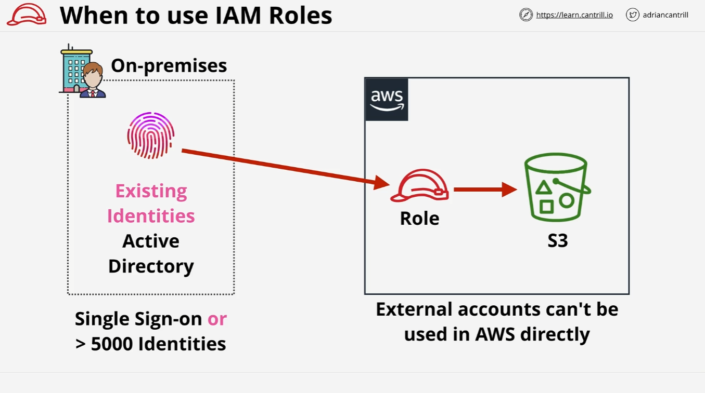
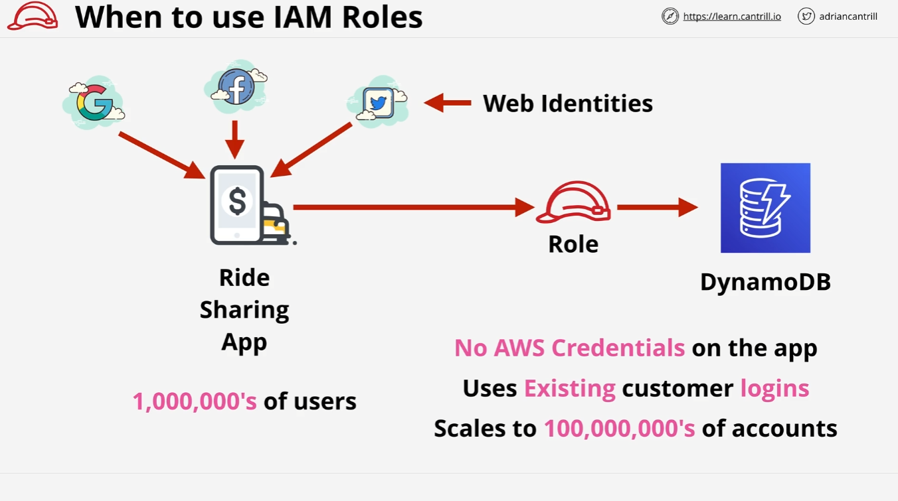
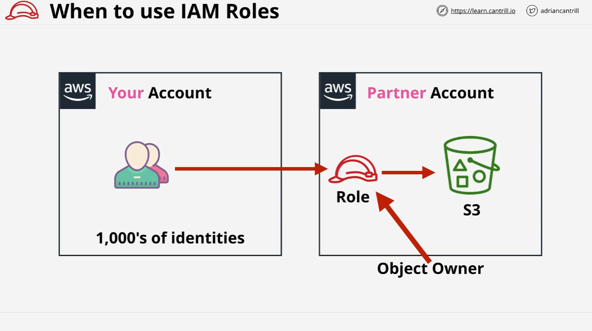

# IAM Roles Use Cases

In this lesson, we’ll explore specific scenarios where IAM roles are useful within AWS. Understanding these situations is key for real-world AWS usage and exam readiness. Let’s dive into the details of where and when to use IAM roles instead of other identity types like IAM users.

## AWS Services Needing Permissions: Lambda Example

One of the most common uses of IAM roles is with AWS services themselves, such as **AWS Lambda**.

- **Lambda Function**: A "function-as-a-service" product that allows you to run code without managing servers. The code might need to interact with other AWS resources, like starting EC2 instances or processing data.
- **Permissions**: A Lambda function doesn’t have permissions by default. Instead of hard-coding access keys into the function (a security risk), you assign a **Lambda execution role**.

### How it Works

1. **IAM Role**: The execution role trusts the Lambda service (via trust policy).
2. **Temporary Credentials**: When the Lambda function is invoked, the role is assumed, and **AWS STS** generates temporary security credentials.
3. **Access Control**: The temporary credentials allow the Lambda runtime environment to access AWS resources, based on the role’s permission policy.

### Why Use Roles?

- **Security**: Avoids the security risk of hard-coded access keys.
- **Flexibility**: Handles multiple invocations of the Lambda function efficiently (whether it's 1 or 100).
- **Short-term Permissions**: The temporary credentials expire after the task is complete.

## Break-Glass Situations: Emergency Access

Another scenario is handling emergency situations where elevated permissions are temporarily needed.

- **Example**: Wayne, who works on the service desk team, typically has **read-only access** to AWS resources.
- **Emergency Scenario**: Occasionally, Wayne might need additional permissions (e.g., stopping an EC2 instance at 3 AM).

### Break-Glass Role

- **Design**: Wayne’s team doesn’t have permanent access to risky operations but can assume an **emergency role** if needed.
- **Logging and Control**: The role assumption is logged, and Wayne’s regular permissions remain minimal to ensure security.

This "break-glass" mechanism ensures that elevated permissions are only granted in rare, controlled situations, protecting both the user and the system.

## Corporate Environments and Identity Federation

IAM roles are essential when integrating AWS with **existing corporate environments**. A typical setup involves reusing corporate identities with AWS services.

### Scenario: Active Directory Integration

- **Existing Identity Provider**: The business uses **Microsoft Active Directory** (AD) for login purposes.
- **SSO (Single Sign-On)**: Staff can use their AD credentials to access AWS through **Identity Federation**.

### Why Use Roles?

- **Limitations**: AWS imposes a limit of 5,000 IAM users per account. Roles help bypass this limitation by allowing external identities (e.g., AD users) to assume roles in AWS.
- **Scaling**: Roles are easier to manage and scale compared to individual IAM users, especially in environments with more than 5,000 staff.

## Web Identity Federation: Mobile Applications

Roles are also crucial for large-scale mobile applications that need to interact with AWS resources, such as a ride-sharing app with millions of users.

- **Challenge**: The application needs access to AWS services (e.g., DynamoDB) but cannot create an IAM user for each mobile user due to the 5,000 user limit.

### Web Identity Federation

- **Federation**: Users can log in using web identities like **Facebook**, **Google**, or **Twitter**.
- **Role Assumption**: Once authenticated, these identities can assume an IAM role, gaining temporary credentials to access AWS resources.

### Benefits

- **Security**: No AWS credentials are stored in the mobile app.
- **Scalability**: This architecture scales to millions of users, avoiding the IAM user limit.
- **User Experience**: Customers use existing social accounts, improving user experience.

## Cross-Account Access

IAM roles simplify **cross-account access**, especially in multi-account setups or when collaborating with external partners.

### Scenario: Partner Account and S3 Access

- **Your Account**: Your team needs to upload data to an S3 bucket in a partner’s AWS account.
- **Solution**: The partner creates an IAM role in their account that your users can assume. Temporary credentials are generated, allowing access to the S3 bucket.

This method ensures secure and efficient cross-account collaboration without creating IAM users in the partner's account for your team.

## Conclusion

IAM roles are fundamental in various AWS scenarios, particularly for:

- AWS services (e.g., Lambda)
- Emergency access (break-glass situations)
- Corporate environments with identity providers (e.g., Active Directory)
- Large-scale mobile applications (using Web Identity Federation)
- Cross-account access in multi-account setups

Roles allow you to manage permissions securely, avoid hard-coded credentials, and scale your environment efficiently. As you progress through the course, these concepts will become second nature with more hands-on practice.
