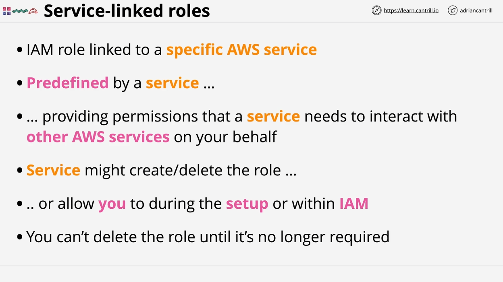
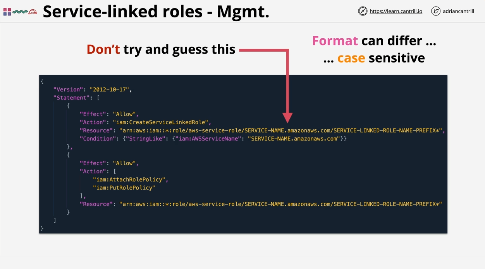
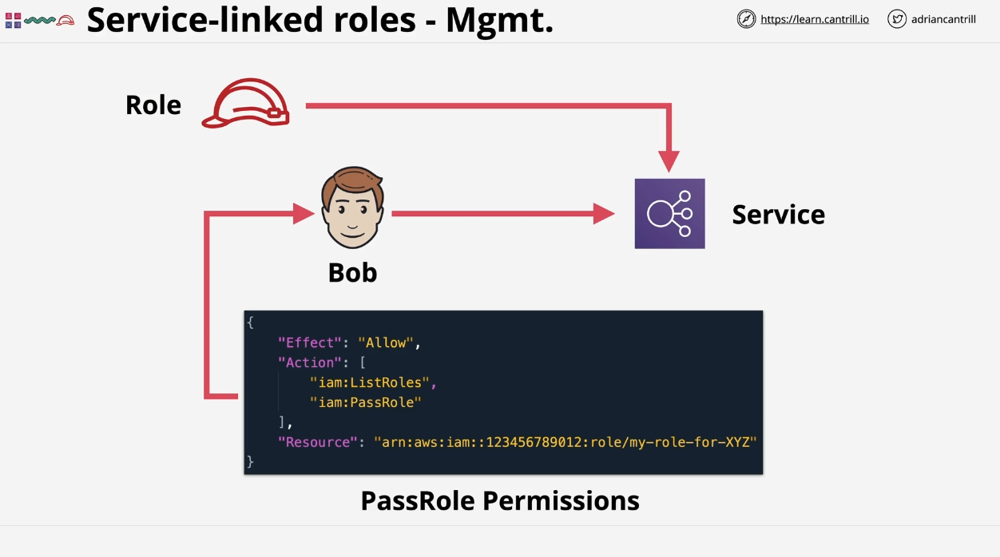

# AWS SA-C03 - Service-Linked Roles Summary

## Overview



A **Service-Linked Role** is a specialized IAM role directly associated with a specific AWS service. These roles have predefined permissions that allow the service to interact with other AWS services on behalf of the user. The creation, modification, and deletion of these roles are managed by the service itself and may vary depending on the specific service.

The key characteristics of a Service-Linked Role are:

1. **Predefined Permissions**: The service defines the permissions required to perform actions on other AWS services.
2. **Role Management**: The AWS service can automatically create or delete the role, or allow the user to manage the role through IAM or within the service's setup process.
3. **Deletion Restrictions**: You cannot delete a service-linked role unless it is no longer being used by the associated service.

More details can be found in the [official AWS documentation](https://docs.aws.amazon.com/IAM/latest/UserGuide/using-service-linked-roles.html).

## Key Concepts

### Creation and Management of Service-Linked Roles



- **Automatic Creation**: AWS services may automatically create a service-linked role when needed.
- **Manual Creation**: You might be allowed to create a service-linked role during the setup of a service or manually through IAM.

For example, if you are setting up an AWS service that requires a service-linked role, the role might be created for you automatically, or the service might guide you through the process of creating one. In some cases, you will need to manually create the role through IAM with a policy like the one shown below.

### Example Policy for Creating Service-Linked Roles

```json
{
  "Version": "2012-10-17",
  "Statement": [
    {
      "Effect": "Allow",
      "Action": "iam:CreateServiceLinkedRole",
      "Resource": "arn:aws:iam::account-id:role/service-linked-role-name"
    }
  ]
}
```

**Important Note**: The `service-name.amazonaws.com` in the policy is specific to the AWS service and is case-sensitive. It’s crucial not to guess the name, as formatting can vary between services.

### Role Deletion

A **Service-Linked Role** can only be deleted once it is no longer in use by its associated service. This ensures that you don't accidentally remove a role that is critical for an AWS service's operation.

## Role Separation



**Role Separation** refers to the practice of separating responsibilities across different job roles. For example, one team might be responsible for creating IAM roles, while another team may only have permission to use the roles.

### PassRole Permissions

To allow a user (e.g., Bob) to use an existing role without modifying or creating it, you can assign **PassRole** permissions. This allows Bob to pass an existing role into an AWS service, but he won't have permissions to create or modify roles.

An example policy for **PassRole** might look like this:

```json
{
  "Version": "2012-10-17",
  "Statement": [
    {
      "Effect": "Allow",
      "Action": "iam:PassRole",
      "Resource": "arn:aws:iam::account-id:role/service-role-name"
    }
  ]
}
```

With this permission, Bob can configure an AWS service using a role that has already been created by another team.

## Real-World Application of PassRole

One common use case for **PassRole** is with **CloudFormation**. Normally, when you create a CloudFormation stack, it uses the permissions of your IAM identity. However, you can assign a specific role for CloudFormation to use, which may have broader permissions than your own. This allows for greater flexibility in defining which AWS resources the stack can create.

## Key Takeaways

- **Service-Linked Roles** simplify the process of assigning permissions for specific AWS services to interact with other AWS services on your behalf.
- They are automatically created, managed, and deleted by the service itself, but you can manually manage them in some cases.
- **PassRole** is a powerful security feature that allows users to pass roles into AWS services, enabling role separation and limiting the permissions required by individual users.

By understanding these concepts, you can better manage access and permissions in AWS, ensuring secure and efficient interactions between AWS services and IAM roles.

## Conclusion

Service-linked roles are a specific type of IAM role designed to be tightly coupled with AWS services. They follow similar principles to regular roles but are managed more directly by the associated service. It is essential to understand their unique creation and deletion processes, as well as how **PassRole** fits into the larger AWS security architecture.

This lesson builds upon your foundational knowledge of IAM roles, and you'll encounter service-linked roles in practical demos throughout the course.
