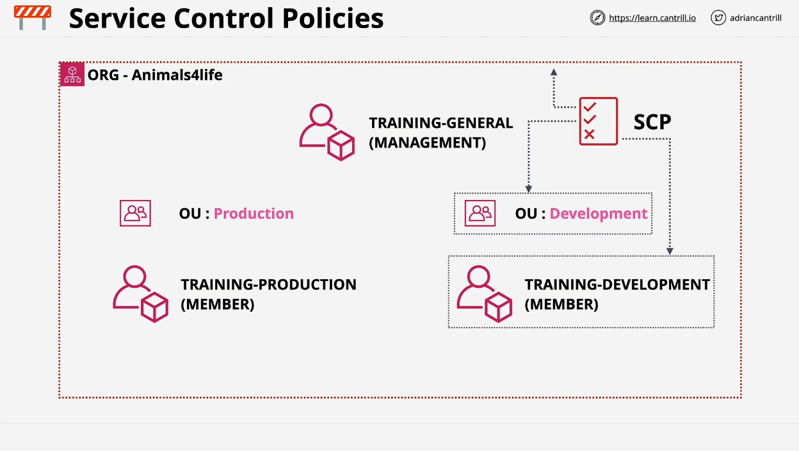
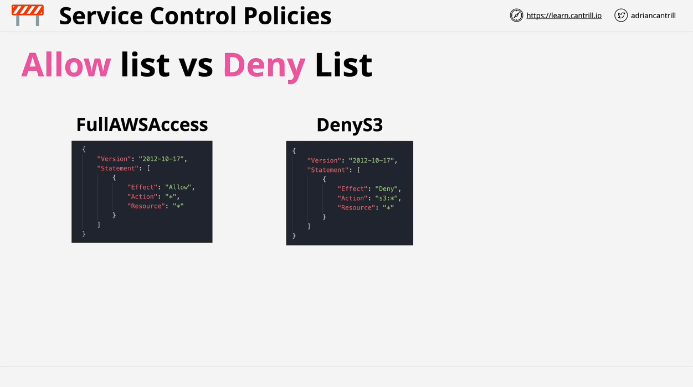
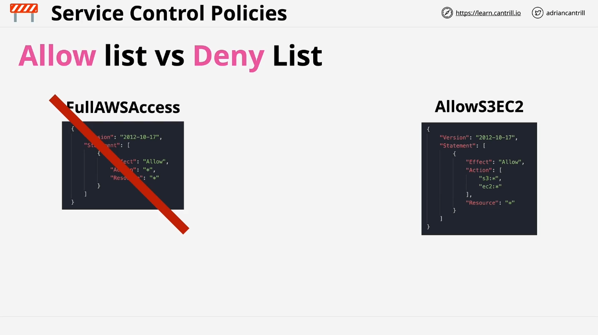
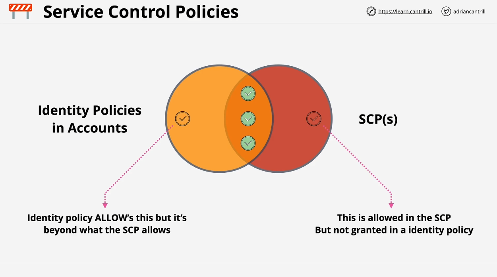

# AWS SA C03: Service Control Policies (SCPs) - Summary

## Overview of Service Control Policies (SCPs)

Service Control Policies (SCPs) are a feature within **AWS Organizations** used to manage and restrict access across multiple AWS accounts. SCPs play a critical role in designing and implementing secure, scalable AWS platforms. In this module, we cover the fundamentals of SCPs and their usage in setting account permissions boundaries within an AWS organization.

## AWS Organization Setup

- **Organization**: Example organization is named "Animals for Life."
- **Accounts**:
  - **Management Account**: General administration account with unrestricted permissions.
  - **Member Accounts**: Includes `prod` (production) and `dev` (development) accounts.
- **Root Container**: Currently, all accounts reside in the root container. Future configurations will place `prod` and `dev` accounts into specific **Organizational Units (OUs)**.

## What Are Service Control Policies (SCPs)?

- SCPs are JSON-based policy documents used to control permissions across an AWS organization.
- They can be attached to various entities:
  - **Root Container**: Affects all accounts within the organization.
  - **Organizational Units (OUs)**: Impacts all accounts within the OU and any nested OUs.
  - **Individual Accounts**: Restricts only the directly attached accounts.

### SCP Inheritance

SCPs inherit down the organization tree. If applied at a higher level (e.g., root), all lower levels (OUs, accounts) are affected.

### Exception for Management Account

The **Management Account** is special:

- It is **unaffected by SCPs** even if policies are applied at the root container or OU level.
- This exception can be both beneficial (for administration) and limiting (for security) purposes.
- Recommended best practice: Avoid using the management account for any AWS resources in production to maintain security boundaries.

## SCPs as Account Permission Boundaries

- SCPs set **boundaries on AWS accounts** but do not grant permissions.
- They limit what accounts—and implicitly, the **root user** of those accounts—can do.
- SCPs affect the account's **effective permissions**:
  - SCPs indirectly restrict the **root user** by limiting what can be allowed on the account itself, though the root user always has 100% access to the account.

### Example Applications

1. **Regional Restriction**: SCPs can restrict account usage to specific regions (e.g., `us-east-1`).
2. **Service-Specific Restrictions**: SCPs can limit usage of specific AWS resources, such as allowing only a certain EC2 instance type.

## SCP Permissions Model: Boundaries, Not Grants

- SCPs are **permission boundaries**. They define what actions can or cannot be permitted within accounts but do not directly grant permissions.
- **Identity Policies**: Individual AWS identities within accounts still need identity policies to interact with AWS resources.
  - **Effective Permissions**: Only permissions allowed in both SCPs and identity policies become active.

## SCP Architecture Models: Deny List vs. Allow List

### Deny List Model (Default)

- **Default SCP Configuration**: `FullAWSAccess` policy is attached, which effectively means no restrictions initially.
- **Implicit Deny**: SCPs use an implicit deny mechanism similar to IAM policies; only explicitly allowed permissions are permitted.
- **Deny List Advantage**: Minimal administrative effort as services are allowed by default; new services are automatically included.

### Allow List Model

- **Allow List Setup**: Requires removing `FullAWSAccess` and explicitly adding allowed services.
- **Use Case**: Better for highly restrictive environments, though more administrative effort is needed.
  - Any new services must be explicitly allowed for account access, increasing overhead but improving security.

### Recommended Approach

Generally, the **Deny List architecture** is preferred due to lower maintenance. Explicitly allowed services expand automatically with new AWS service offerings, reducing ongoing admin tasks.

## Visual Representation of SCP Effect on Permissions

- **Identity Policies vs. SCPs**:
  - Only permissions present in both identity policies and SCPs are effective within an AWS account.
  - Permissions allowed in SCP but not in identity policies (or vice versa) have no effect.

## Exam Preparation Tips

- Focus on understanding how SCPs affect **effective permissions** as the intersection of identity policies and SCPs.
- SCPs are critical to controlling access within AWS Organizations, particularly in large-scale deployments.

### Demo

The upcoming module will cover a practical demonstration of implementing SCPs within the **Animals for Life** AWS organization.

Complete this lesson and prepare for hands-on experience in the next demo video.
