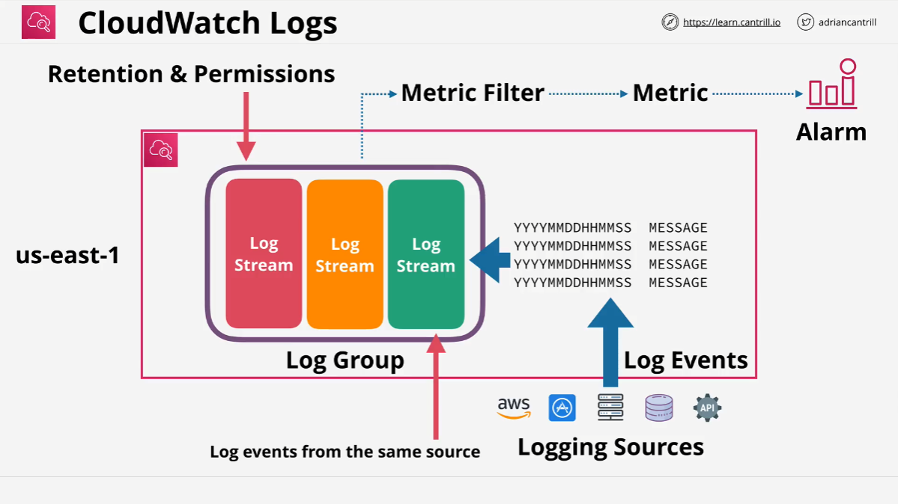

# Learn Cantrill.io AWS SA C03: Introduction to CloudWatch Logs

## Overview

In this lesson, we cover the theory and architecture of **CloudWatch Logs**. Previously, metrics in CloudWatch were discussed, and now, we turn to logs because they are essential for using services like **CloudTrail**. This lesson focuses on understanding the **CloudWatch Logs** architecture, which is necessary as CloudTrail logs will use it as a destination.

## CloudWatch Logs: Introduction

**CloudWatch Logs** is a public service with endpoints hosted in the AWS Public Zone, which allows:

- Usage within AWS VPCs, from on-premises environments, or even other cloud platforms.
- Network connectivity and AWS permissions to access and utilize it.

**CloudWatch Logs** facilitates storing, monitoring, and accessing logging data. At its core, logging data includes a **timestamp** (year, month, day, hour, minute, second, and time zone) and **data**. Additional fields may also exist, but these are the minimum components.

### AWS Integrations with CloudWatch Logs

**CloudWatch Logs** integrates seamlessly with various AWS services, including:

- **EC2**
- **VPC Flow Logs**
- **Lambda**
- **CloudTrail**
- **Route 53**
- Many more

AWS services can store data directly within **CloudWatch Logs**, and security is usually handled via **IAM roles** or **service roles**. For non-AWS services or custom applications, you can log data using the **Unified CloudWatch Agent**. This will be demonstrated later in the course, specifically in the EC2 section.

### Methods to Log Data to CloudWatch Logs

- **AWS Services Integrations** (e.g., EC2, VPC Flow Logs)
- **Unified CloudWatch Agent** for external or custom logging (e.g., EC2 OS logs)
- **AWS Development Kits** to directly log from custom applications (covered in Developer and DevOps courses)

## Metric Filters in CloudWatch Logs

**CloudWatch Logs** allows for creating metrics from log data using **metric filters**. Consider the following example:

- A **Linux instance** logs failed SSH connection attempts.
- This log data is injected into **CloudWatch Logs**.
- A **metric filter** constantly scans these logs and increments a metric when a failed SSH connection is detected.
- **Alarms** can then be configured based on this metric to trigger actions or notify administrators.

## CloudWatch Logs Architecture

### Regional Service Consideration

**CloudWatch Logs** is a **regional service**. For example, consider the **US East 1** region as a reference. The primary components include:

#### Logging Sources

Logging sources can be diverse and include:

- AWS products and services
- Mobile or server-based applications
- External compute services (virtual or physical servers)
- Databases
- External APIs

These sources inject data as **log events** into **CloudWatch Logs**.

#### Log Events

- Each **log event** contains a **timestamp** and a **message block** (raw data).
- The **message block** can be any data format. **CloudWatch Logs** treats it as raw data but allows data interpretation through defined fields and columns.

#### Log Streams

- **Log streams** are sequences of **log events** from the same source.
- For example, if multiple **EC2 instances** log data from the `var/log/messages` file, each instance’s data is a separate log stream:
  - **Log Stream 1**: `var/log/messages` for **EC2 Instance 1**
  - **Log Stream 2**: `var/log/messages` for **EC2 Instance 2**

#### Log Groups

- **Log groups** contain multiple **log streams** of similar types.
- Continuing the `var/log/messages` example, all log streams for this type are placed in one **log group**.
- **Log group** settings such as **retention** and **permissions** apply to all contained log streams.

#### Metric Filters and Alarms

- **Metric filters** analyze log events for specific patterns (e.g., an error code or failed login).
- When a pattern is detected, it increments a metric.
- Metrics can trigger **alarms**, which notify administrators or integrate with systems to perform actions.

## Practical Use Cases and Integrations

**CloudWatch Logs** will be revisited throughout the course as numerous AWS services integrate with it, including:

- **CloudTrail** for logging API calls
- **Lambda** for function executions
- **VPC Flow Logs** for network traffic analysis

### Key Takeaways

- **CloudWatch Logs** is a powerful tool for storing, monitoring, and analyzing log data.
- It supports multiple AWS services and offers robust integration capabilities.
- **Metric filters** enable metrics generation and alarms based on log data patterns.

Thank you for joining this theoretical introduction to **CloudWatch Logs**. In future lessons, we will demonstrate its practical use with services like **CloudTrail** and **EC2**. Continue to the next lesson when you're ready!
