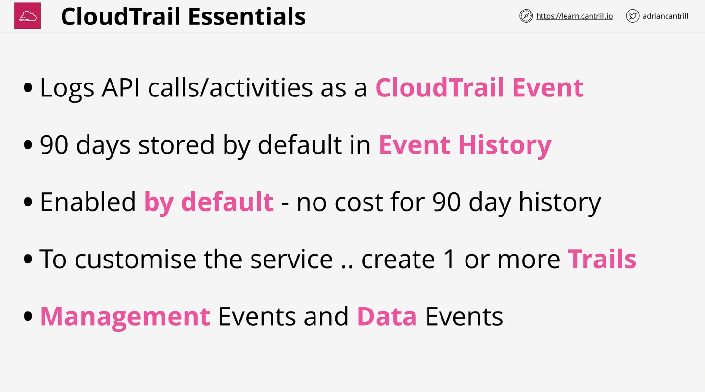
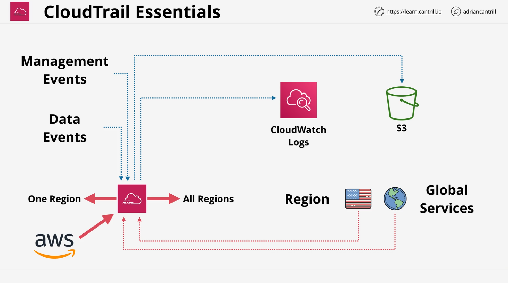
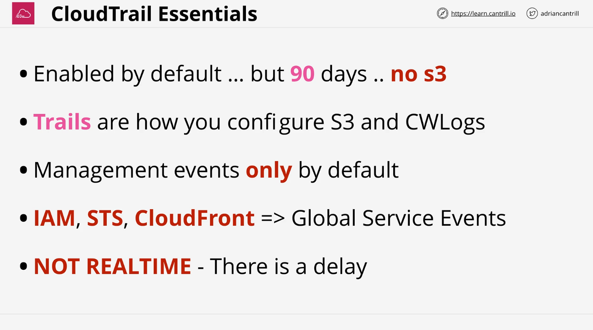

# CloudTrail Theory

## Introduction to CloudTrail

**CloudTrail** is an AWS service that logs API actions and account activities, creating a detailed record of operations performed on AWS resources. Key use cases include monitoring activities such as:

- Stopping or starting an EC2 instance
- Changing a security group
- Creating or deleting an S3 bucket

These logs help with compliance, operational troubleshooting, and security monitoring.

## Key Features of CloudTrail

### 1. **CloudTrail Event History**

- **Default Availability:** Enabled by default on all AWS accounts.
- **Retention:** Stores the last 90 days of events.
- **Cost:** Free for the default event history.
- **Event Types:**
  - **Management Events:** Logs control plane operations (e.g., creating or deleting AWS resources).
  - **Data Events:** Logs resource-specific operations (e.g., S3 object access, Lambda invocations).
    - **Not enabled by default** due to their high volume and potential cost.

### 2. **CloudTrail Trails**

A **trail** provides extended capabilities to CloudTrail, such as persistent storage and enhanced logging.

#### Trail Configuration Options:

- **Regional or All-Region Trails:**
  - **Single Region Trail:** Logs events in a specific AWS region only.
  - **All-Region Trail:** Logs events across all AWS regions and updates automatically as new regions are added.
- **Global Service Events Logging:**
  - For services like IAM, STS, and CloudFront, events are logged in the US East 1 (Northern Virginia) region.
  - Trails must explicitly enable global service event logging to capture these logs.
- **Data Storage Options:**
  - **S3 Bucket:** Allows indefinite storage of logs as compressed JSON files, making them lightweight and easily parsable.
  - **CloudWatch Logs Integration:** Enables advanced querying, monitoring, and metric generation.

### 3. **Event Types in Detail**

#### **Management Events:**

- Default logging type.
- Tracks control plane operations, such as:
  - Creating or terminating EC2 instances.
  - Creating or modifying a VPC.

#### **Data Events:**

- Tracks high-volume resource operations, such as:
  - Uploading or downloading S3 objects.
  - Invoking a Lambda function.
- **Note:** Requires explicit enablement and incurs additional cost.

### 4. **Organizational Trail**

- Created from the **management account** of an AWS organization.
- Captures API and account events across all member accounts.
- Centralizes logging and simplifies multi-account management.

## Important Considerations

### **Regional vs. Global Logging**

- Most services log events regionally, but IAM, STS, and CloudFront log globally.
- Global service events are logged in **US East 1**.

### **Retention and Storage**

- **Default Retention:** 90 days for CloudTrail Event History.
- **Custom Retention:** Trails can store logs indefinitely in S3 or CloudWatch Logs.

### **Cost**

- Management events: Included in default settings (free).
- Data events: Require explicit enablement and come with additional cost.

### **Real-Time Logging**

- **Limitation:** CloudTrail is not real-time.
- Logs are typically available within **15 minutes** and may not reflect the latest activity instantly.

## Practical Application

### **Example Use Case: Organizational Trail**

In the next demo:

- We'll create an organizational trail in the management account.
- Configure it to:
  - Capture events for all member accounts.
  - Store logs in an S3 bucket and CloudWatch Logs.
- Benefits:
  - Centralized visibility across the organization.
  - Enhanced troubleshooting and compliance tracking.

## Summary

CloudTrail is a powerful service for tracking AWS account activities and API actions. While it offers extensive default capabilities, creating and configuring trails enables:

- Persistent storage of logs.
- Advanced monitoring with CloudWatch Logs.
- Multi-account management via organizational trails.

By understanding the architecture and options, CloudTrail can be leveraged for both **exam preparation** and **real-world scenarios**.
