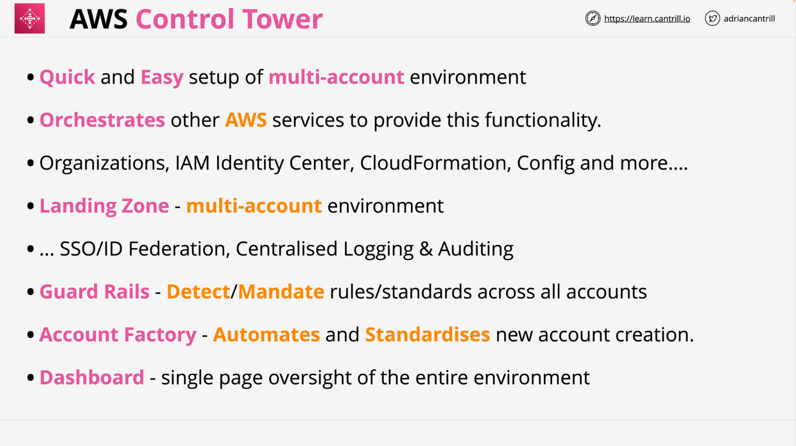

# Learn Cantrill.io AWS SA C03: AWS Control Tower Summary

## Introduction

AWS Control Tower is a comprehensive tool designed for setting up and managing multi-account environments in AWS. It orchestrates various AWS services like AWS Organizations, AWS IAM Identity Center (formerly AWS SSO), CloudFormation, and AWS Config to provide automation, governance, and compliance features.

## Key Features of AWS Control Tower

### Overview

Control Tower is essentially an evolution of AWS Organizations, enhancing it with automation, intelligence, and additional features to simplify multi-account management. Key components include:

- **Landing Zone**: A well-architected multi-account environment.
- **Guardrails**: Rules to enforce or monitor governance across accounts.
- **Account Factory**: Automated AWS account provisioning and management.
- **Dashboard**: A single-page overview of the organization.

## Control Tower Components

### 1. Landing Zone

The landing zone is the foundation of AWS Control Tower, providing:

- **Multi-account environment setup**: Built on AWS Organizations and augmented with additional services.
- **Single Sign-On (SSO)**: Enabled by IAM Identity Center, allowing centralized access to accounts with ID Federation.
- **Centralized Logging and Auditing**: Managed through AWS Config, CloudTrail, CloudWatch, and SNS.

#### Organizational Units (OUs)

- **Security OU**:
  - Includes the `Log Archive Account` for storing centralized logs securely.
  - Includes the `Audit Account` for auditing and monitoring the environment.
- **Sandbox OU**: Often used for testing purposes.

#### Monitoring and Notifications

- **CloudWatch**: Provides landing zone-wide metrics.
- **SNS**: Delivers notifications related to governance and security changes.

### 2. Guardrails

Guardrails ensure governance and compliance across accounts. They are categorized as:

- **Mandatory**: Always enforced.
- **Strongly Recommended**: Advised by AWS for best practices.
- **Elective**: Optional rules for specific organizational needs.

#### Types of Guardrails

- **Preventative**: Enforces rules using Service Control Policies (SCPs) to block non-compliant actions.
- **Detective**: Uses AWS Config rules to detect configuration violations.

#### Examples

- Preventative: Deny usage of specific AWS regions.
- Detective: Verify CloudTrail is enabled or ensure EC2 instances do not have public IPs.

### 3. Account Factory

The Account Factory streamlines the creation and management of AWS accounts:

- **Automated Account Provisioning**:
  - Allows creation of accounts with predefined configurations.
  - Ensures consistency in networking and account setup across the organization.
- **Guardrail Application**: Automatically applies governance policies to new accounts.
- **Self-Service Capability**:
  - End-users with appropriate permissions can provision accounts.
  - Configurations include admin rights and compliance settings.
- **Integration with SDLC**:
  - APIs allow integration with software development lifecycles for automated provisioning.

#### Use Cases

- Long-running or short-term accounts for development, testing, or demos.
- Avoiding IP overlap in VPC configurations across accounts.

## High-Level Architecture

1. **Management Account**:

   - Serves as the root account orchestrating the Control Tower.
   - Hosts AWS Organizations for multi-account structures and IAM Identity Center for SSO.

2. **Foundational Accounts**:

   - **Log Archive Account**: Securely stores logs from CloudTrail, AWS Config, etc.
   - **Audit Account**: Provides a secure space for monitoring and auditing activities.

3. **Custom OUs and Accounts**:
   - Customized based on organizational needs.
   - Automated creation and governance through Account Factory.

## Practical Insights

- **Scalability**: Control Tower adapts from small to complex multi-account environments.
- **Hands-on Experience**: Using Control Tower enhances understanding of its features and benefits.
- **Exam Relevance**: A foundational knowledge of Control Tower suffices for certification exams unless deeper expertise is required by the specific study path.

## Conclusion

AWS Control Tower simplifies the process of managing multi-account environments with built-in automation, compliance, and governance. Understanding its components, features, and integration capabilities is crucial for effectively using AWS in real-world scenarios.
