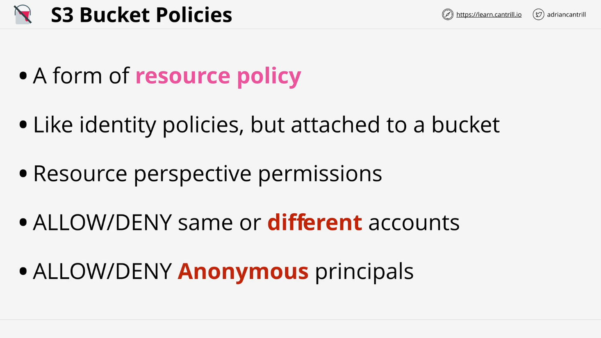
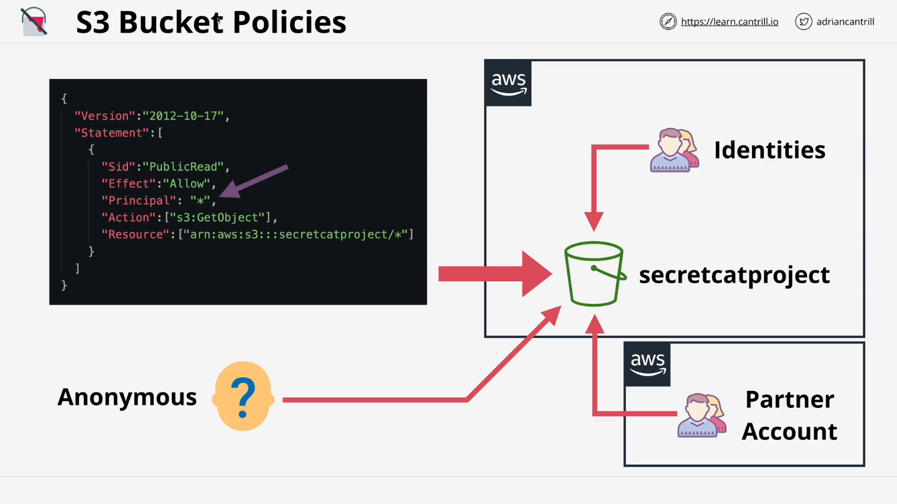
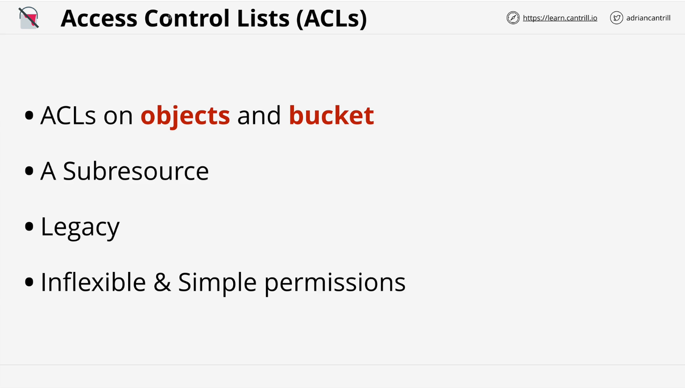
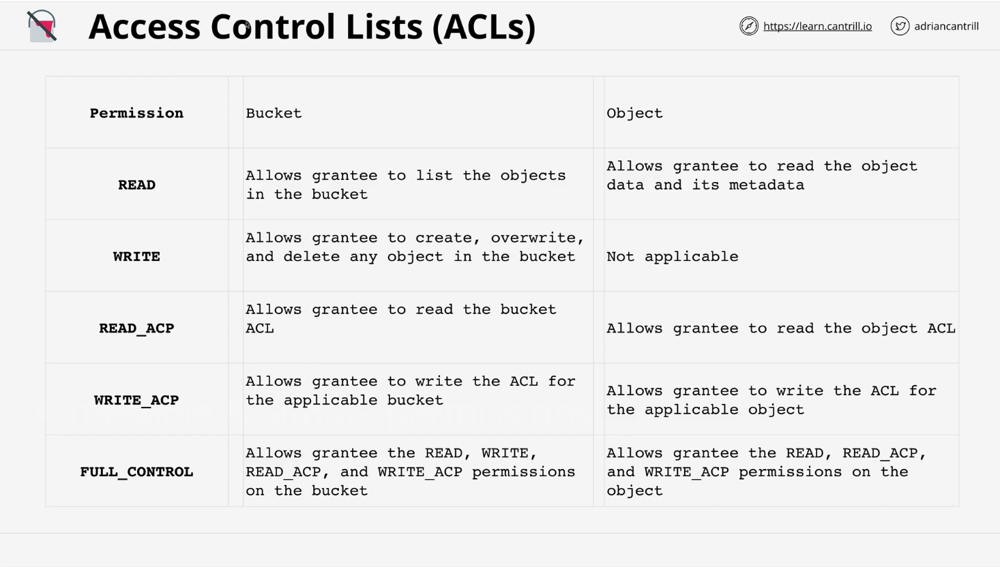
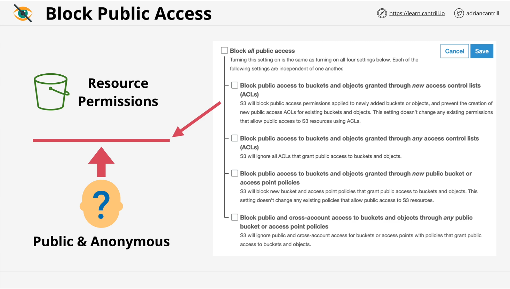
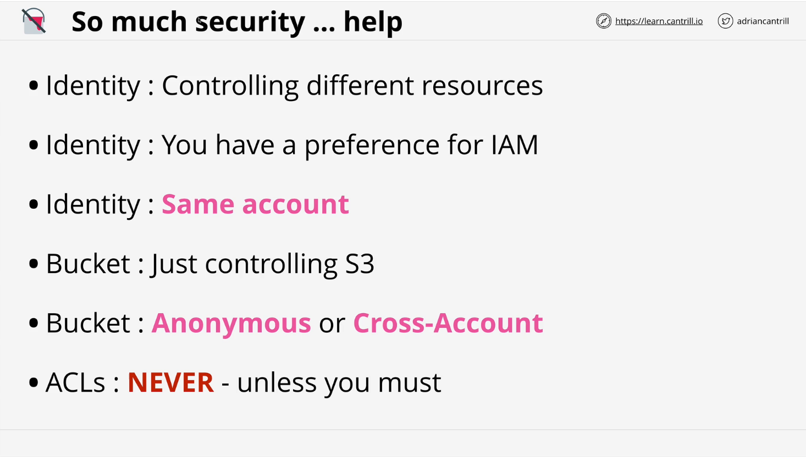

# S3 Security (Resource Policies & ACLs)

## Overview

This lesson covers S3 security concepts, focusing on **bucket policies**, **access control lists (ACLs)**, and **block public access settings**. It provides a detailed explanation of permissions models in S3, their practical applications, and scenarios for their use.

## S3 Security Fundamentals

- **S3 is private by default**:
  - Only the root user of the account owning the bucket has initial access.
  - All additional permissions must be explicitly granted.

## Bucket Policies



### Definition and Purpose

- **Bucket policies** are a type of **resource policy**.
- Unlike identity policies:
  - Identity policies control **what an identity can access**.
  - Resource policies control **who can access a resource**.

### Key Features



1. **Cross-Account Access**:
   - Bucket policies allow access to identities from different AWS accounts.
   - Can reference external identities in other accounts.
2. **Anonymous Access**:
   - Can grant or deny access to anonymous users.
   - Useful for public access scenarios.
3. **Conditions**:
   - Enable fine-grained control, e.g., blocking access based on IP addresses or requiring MFA for specific resources.

### Example Scenarios

- Granting public read access to all objects in a bucket.
- Restricting access to objects based on IP address.
- Enforcing MFA for access to specific folders (prefixes) in a bucket.

### Policy Components

```json
{
  "Version": "2012-10-17",
  "Statement": [
    {
      "Sid": "PublicRead",
      "Effect": "Allow",
      "Principal": "*",
      "Action": ["s3:GetObject"],
      "Resource": ["arn:aws:s3:::secretcatproject/*"]
    }
  ]
}
```

- **Components**:

  - **Version**: `"2012-10-17"` – Defines the policy language version.
  - **Sid**: `"PublicRead"` – A unique identifier for this statement.
  - **Effect**: `"Allow"` – Grants permission for the specified actions.
  - **Principal**: `"*"` – Allows access to anyone (public access).
  - **Action**: `["s3:GetObject"]` – Permits read-only access to objects in the bucket.
  - **Resource**: `["arn:aws:s3:::secretcatproject/*"]` – Applies to all objects in the `secretcatproject` bucket.
  - **Risk**: The `"Principal": "*"` makes the bucket publicly accessible, which can expose sensitive data. Use restrictive policies for sensitive resources.

- **Principal**:
  - Specifies the identities impacted by the policy.
  - For anonymous access, the principal is `*` (wildcard).
- **Effect**:
  - Defines whether the action is allowed or denied.
- **Action**:
  - Specifies the operations (e.g., `s3:GetObject`) permitted or denied.
- **Resource**:
  - Identifies the bucket and/or objects the policy applies to.

### More Policy Components

#### **Example 1**:

```json
{
  "Version": "2012-10-17",
  "Id": "BlockUnLeet",
  "Statement": [
    {
      "Sid": "IPAllow",
      "Effect": "Deny",
      "Principal": "*",
      "Action": "s3:*",
      "Resource": "arn:aws:s3:::secretcatproject/*",
      "Condition": {
        "NotIpAddress": {
          "aws:SourceIp": "1.3.3.7/32"
        }
      }
    }
  ]
}
```

- **Version**: `"2012-10-17"` – Policy language version.
- **Id**: `"BlockUnLeet"` – Identifier for the policy.
- **Sid**: `"IPAllow"` – Statement ID for easy reference.
- **Effect**: `"Deny"` – Denies access to specified actions unless conditions are met.
- **Principal**: `"*"` – Policy applies to all users.
- **Action**: `"s3:*"` – Denies all S3 actions (e.g., read, write, delete).
- **Resource**: `"arn:aws:s3:::secretcatproject/*"` – Applies to all objects in the `secretcatproject` bucket.
- **Condition**:
  - **NotIpAddress**: Denies access unless the source IP matches `1.3.3.7/32`.
- **Purpose**: This policy blocks all access to the bucket except for requests originating from the IP address `1.3.3.7`.

#### **Example 2**:

```json
{
  "Version": "2012-10-17",
  "Id": "protectboris",
  "Statement": [
    {
      "Sid": "",
      "Effect": "Deny",
      "Principal": "*",
      "Action": "s3:*",
      "Resource": "arn:aws:s3:::secretcatproject/boris/*",
      "Condition": {
        "Null": {
          "aws:MultiFactorAuthAge": true
        }
      }
    },
    {
      "Sid": "therest",
      "Effect": "Allow",
      "Principal": "*",
      "Action": ["s3:GetObject"],
      "Resource": "arn:aws:s3:::secretcatproject/*"
    }
  ]
}
```

- **Version**: `"2012-10-17"` – Policy language version.
- **Id**: `"protectboris"` – Identifier for the policy.

- **First Statement**:
  - **Sid**: (empty) – Unlabeled statement.
  - **Effect**: `"Deny"` – Blocks all specified actions.
  - **Principal**: `"*"` – Applies to everyone.
  - **Action**: `"s3:*"` – Denies all S3 actions (read, write, etc.).
  - **Resource**: `"arn:aws:s3:::secretcatproject/boris/*"` – Targets the `boris` folder in the bucket.
  - **Condition**:
    - **Null**: Denies access if `aws:MultiFactorAuthAge` is null, meaning MFA is not enabled.
- **Second Statement**:
  - **Sid**: `"therest"` – Identifies the statement.
  - **Effect**: `"Allow"` – Grants permission.
  - **Principal**: `"*"` – Applies to everyone.
  - **Action**: `["s3:GetObject"]` – Allows read-only access.
  - **Resource**: `"arn:aws:s3:::secretcatproject/*"` – Applies to all objects in the bucket.
- **Purpose**:

1. The first statement protects the `boris` folder, ensuring only users with MFA enabled can access it.
2. The second statement allows public read access to the rest of the bucket's objects.

## Access Control Lists (ACLs)



### Overview

- **Legacy feature**, not recommended by AWS for most use cases.
- Define permissions at a bucket or object level but are limited in functionality compared to bucket policies.

### Features and Limitations



- Permissions: `READ`, `WRITE`, `READ_ACP`, `WRITE_ACP`, and `FULL_CONTROL`.
- Cannot define conditions (e.g., IP restrictions).
- Less flexible than bucket policies and often superseded by them.

### Use Cases

- Rarely used unless explicitly required for legacy compatibility.

## Block Public Access Settings



### Purpose

- Added to prevent accidental public access to S3 buckets, reducing data breach risks.

### Configuration Options

1. **Block All Public Access**:
   - Overrides resource policies to prevent any public access.
2. **Allow Existing Public Access via ACLs**:
   - Blocks new ACL-based public access but allows existing ones.
3. **Block Public Access via ACLs**:
   - Blocks all public access granted through ACLs, regardless of when it was configured.
4. **Allow Existing Public Access via Policies**:
   - Permits existing public access granted by bucket or access point policies but blocks new configurations.
5. **Block Public Access via Policies**:
   - Blocks both existing and new public access granted by bucket or access point policies.

### Fail-Safe Mechanism

- Ensures anonymous principles (non-authenticated users) are blocked unless explicitly allowed.

## Best Practices and Exam Tips



### Identity vs. Resource Policies

- **Identity Policies**:
  - Use for managing access within the same account.
  - Suitable for permissions on multiple resources.
- **Resource Policies**:
  - Use for cross-account access or anonymous access.
  - Efficient for managing permissions at the resource level.

### Avoid Access Control Lists

- Use bucket policies or identity policies instead of ACLs wherever possible.
- ACLs are legacy, less flexible, and not recommended by AWS.

## Conclusion

Understanding S3 security is crucial for effective AWS administration and exam preparation. This lesson emphasizes the importance of bucket policies, the limitations of ACLs, and the role of block public access settings as a safety net.

Ready for more? Proceed to the next lesson to explore another exciting S3 feature.
