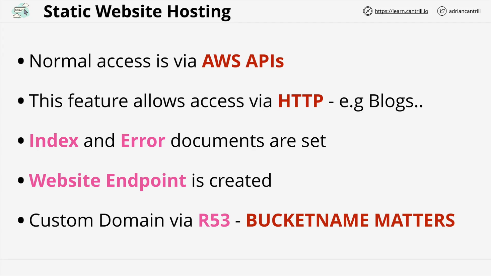
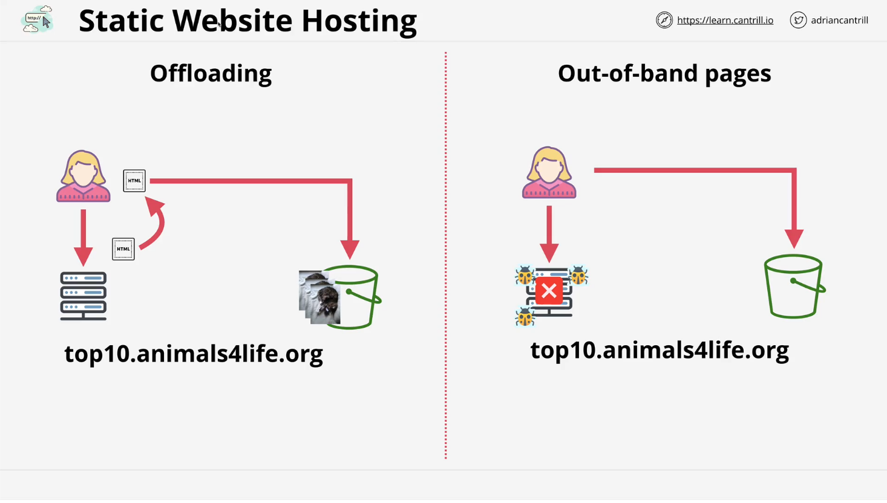

# S3 Static Website Hosting

## Introduction to S3 Static Website Hosting

S3 static website hosting is a feature of AWS S3 that allows buckets to serve static websites accessible via HTTP. It is highly flexible and offers a cost-effective solution for hosting simple websites.

## API Access vs. Static Website Hosting

- **API Access**: AWS S3 typically interacts via APIs (e.g., `GetObject`), which is secure and flexible.
- **Static Website Hosting**: Enables S3 buckets to serve static files (e.g., HTML) directly via HTTP, making it accessible to web browsers without API interaction.

## Setting Up Static Website Hosting

1. **Enable Static Website Hosting**:
   - Specify an index document (e.g., `index.html`) for the entry point.
   - Set an error document (e.g., `error.html`) to handle errors like missing files.
2. **Generated Endpoint**:
   - AWS provides an auto-generated HTTP endpoint influenced by bucket name and region.
3. **Using Custom Domains**:
   - To use a custom domain, the bucket name must match the domain name.

## Use Cases for Static Website Hosting

### Hosting Static Websites

Ideal for blogs and similar static content sites, leveraging S3’s efficiency and scalability.

### Offloading Content

- **Scenario**:
  - Websites often host dynamic HTML and static assets (e.g., images).
  - Dynamic content remains on compute services like EC2.
  - Static assets are moved to S3 to reduce costs and improve scalability.
- **Benefits**:
  - S3 is cost-efficient and optimized for large-scale data storage and delivery.

### Out-of-Band Pages

- **Definition**: Provides access outside the main method (e.g., during maintenance or outages).
- **Usage**:
  - Host status or maintenance pages on S3 to ensure availability during outages.
  - Update DNS to point to the S3-hosted page during disruptions.

## Pricing Structure

1. **Storage Costs**:
   - Charged per GB per month.
   - Scaled based on storage duration and size.
2. **Data Transfer Costs**:
   - Data transfer into S3: Free.
   - Data transfer out of S3: Charged per GB.
3. **Request Costs**:
   - Charges apply for `GET`, `PUT`, and other operations.
   - Different rates for each operation per 1,000 requests.

### Free Tier

- 5 GB of storage.
- 20,000 `GET` requests.
- 2,000 `PUT` requests.

## Real-World Example: Cantrill.io Blog

- Hosted using S3 static website hosting.
- Despite substantial traffic, monthly costs have remained minimal (e.g., $0.17 in one month).

## Key Benefits of S3 Static Website Hosting

- Cost-effectiveness.
- Scalability for static and large-scale data hosting.
- Simplified infrastructure management for static assets and backup pages.

## Upcoming Demo

The next lesson includes a practical demonstration of setting up a static website using S3, combining various theoretical concepts covered.

---

Mark the video as complete to proceed to the hands-on demo.
