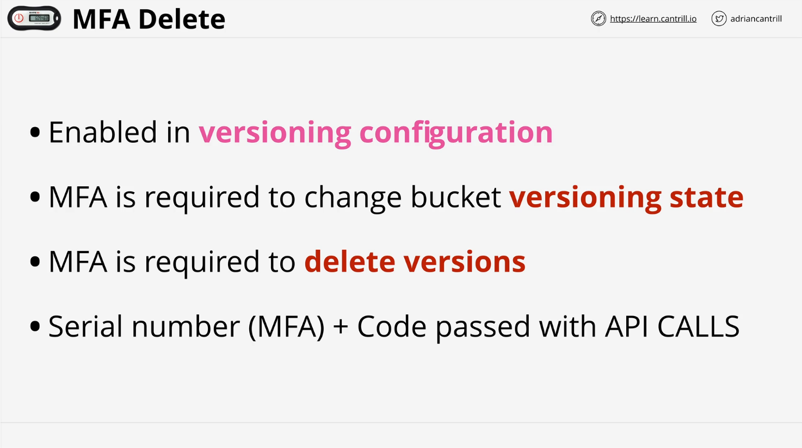

# AWS S3 Object Versioning and MFA Delete

This lesson covers two essential Amazon S3 features: **Object Versioning** and **MFA Delete**. These topics are critical for both the AWS Solutions Architect - Associate (SAA-C03) exam and real-world projects. Let's dive into the details.

## Object Versioning

### Key Concepts

1. **Bucket-Level Control**:

   - Object versioning is managed at the bucket level.
   - Default state: **Disabled**.

2. **State Changes**:
   

   - Disabled → Enabled: Once enabled, it cannot be reverted to disabled.
   - Enabled → Suspended: Can be toggled back to enabled.
   - **Important**: Enabled buckets cannot return to a disabled state.

3. **Object Identification**:
   

   - Without versioning: Objects are identified solely by their unique **object key**.
   - With versioning: Objects also receive a unique **version ID**.

### How Versioning Works

- **Modification**:

  - Changes to an object create a new version while retaining the old one.
  - Example: Uploading a new file with the same key replaces the current version but keeps the previous one accessible.

- **Deletion**:

  - Deleting an object without specifying a version ID creates a **delete marker**.
    - The object is not removed but hidden.
    - Deleting the delete marker restores the previous version.
  - To truly delete an object version, specify its version ID.

- **Accessing Versions**:
  - By default, the **current version** (most recent) is retrieved unless a specific version ID is requested.

### Exam Tips

- Enabled buckets cannot revert to disabled; they can only be suspended.
- Understand state transitions and their implications for exam questions.
- Remember: Space usage and billing include all object versions in a bucket.

### Storage Considerations

- Each object version consumes space.
- Example: A 5GB object with 5 versions = 25GB storage.
- Costs for all versions persist even when versioning is suspended. The only way to eliminate these costs is to delete the bucket.

## MFA Delete

### Overview

- **Multi-Factor Authentication (MFA) Delete** enhances bucket security by requiring MFA for:
  1. Changing versioning states (Enabled ↔ Suspended).
  2. Deleting specific object versions.

### How It Works

1. **Configuration**:

   - Enabled as part of the bucket’s versioning settings.

2. **Requirements**:

   - API calls must include:
     - MFA token serial number.
     - MFA code (concatenated with the serial number).

3. **Use Cases**:
   - Prevent unauthorized or accidental deletions.
   - Add an extra layer of security for sensitive data.

## Summary

### Object Versioning

- Critical for managing object modifications and deletions.
- Enabled buckets consume storage for all versions and cannot revert to disabled.

### MFA Delete

- Provides additional security for versioning state changes and deletions.

Understanding these features is essential for the AWS SAA-C03 exam and effective AWS S3 management in professional settings. For more details, revisit the lesson video or consult the AWS documentation.
