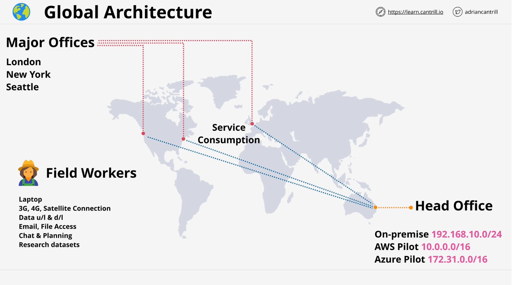
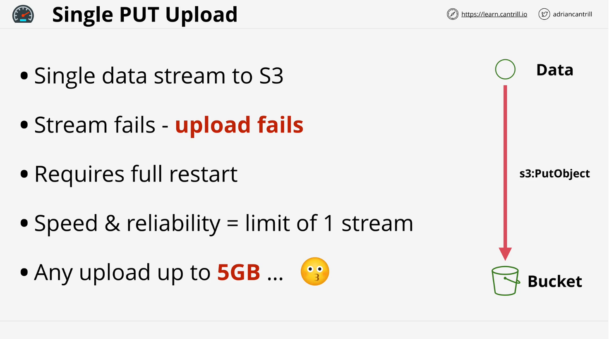
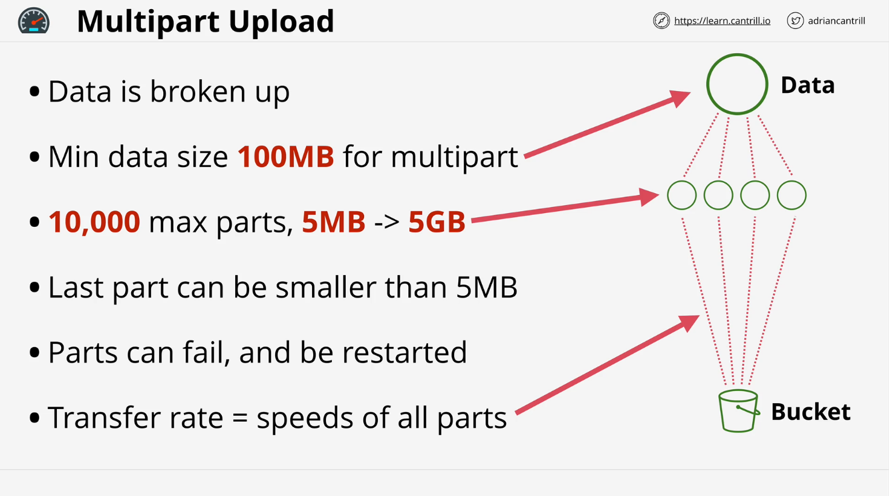
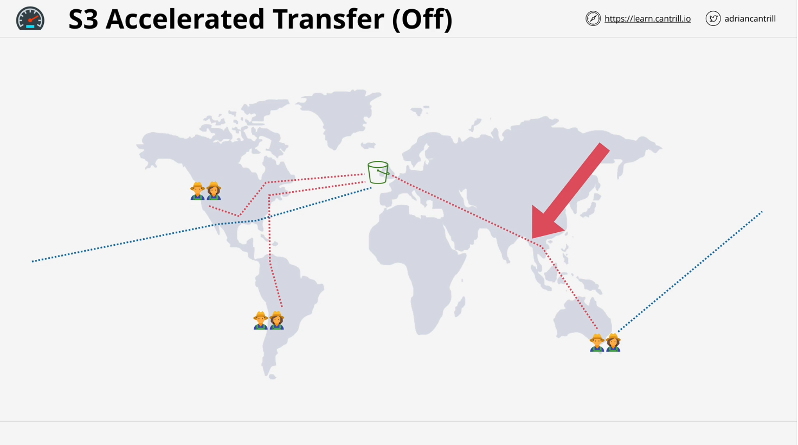
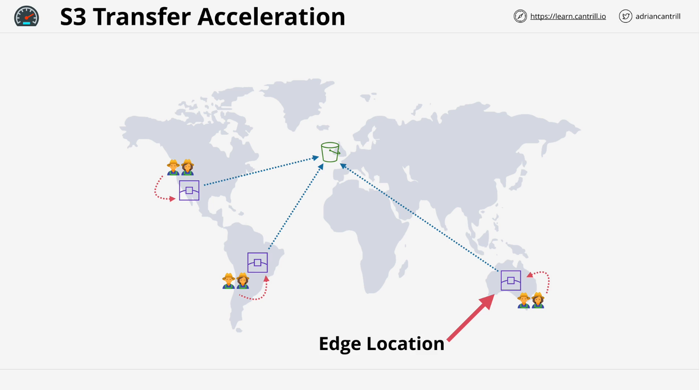

# S3 Performance Optimization

This document summarizes the key points from the video on optimizing S3 performance as a solutions architect.

## Scenario Overview: Animals for Life

- **Context**: Distributed organization with:
  - Head office in Brisbane.
  - Remote offices and workers accessing services from Brisbane.
  - Potentially slower and unreliable internet connections for remote workers.
- **Goal**: Improve performance and reliability of data transfer using S3 features.

## Default S3 Upload Behavior

### Characteristics:

- **Single-Stream Upload**: Data is uploaded as a single blob using the `PutObject` API.
- **Limitations**:
  - If the upload fails (e.g., at 4.5 GB of a 5 GB upload), the entire process must restart.
  - Inefficient for large files, especially over unreliable networks.

## Multi-Part Upload

### Overview:

- **Purpose**: Improves speed and reliability by splitting large data into smaller parts.
- **Key Features**:
  - Minimum object size for multi-part upload: **100 MB**.
  - Maximum of **10,000 parts**; each part ranges between **5 MB and 5 GB**.
  - Parts upload independently, enabling isolated retries and faster transfers.

### Benefits:

1. **Fault Tolerance**: Individual part failures do not affect the whole upload.
2. **Improved Speed**: Parallel uploads maximize available bandwidth.
3. **Automatic Use**: AWS tools automatically enable multi-part upload for eligible data sizes.

## Transfer Acceleration

### Challenges with Default Global Transfers:

- Public internet routing is unpredictable, often indirect, and slower due to multiple hops.
- Inefficiencies worsen with increasing distance between the upload source and S3 bucket.

### How Transfer Acceleration Works:

1. **AWS Edge Locations**:
   - Closest edge location acts as the entry point for uploads.
   - Shorter, more efficient path over public internet.
2. **AWS Global Network**:
   - Data moves over AWS's purpose-built, high-speed network to the S3 bucket.

### Benefits:

- **Faster Transfers**: Direct, controlled network paths reduce latency and improve speed.
- **Better Reliability**: Minimized dependence on public internet routing.
- **Greater Impact Over Distance**: Significant performance gains for long-distance transfers.

### Restrictions:

- Bucket must have **Transfer Acceleration** enabled.
- Bucket names:
  - Must be **DNS-compatible**.
  - Cannot contain **periods**.

## Practical Implications for the Scenario

1. **Remote Worker Uploads**:
   - Use multi-part upload to handle large datasets reliably.
   - Leverage transfer acceleration for distant uploads (e.g., Australia to UK).
2. **Critical Data**:
   - Ensure fast, secure, and reliable data transfers to support operational needs.

## Next Steps: Demonstration

- Learn how to enable **Transfer Acceleration** on an S3 bucket.
- See performance improvements using AWS tools.

**Note**: The combination of multi-part uploads and transfer acceleration significantly enhances the usability of S3 in distributed environments, ensuring reliable and performant operations.
