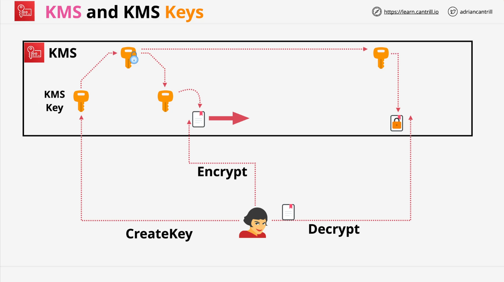
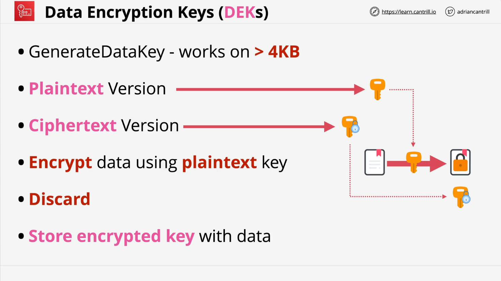
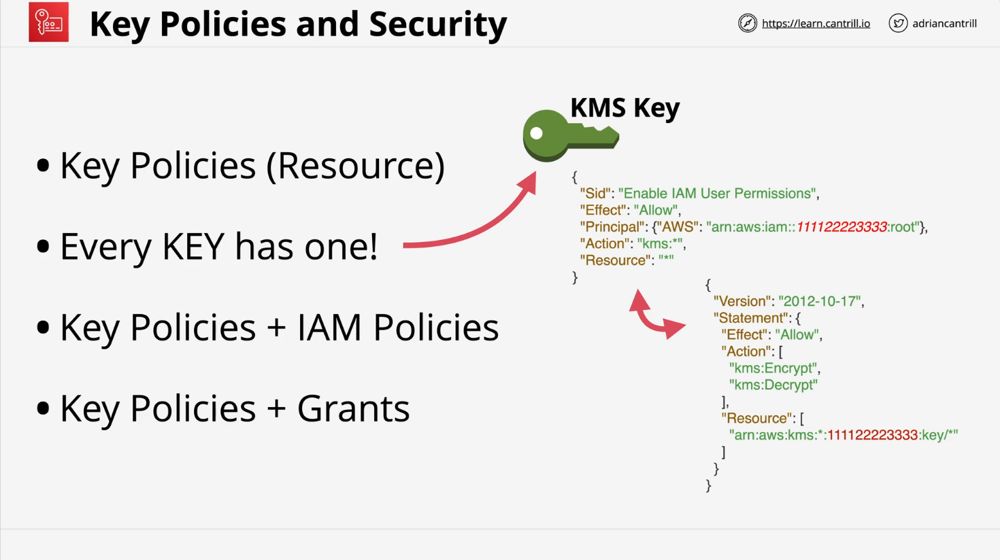

# Learn Cantrill.io AWS SA C03: Key Management Service (KMS)

## Introduction to KMS

The AWS Key Management Service (KMS) is a foundational encryption service in AWS, used by various AWS services for cryptographic operations. This overview provides key concepts, features, and architecture of KMS.

### Key Characteristics of KMS

- **Regional and Public Service**:
  - Each AWS region operates an isolated instance of KMS.
  - KMS is accessible in the AWS public zone with proper permissions.
- **Key Management**:
  - Manages cryptographic keys for encryption and decryption.
  - Supports symmetric and asymmetric key types.
- **Compliance**:
  - Provides FIPS 140-2 level 2 compliance.
  - Some features achieve level 3 compliance.

## Core Features of KMS

### Cryptographic Operations



- KMS performs cryptographic operations such as encryption and decryption.
- Keys never leave KMS, ensuring security.

### Types of Keys

1. **Symmetric Keys**:
   - Default for most operations unless otherwise specified.
2. **Asymmetric Keys**:
   - Supported but covered in advanced lessons.

### KMS Keys

- **KMS Keys**: Formerly known as Customer Master Keys (CMKs).
  - Contain metadata like key ID, creation date, and key policy.
  - Backed by physical key material, either generated or imported.

## Data Encryption Key (DEK) Workflow



- **Generate Data Keys**:
  - Created using the `GenerateDataKey` operation.
  - Used to encrypt data larger than 4 KB.
  - KMS provides:
    - A plaintext DEK (for immediate use).
    - An encrypted DEK (stored for future use).
  - After use, the plaintext DEK is discarded.
- **Data Decryption**:
  - Encrypted DEKs can be passed back to KMS for decryption.
  - Decrypted DEKs are used for data decryption and discarded thereafter.

## Multi-Region Keys and Key Ownership

### Regional Scope

- Keys are stored regionally by default.
- Multi-region keys are supported for specific use cases.

### Ownership

- **AWS-Owned Keys**:
  - Managed by AWS, used across multiple accounts.
- **Customer-Owned Keys**:
  1. **AWS-Managed Keys**:
     - Created automatically by AWS services like S3.
     - Limited customization.
  2. **Customer-Managed Keys**:
     - Explicitly created by customers.
     - More configurable (e.g., cross-account access).

## Key Rotation and Aliases

### Key Rotation

- **AWS-Managed Keys**: Automatically rotated annually.
- **Customer-Managed Keys**: Rotation is optional and configurable.

### Key Aliases

- Aliases act as shortcuts for keys.
- Aliases are regional and point to region-specific keys.

## Permissions in KMS

### Key Policies



- **Foundation of KMS Security**:
  - Every KMS key has a key policy.
  - Explicitly grant trust to AWS accounts (not automatic).
- Example Key Policy:

  ```json
  {
    "Version": "2012-10-17",
    "Statement": [
      {
        "Effect": "Allow",
        "Principal": {
          "AWS": "arn:aws:iam::11112223333:root"
        },
        "Action": "kms:*",
        "Resource": "*"
      }
    ]
  }
  ```

  ```json
  {
    "Version": "2012-10-17",
    "Statement": {
      "Effect": "Allow",
      "Action": ["kms:Encrypt", "kms:Decrypt"],
      "Resource": ["arn:aws:kms:*:111122223333:key/*"]
    }
  }
  ```

### Identity Policies

- Supplement key policies by defining user-specific permissions.
- Permissions include operations like encrypt, decrypt, or manage keys.

## Summary of Key Concepts

- KMS is a highly secure service with granular control over permissions and operations.
- Understanding key policies and permissions is critical for effective KMS usage.
- The interplay of KMS keys, DEKs, and aliases allows for flexible and scalable encryption workflows.

For more in-depth details, refer to specific lessons on advanced KMS features, multi-region keys, and integration with AWS services.
