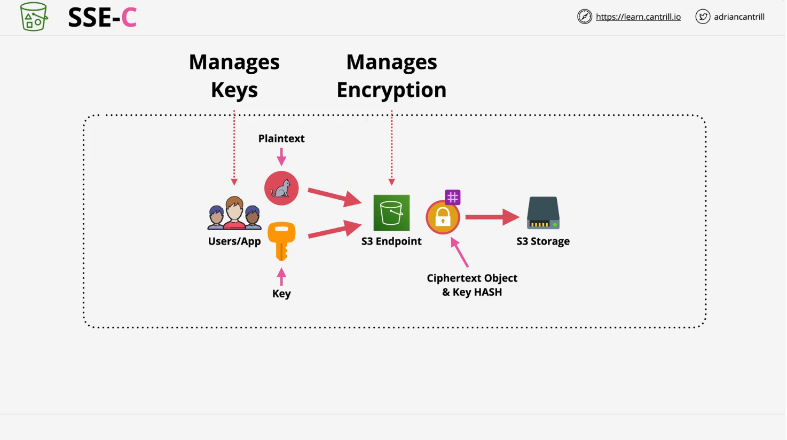

# Understanding S3 Encryption

This summary provides a detailed breakdown of the Learn Cantrill.io AWS SA-C03 lesson on S3 encryption, focusing on **Server-Side Encryption (SSE)** and touching upon **Client-Side Encryption (CSE)**. The content is structured with headings and formatted for GitHub in Markdown.

## Introduction to S3 Encryption

- **S3 Encryption Scope**:

  - Encryption applies to **objects** in an S3 bucket, not the bucket itself.
  - Objects within the same bucket can have different encryption settings.
  - "Bucket default encryption" is a separate concept.

- **Types of Encryption**:
  - **Client-Side Encryption (CSE)**: Encryption is handled before data is uploaded to S3.
  - **Server-Side Encryption (SSE)**: Encryption occurs after data reaches S3.

## Encryption Overview

### Encryption at Rest

- Ensures that data stored on physical disks is protected.
- Even if physical disks are accessed, keys are required to decrypt the data.

### Encryption in Transit

- Data is encrypted via HTTPS while being transferred to and from S3.
- **Focus of this lesson**: Encryption at rest.

## Client-Side Encryption (CSE)

- **Process**:
  - Data is encrypted by the client before uploading to S3.
  - AWS receives and stores only ciphertext (encrypted data).
- **Advantages**:

  - Full control over encryption keys and processes.
  - AWS never sees plaintext data.

- **Disadvantages**:

  - Higher CPU consumption for encryption tasks.
  - Full responsibility for managing keys and the encryption process.

- **When to Use**:
  - Regulatory requirements prohibit AWS involvement in the encryption process.
  - Strong preference for customer-controlled encryption.

## Server-Side Encryption (SSE)

AWS performs encryption after data reaches S3. Several types of SSE offer different levels of control and management.

### 1. SSE-C (Server-Side Encryption with Customer-Provided Keys)

- **Process**:

  - Customer provides an encryption key with each upload.
  - S3 encrypts the object and discards the key after use.
  - A hash of the key is stored with the object for validation.

- **Advantages**:

  - Offloads CPU-intensive encryption tasks to AWS.
  - Customer retains control of key management.

- **Disadvantages**:

  - AWS must be trusted to discard keys after use.
  - Customers are responsible for securely managing keys.

- **Use Case**:
  - Scenarios requiring key control but allowing AWS to handle encryption/decryption processes.

### 2. SSE-S3 (Server-Side Encryption with Amazon S3 Managed Keys)

- **Process**:

  - AWS generates and manages a unique encryption key for each object.
  - A master key managed by S3 encrypts these per-object keys.

- **Advantages**:

  - Minimal administrative overhead.
  - Suitable for most use cases with standard encryption requirements.

- **Disadvantages**:

  - Limited control over keys and key rotation.
  - Lack of role separation (e.g., S3 administrators can access data).

- **Use Case**:
  - General-purpose encryption without strict regulatory requirements.

### 3. SSE-KMS (Server-Side Encryption with AWS Key Management Service Keys)

- **Process**:

  - Integrates AWS Key Management Service (KMS) to manage keys.
  - KMS generates a data encryption key for each object.
  - S3 uses the key to encrypt the object and discards the plaintext key.

- **Advantages**:

  - Fine-grained control over KMS keys (creation, permissions, rotation).
  - Enables role separation: S3 admins can manage buckets without accessing data.
  - Full auditing and logging of key usage with AWS CloudTrail.

- **Disadvantages**:

  - Slightly more administrative overhead compared to SSE-S3.

- **Use Case**:
  - Environments requiring strict regulatory compliance, key control, and auditing.

## Comparison of SSE Types

| Feature                | SSE-C                        | SSE-S3                     | SSE-KMS                            |
| ---------------------- | ---------------------------- | -------------------------- | ---------------------------------- |
| **Key Management**     | Customer                     | AWS                        | AWS KMS                            |
| **Encryption Process** | AWS                          | AWS                        | AWS + KMS                          |
| **Key Control**        | Customer                     | AWS                        | Customer (via KMS)                 |
| **Admin Overhead**     | High                         | Low                        | Moderate                           |
| **Use Case**           | Regulatory, customer control | General-purpose encryption | Compliance, audit, role separation |

## Key Takeaways

- **Client-Side Encryption**: Full control over keys and process, suitable for strict regulatory needs.
- **Server-Side Encryption**:
  - **SSE-C**: Customer-controlled keys with AWS handling encryption.
  - **SSE-S3**: AWS manages keys and encryption, minimal overhead.
  - **SSE-KMS**: Combines AWS key management with advanced features like role separation and auditing.

### Recommended Default

- **SSE-S3** is the most common and user-friendly option for general use cases.
- Choose **SSE-KMS** for compliance-heavy environments requiring fine-grained control.

This structured approach ensures a comprehensive understanding of S3 encryption for AWS SA-C03.
