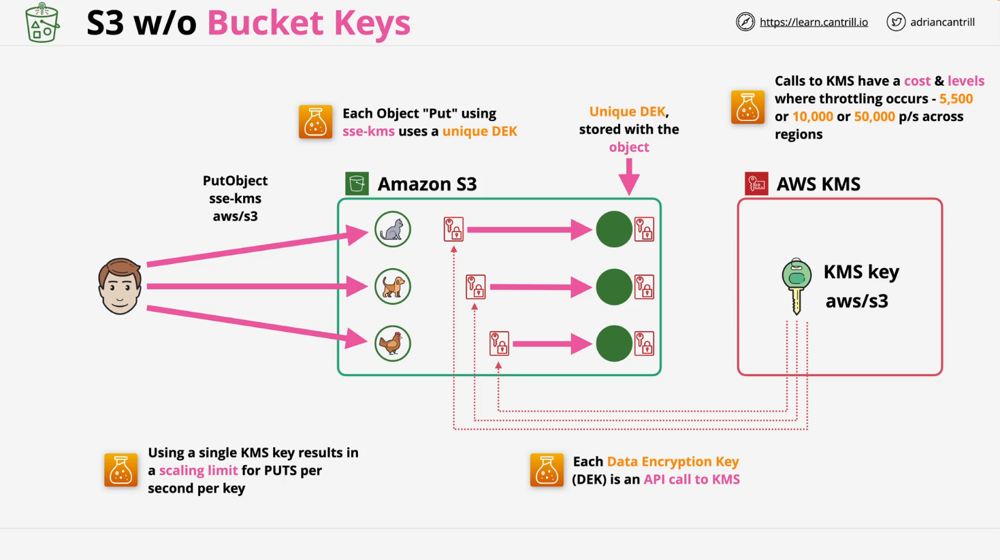
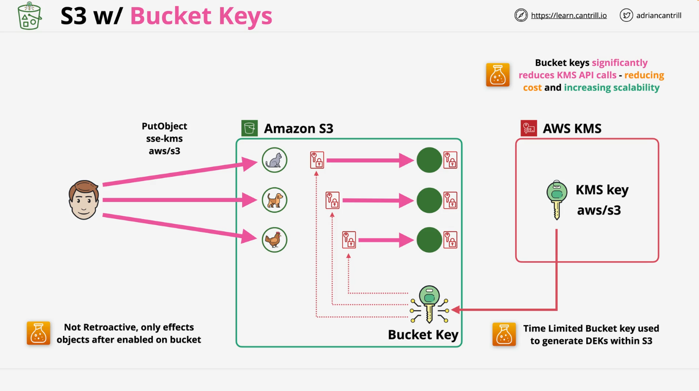

# Understanding S3 Bucket Keys

## Introduction to S3 Bucket Keys

Amazon S3 Bucket Keys are designed to reduce the cost and enhance the scalability of server-side encryption using AWS Key Management Service (SSE-KMS). They minimize API requests to AWS KMS by utilizing bucket-level encryption keys, making them particularly beneficial for high-scale workloads.

## How S3 Bucket Keys Work

### Standard KMS Encryption Workflow

- **Architecture Overview**:

  - **S3 Bucket**: The storage location for objects.
  - **AWS KMS**: Provides encryption keys (KMS keys).
  - **Encryption Flow**: Each object uses a unique Data Encryption Key (DEK), generated by calling AWS KMS.

- **Workflow**:

  1. A request to upload an object triggers a call to AWS KMS.
  2. KMS generates a unique DEK.
  3. The DEK encrypts the object, and both the encrypted object and DEK are stored in S3.

- **Challenges**:
  - Increased costs: Every object upload generates a unique KMS request.
  - Performance limits: KMS throttles requests (e.g., 5,500 to 50,000 requests per second per region).

### Bucket Keys Workflow

- **Improved Architecture**:

  - AWS KMS generates a temporary bucket-level key, reducing the number of direct calls to AWS KMS.
  - The bucket key remains valid for a time-limited period and is used to generate DEKs within the bucket.

- **Benefits**:
  - Reduced API calls to KMS, lowering costs.
  - Enhanced scalability for large-scale object uploads.

## Key Considerations for S3 Bucket Keys

### CloudTrail Logging Changes

- **ARN in Logs**:
  - With bucket keys, CloudTrail logs show the **bucket ARN** instead of the **object ARN**.
- **Fewer Events**:
  - Since much of the encryption processing shifts to S3, fewer KMS-related events appear in CloudTrail.

### Replication with Bucket Keys

- **Same-Region Replication (SRR)** and **Cross-Region Replication (CRR)** support bucket keys.
- Behavior changes:
  - If the source object is not encrypted but the destination bucket uses default encryption with bucket keys, the destination bucket encrypts the object upon replication.
  - This can result in **ETag changes** between the source and destination objects.

## Implementation of S3 Bucket Keys

### Configuration Methods

- **Amazon S3 Console**:
  - Configure bucket keys during bucket creation or by updating properties of an existing bucket.
- **AWS CLI, SDKs, and REST API**:
  - Supported operations include enabling/disabling bucket keys and overriding bucket settings at the object level.

### Supported API Operations

- **Bucket-Level Configuration**:
  - `PutBucketEncryption`: Enables bucket keys with `BucketKeyEnabled`.
  - `GetBucketEncryption`: Retrieves the `BucketKeyEnabled` status.
- **Object-Level Configuration**:
  - Headers like `x-amz-server-side-encryption-bucket-key-enabled` manage bucket key settings for specific objects.

### CloudFormation Support

- The `BucketKeyEnabled` property in the AWS::S3::Bucket resource allows bucket key configuration through CloudFormation.

## Notes Before Enabling S3 Bucket Keys

### Policy Updates

- **IAM and KMS Key Policies**:
  - Bucket keys use the **bucket ARN** as the encryption context instead of the object ARN.
  - Update policies to align with this new context.

### Replication Behavior

- **Source and Destination Settings**:
  - Source objects with bucket keys retain these settings upon replication to the destination bucket.
  - Destination buckets with default encryption apply their configuration to unencrypted source objects.

## Advantages of S3 Bucket Keys

- **Cost Savings**: Reduces AWS KMS request costs by up to 99%.
- **Scalability**: Handles high-frequency uploads with minimal KMS API usage.
- **Ease of Use**: Configurable via multiple methods without changes to client applications.

For more details on implementing and managing S3 Bucket Keys, refer to the official AWS documentation:

- [Amazon S3 Bucket Keys Documentation](https://docs.aws.amazon.com/AmazonS3/latest/userguide/bucket-keys.html)
- [Reducing the Cost of SSE-KMS with Amazon S3 Bucket Keys](https://docs.aws.amazon.com/AmazonS3/latest/userguide/Reducing-Costs-SSE-KMS.html)
