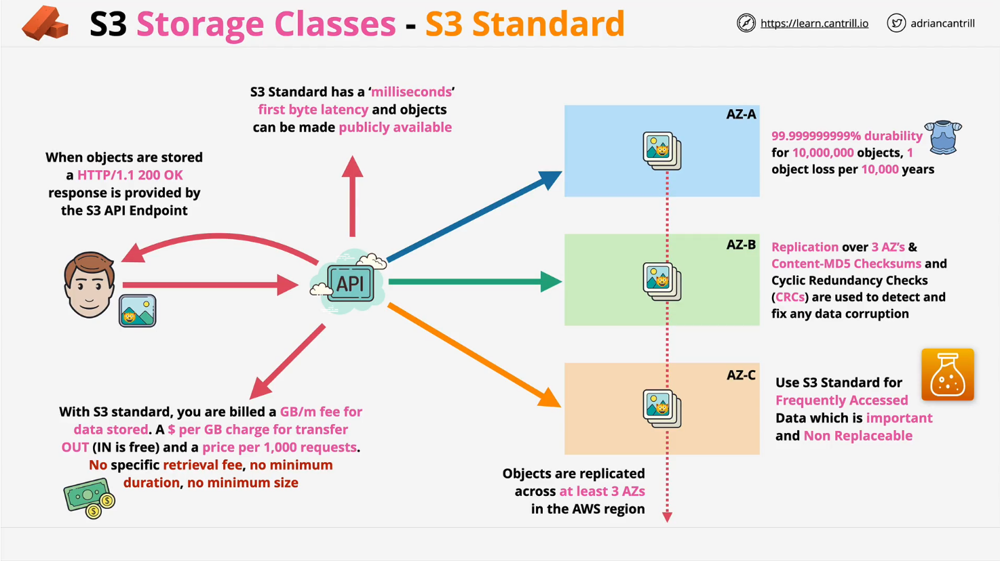
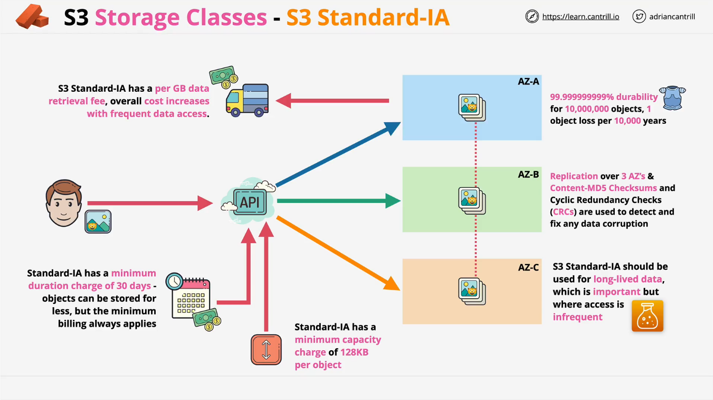
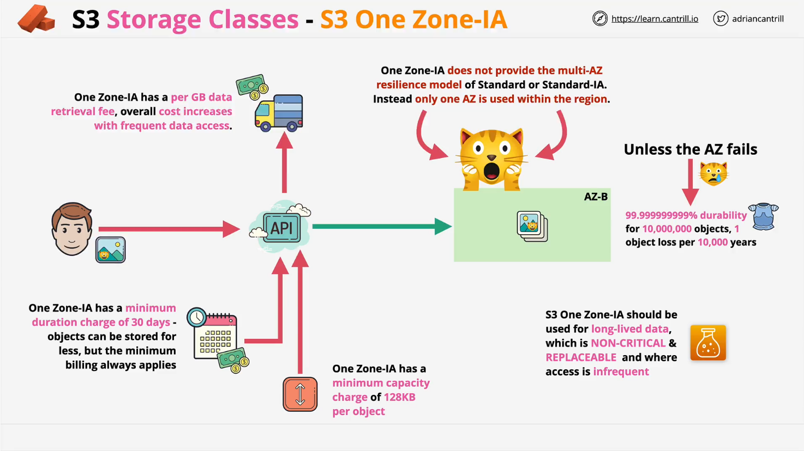

# Learn Cantrill.io AWS SA-C03: S3 Object Storage Classes

This document summarizes the key points from a lesson on S3 Object Storage Classes as part of the AWS SA-C03 course by Learn Cantrill.io. It highlights important concepts, cost structures, features, and scenarios for each S3 storage class.

## 1. S3 Standard

### Overview

- **Replication**: Stores objects across at least three Availability Zones (AZs).
- **Durability**: Provides **11 nines (99.999999999%)** of durability.
- **Accessibility**: Immediate access with millisecond latency.
- **Public Access**: Supports static website hosting and public access configurations.

### Cost Structure

- **Storage Fee**: Charged per GB/month.
- **Data Transfer Out**: Charged per GB.
- **Data Transfer In**: Free.
- **Requests**: Charged per 1,000 requests.
- **No Penalties**: No minimum object size, no retrieval fees, and no minimum duration.

### Use Cases

- Default choice for **frequently accessed**, **important**, and **non-replaceable** data.
- Balances cost and features with no significant compromises.

## 2. S3 Standard Infrequent Access (IA)

### Overview

- Shares architecture and characteristics with S3 Standard:
  - Replication across three AZs.
  - 11 nines of durability.
  - Millisecond first-byte latency.
- **Reduced Storage Costs**: About half the cost of S3 Standard.

### Cost Structure

- **Storage Fee**: Lower than S3 Standard.
- **Retrieval Fee**: Charged per GB retrieved.
- **Minimum Duration**: 30 days.
- **Minimum Object Size**: 128 KB.

### Use Cases

- Suitable for **long-lived**, **important**, and **infrequently accessed** data.
- Avoid using for:
  - Small files.
  - Temporary or frequently accessed data.
  - Data that is easily replaceable.

## 3. S3 One Zone Infrequent Access (One Zone IA)

### Overview

- **Single Availability Zone**: Stores data in one AZ only, reducing costs significantly.
- **Durability**: 11 nines within the single AZ.
- **Risk**: Increased risk of data loss if the AZ fails.
- Similar cost considerations to S3 Standard IA:
  - Retrieval fees, 30-day minimum duration, and 128 KB minimum object size.

### Cost Structure

- Cheaper than S3 Standard and Standard IA due to single AZ storage.

### Use Cases

- Best for:
  - **Non-critical**, **easily replaceable** data.
  - **Replica copies** for replication setups.
  - **Intermediate or temporary data** that can afford occasional loss.
- Avoid using for:
  - Critical or irreplaceable data.
  - Frequently accessed or frequently changed data.

## Key Takeaways

1. **S3 Standard**: Use for frequently accessed, critical data.
2. **S3 Standard IA**: Optimize costs for important data with infrequent access patterns.
3. **S3 One Zone IA**: Further reduce costs for non-critical, replaceable data.

For further details and practical scenarios, continue to the next part of the lesson.
