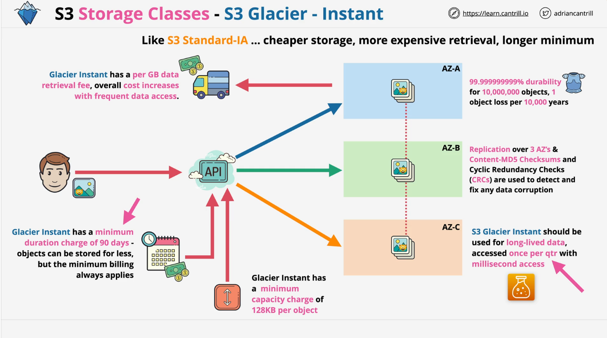
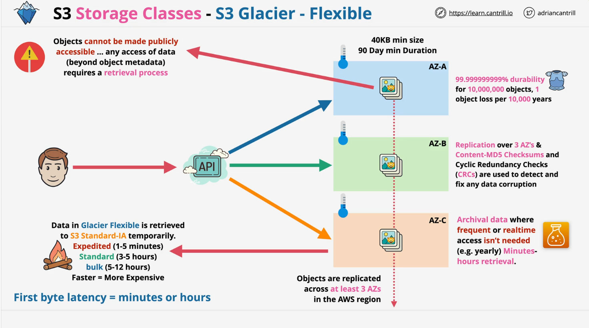
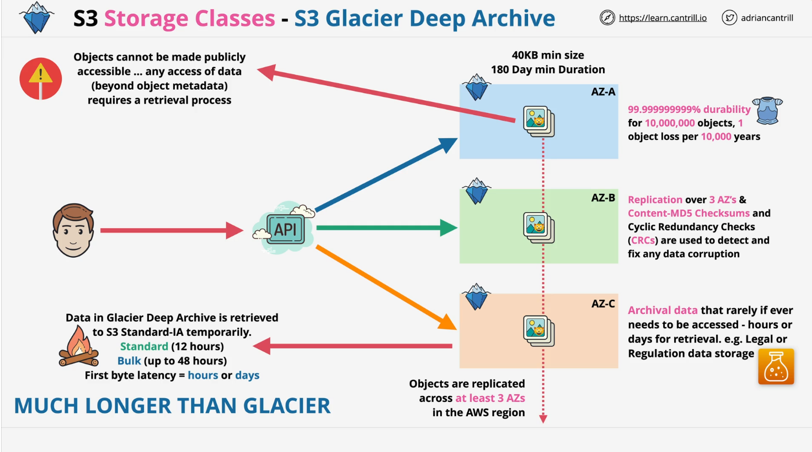
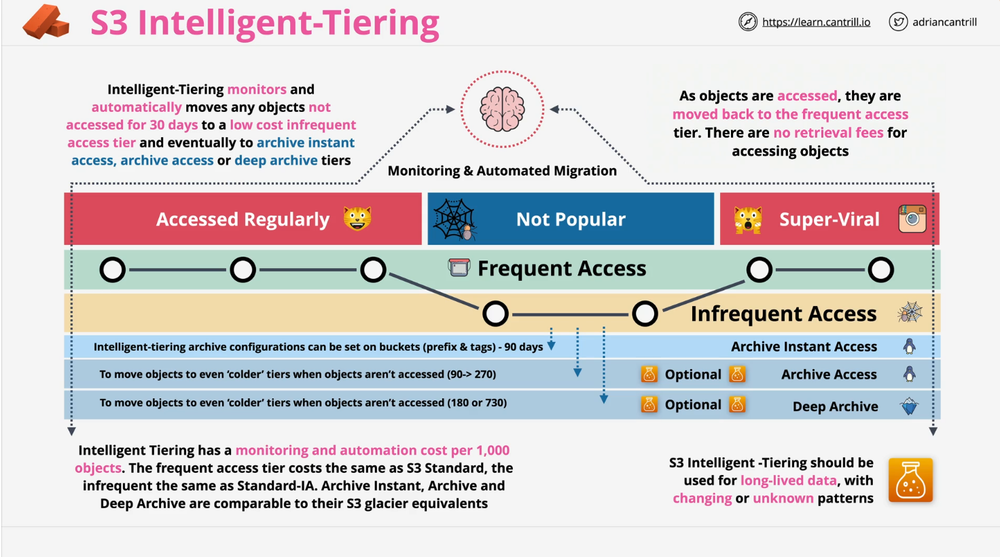

# Summary: Learn Cantrill.io AWS SA-C03 - S3 Storage Classes

This summary details the key points about AWS S3 storage classes as discussed in the provided lesson. It organizes the information for easy reference, focusing on the features, trade-offs, and use cases of each storage class.

## **1. S3-Glacier Instant Retrieval**

- **Overview**: Similar to S3-Standard-Infrequent Access (IA) but offers cheaper storage costs and more expensive retrieval costs.
- **Use Case**: Data that needs instant access but is rarely accessed (e.g., once per quarter).
- **Key Features**:
  - **Minimum Storage Duration**: 90 days (compared to 30 days for Standard IA).
  - **Access**: Instant retrieval without additional processes.
  - **Cost**: Cheaper storage; higher retrieval cost.

## **2. S3-Glacier Flexible Retrieval**

- **Overview**: Formerly S3-Glacier, this class provides cost-effective archival storage with retrieval options.
- **Use Case**: Archival data requiring retrieval within hours, such as yearly access.
- **Key Features**:
  - **Availability Zones**: Three (like S3-Standard and IA).
  - **Durability**: 99.999999999% (11 9s).
  - **Cost**: About one-sixth the cost of S3-Standard.
  - **Retrieval**:
    - **Expedited**: 1–5 minutes (most expensive).
    - **Standard**: 3–5 hours.
    - **Bulk**: 5–12 hours (cheapest).
  - **First Byte Latency**: Minutes to hours.
  - **Restrictions**:
    - Objects can't be made public.
    - Retrieval jobs temporarily restore data to S3-Standard-IA.

## **3. S3-Glacier Deep Archive**

- **Overview**: The cheapest S3 storage class, designed for long-term archival.
- **Use Case**: Rarely accessed data (e.g., legal or regulatory archives) where days of retrieval latency is acceptable.
- **Key Features**:
  - **Minimum Storage Duration**: 180 days.
  - **Retrieval Time**:
    - **Standard**: 12 hours.
    - **Bulk**: Up to 48 hours.
  - **Cost**: Lower than Glacier Flexible Retrieval.
  - **Restrictions**: Objects can't be made public.

## **4. Intelligent Tiering**

- **Overview**: A dynamic storage class that automatically transitions data between multiple tiers based on access patterns.
- **Use Case**: Long-lived data with unpredictable or changing access patterns.
- **Key Features**:
  - **Tiers**:
    - Frequent Access (similar to S3-Standard).
    - Infrequent Access (similar to S3-Standard-IA).
    - Archive Instant Access, Archive Access, and Deep Archive (similar to Glacier classes).
  - **Automation**: Automatically transitions objects between tiers based on access frequency.
  - **Monitoring Fee**: Per 1,000 objects.
  - **Advantages**:
    - Eliminates manual tier transitions.
    - No retrieval fees for moving objects back to frequent access.
  - **Disadvantages**: More expensive due to management fees.

## **Comparison of S3 Storage Classes**

| **Storage Class**             | **Cost**            | **Retrieval Time** | **Minimum Storage Duration** | **Use Case**                            |
| ----------------------------- | ------------------- | ------------------ | ---------------------------- | --------------------------------------- |
| S3-Standard                   | High                | Instant            | None                         | Frequently accessed data.               |
| S3-Standard-IA                | Lower than Standard | Instant            | 30 days                      | Infrequently accessed data.             |
| S3-Glacier Instant Retrieval  | Cheaper than IA     | Instant            | 90 days                      | Rarely accessed data (e.g., quarterly). |
| S3-Glacier Flexible Retrieval | Very cheap          | Minutes to hours   | 90 days                      | Archival with tolerable delays.         |
| S3-Glacier Deep Archive       | Cheapest            | Hours to days      | 180 days                     | Long-term archival rarely accessed.     |
| S3 Intelligent Tiering        | Flexible, dynamic   | Varies by tier     | Varies by tier               | Data with changing or unknown patterns. |

This summary provides the foundational knowledge required for AWS SA-C03 exam preparation and real-world applications of S3 storage classes. For more details, proceed with further lessons or AWS documentation.
