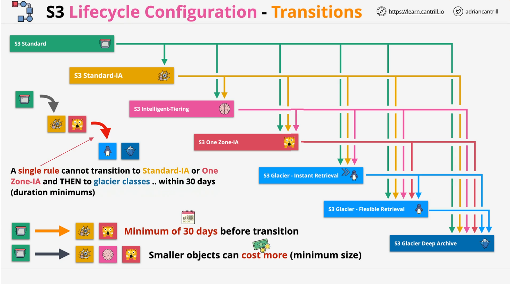

# S3 Lifecycle Configuration

## Overview

S3 Lifecycle Configuration enables automated management of objects in S3 buckets, allowing transitions between storage classes or deletion of objects based on predefined rules. This functionality is vital for cost optimization, making it an essential skill for Solutions Architects, Developers, and Operational Engineers.

## Key Features of S3 Lifecycle Configuration

### **Lifecycle Rules**

- **Purpose**: Automate object transitions or expirations.
- **Structure**: "Do X if Y is true" logic applied to:
  - Entire buckets.
  - Groups of objects defined by prefixes or tags.

### **Action Types**

1. **Transition Actions**:
   - Change the storage class of objects.
   - Example:
     - Move from `S3 Standard` to `S3 Infrequent Access` after 30 days.
     - Move from `S3 Infrequent Access` to `S3 Glacier Deep Archive` after 90 days.
2. **Expiration Actions**:
   - Permanently delete objects or object versions after a specified period.
   - Useful for maintaining a clean bucket.

### **Lifecycle Benefits**

- **Cost Optimization**: Transition to cheaper storage classes over time.
- **Automation**: Minimize manual management of object lifecycles.

## Transitioning Between Storage Classes

### **Storage Classes and Transition Path**

The lifecycle operates like a waterfall:

- Objects flow **downwards** to cheaper storage classes.
- Example Transitions:
  - `S3 Standard` → All classes (e.g., `S3 Standard-IA`, `S3 Glacier`, etc.).
  - `S3 Standard-IA` → `S3 One Zone-IA`, `S3 Glacier`, etc.
  - `Glacier Flexible Retrieval` → `Glacier Deep Archive`.

### **Key Considerations**

1. **Minimum Object Size**:
   - Transitioning smaller objects might increase costs due to minimum size requirements for certain storage classes.
2. **30-Day Rule**:
   - Objects must remain in `S3 Standard` for at least 30 days before transitioning to `S3 Standard-IA` or `S3 One Zone-IA`.
3. **Additional Transition Delay**:
   - Objects must stay in an infrequent access tier for 30 days before transitioning to Glacier classes if managed by a **single lifecycle rule**.

## Combining Lifecycle Rules

- You can combine transition and expiration rules for a complete object lifecycle:
  1. Transition from `S3 Standard` to `S3 Intelligent-Tiering` or `S3 Standard-IA`.
  2. Archive to `S3 Glacier Deep Archive` for long-term storage.
  3. Expire objects after they're no longer needed.

## Best Practices and Restrictions

1. **Careful Planning**:
   - Lifecycle configurations on versioned buckets can become complex.
2. **Storage Class Adjustments**:
   - Use CLI or Console UI for direct class adjustments outside lifecycle rules.
3. **Single Rule Limitations**:
   - A single rule cannot perform transitions from `S3 Standard` to `Glacier` classes without meeting intermediary tier requirements.

## Exam Tips

1. Understand the 30-day minimum retention rule for objects in `S3 Standard` before moving to infrequent access tiers.
2. Lifecycle rules cannot bypass the 30-day delay when moving objects between tiers in a single rule.

## Visualizing the Lifecycle Process

The lifecycle resembles a **waterfall**:

- Objects progressively move from higher-cost to lower-cost storage classes.
- Transition flow is **downward only**; upward transitions are not supported.

## Conclusion

S3 Lifecycle Configuration is a powerful feature for automating object management and reducing storage costs. By understanding and applying lifecycle rules, AWS users can optimize their S3 usage effectively.
