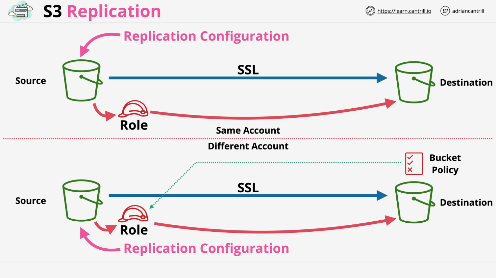

# S3 Replication Overview

## Overview of S3 Replication

S3 replication enables replication of objects between a source and destination S3 bucket. It supports two main types:

- **Cross-Region Replication (CRR):** Replicates objects between buckets in different AWS regions.
- **Same-Region Replication (SRR):** Replicates objects between buckets within the same AWS region.

Both replication types can occur between buckets in the **same AWS account** or **different AWS accounts**, with variations in configuration depending on account structure.

## Key Components of S3 Replication

1. **Replication Configuration:**
   - Applied to the source bucket.
   - Specifies:
     - The **destination bucket**.
     - An **IAM role** for replication (defines trust and permission policies for S3 to read from source and write to destination).
2. **Account Configuration Differences:**
   - **Same Account:** IAM role automatically has access to both source and destination buckets.
   - **Different Accounts:** Requires a bucket policy on the destination bucket to allow the IAM role from the source account to replicate objects.

## Replication Configuration Options

### 1. What to Replicate

- Default: Entire source bucket.
- Customization:
  - **Filters**: Replicate specific prefixes, tags, or combinations.
  - **Storage Class**: Choose a different class for the destination (e.g., use cheaper classes like `One Zone IA` for secondary copies).

### 2. Ownership Settings

- Default: Destination objects are owned by the source bucket's account.
- Option: Change ownership to the destination account (useful for cross-account replication).

### 3. Replication Time Control (RTC)

- Guarantees a **15-minute SLA** for replication.
- Adds enhanced monitoring and reliability.
- Best for strict business requirements; optional for casual use cases.

## Important Exam Considerations

1. **Replication Behavior:**

   - **Not Retroactive:** Only new objects after enabling replication are replicated.
   - **Versioning Requirement:** Both source and destination buckets must have versioning enabled.

2. **Replication Limitations:**
   - **One-Way by Default:** Replication is unidirectional unless bidirectional replication is explicitly configured.
   - **Encryption Support:**
     - Handles unencrypted, SSE-S3, SSE-KMS (requires extra setup), and SSE-C (recently added).
   - **Object Ownership:** The source bucket account must own objects to replicate them.
   - **Storage Classes Excluded:** Cannot replicate Glacier or Glacier Deep Archive objects.
   - **No System Events:** Lifecycle management events are not replicated.
   - **Delete Markers:** Not replicated unless explicitly enabled.

## Use Cases for S3 Replication

### Same-Region Replication (SRR)

- **Log Aggregation:** Consolidate logs from multiple buckets into one.
- **Environment Synchronization:** Replicate data between production and test accounts.
- **Data Sovereignty:** Ensure data stays within a specific AWS region while providing resilience.

### Cross-Region Replication (CRR)

- **Global Resilience:** Backup data to another region to handle large-scale failures.
- **Latency Optimization:** Replicate data closer to users in other regions to improve performance.

## What is Replicated

Amazon S3 replicates the following:

- **New Objects**: Only objects created after replication configuration is set up.
- **Encryption**:
  - Unencrypted objects.
  - Objects encrypted with SSE-S3, SSE-KMS, SSE-C.
  - Metadata is also replicated.
- **Permissions**:
  - Objects for which the source bucket owner has read and ACL permissions.
  - Object ACL updates (unless ownership is overridden for destination buckets with different owners).
- **Tags and Lock Information**:
  - Object tags, if present.
  - S3 Object Lock retention information (replica retention aligns with source retention).

### Delete Operations

- **Delete Marker Behavior**:
  - Delete markers are not replicated unless explicitly configured for non-tag-based rules.
  - Lifecycle configuration delete markers are not replicated.
- **Versioned Object Deletion**:
  - Deleting a specific object version in the source bucket does not delete it in the destination bucket, ensuring protection against malicious deletions.

## What Isn’t Replicated

Amazon S3 does **not** replicate:

- Objects that are already replicas from other replication rules.
- Objects previously replicated to a different destination (use Batch Replication to re-replicate).
- Objects stored in the following storage classes:
  - S3 Glacier Flexible Retrieval
  - S3 Glacier Deep Archive
  - S3 Intelligent-Tiering Archive tiers
- Objects without sufficient source bucket permissions for replication.
- Bucket-level subresources (e.g., lifecycle configurations, notifications).
- Lifecycle configuration actions (e.g., delete markers created for expired objects).
- Objects tagged after the initial `PutObject` operation (requires Batch Replication).

## Types of Replication

### Cross-Region Replication (CRR)

Replicates objects across buckets in **different AWS Regions**. Use cases:

- **Compliance**: Meet requirements for geographically distant data storage.
- **Latency**: Improve performance for users in multiple Regions.
- **Efficiency**: Support workloads needing replicated data across Regions.

### Same-Region Replication (SRR)

Replicates objects across buckets in the **same AWS Region**. Use cases:

- **Log Aggregation**: Consolidate logs across multiple accounts or buckets.
- **Production and Test Accounts**: Share data while maintaining metadata.
- **Data Sovereignty**: Ensure compliance with regulations that restrict data to specific Regions.

### Two-Way Replication (Bi-Directional)

Synchronizes metadata and objects between buckets in the same or different Regions. Use cases:

- Build **shared datasets** across Regions.
- Keep data synchronized during **failovers**.
- Ensure **high availability** during disruptions.

### Batch Replication

Used for **on-demand replication** of existing objects. Use cases:

- Replicate objects added before live replication configuration.
- Retry previously failed replications.
- Replicate replicas from other replication rules.

## Key Features and Use Cases

- **Metadata Retention**: Replicated objects retain all metadata, including version IDs and creation times.
- **Cross-Account Ownership**: Change ownership to destination account using the "owner override" option.
- **Storage Classes**:
  - Directly replicate to colder storage classes (e.g., S3 Glacier).
  - Use lifecycle configurations to manage storage costs post-replication.
- **Regional Distribution**:
  - Replicate across multiple Regions for geographic diversity.
  - Maintain compliance with specific regulations.

## Replication Time Control (S3 RTC)

### Overview

S3 RTC offers **predictable replication time**, replicating 99.99% of new objects within **15 minutes**, backed by an SLA.

### Benefits

- **Compliance Support**: Helps meet strict business or regulatory requirements.
- **Monitoring**:
  - Tracks replication progress with Amazon CloudWatch metrics.
  - Provides visibility into pending replication jobs.

### Availability

S3 RTC is supported in all commercial AWS Regions (except AWS China).

## Workload Requirements and Live Replication

Depending on your workload requirements, some types of live replication are better suited for your use case than others. Use the following table to determine the type of replication and whether to use S3 Replication Time Control (S3 RTC) for your workload.

S3 RTC replicates 99.99% of new objects stored in Amazon S3 within 15 minutes, backed by a service-level agreement (SLA).

| **Workload Requirement**                                                                     | **S3 RTC (15-minute SLA)** | **Cross-Region Replication (CRR)** | **Same-Region Replication (SRR)** |
| -------------------------------------------------------------------------------------------- | -------------------------- | ---------------------------------- | --------------------------------- |
| Replicate objects between different AWS accounts                                             | Yes                        | Yes                                | Yes                               |
| Replicate objects within the same AWS Region within 24-48 hours (not SLA backed)             | No                         | No                                 | Yes                               |
| Replicate objects between different AWS Regions within 24-48 hours (not SLA backed)          | No                         | Yes                                | No                                |
| Predictable replication time: Backed by SLA to replicate 99.99% of objects within 15 minutes | Yes                        | No                                 | No                                |

## Key Exam Tips

- Understand default behaviors, limitations, and optional configurations (e.g., RTC, bidirectional replication).
- Pay attention to storage class options and scenarios for SRR vs. CRR.
- Remember the conditions for encryption and ownership in replication.
