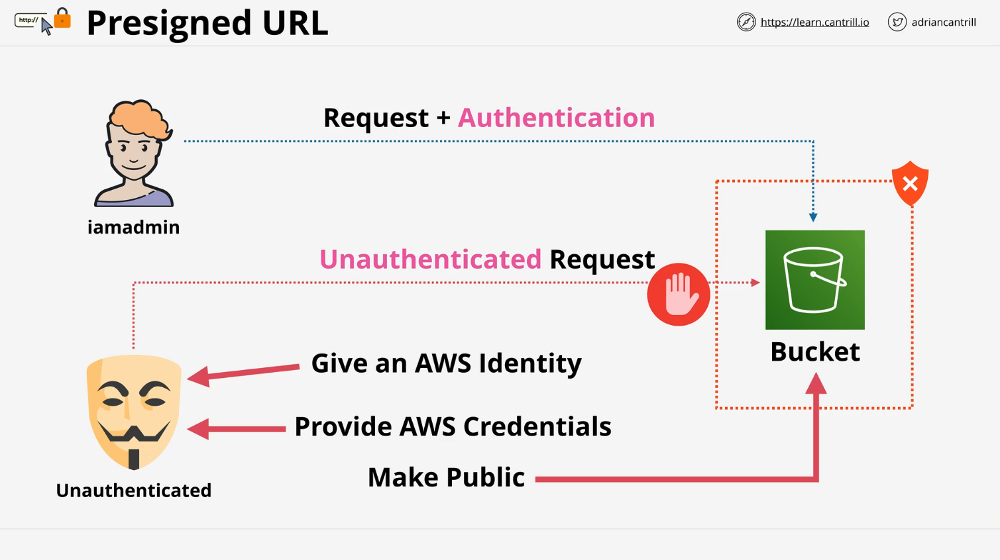
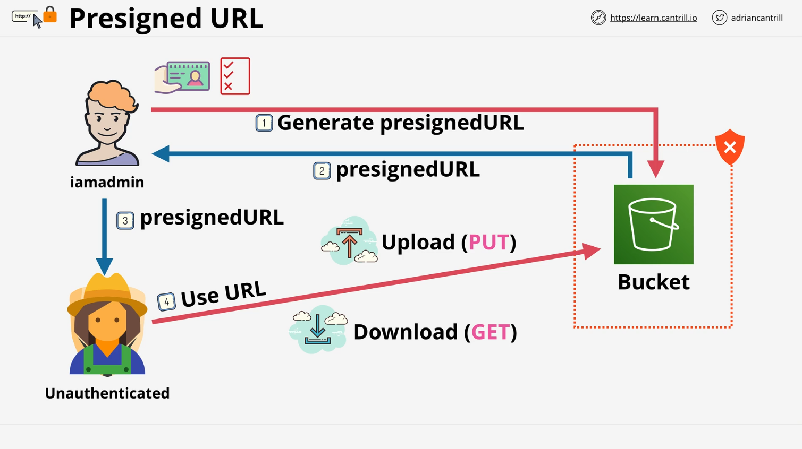
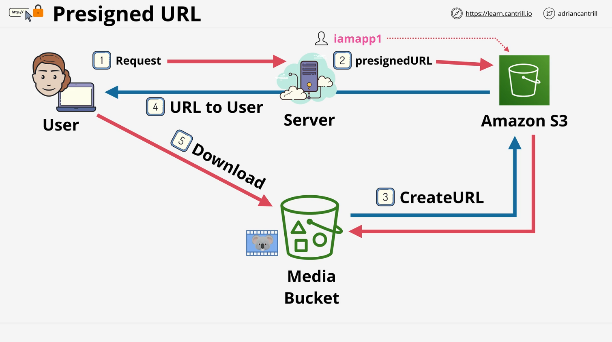

# AWS S3 Pre-Signed URLs - Summary

This lesson explains **AWS S3 Pre-Signed URLs**, their use cases, how they work, and considerations when using them. Pre-Signed URLs provide secure and temporary access to objects in private S3 buckets without making the bucket public or sharing AWS credentials directly.

## **What Are Pre-Signed URLs?**

Pre-Signed URLs are secure, time-limited URLs generated using AWS credentials, allowing access to objects in private S3 buckets without directly exposing credentials. They can be used for:

- **Downloading objects** (GET operations)
- **Uploading objects** (PUT operations)

## **Use Case Scenarios**

### **Scenario 1: Private S3 Bucket**

- **Challenge**: A private S3 bucket only allows access via authenticated users.
- **Problem**: Sharing direct credentials or making the bucket public is not secure.
- **Solution**: Use Pre-Signed URLs to grant temporary access.

### **Scenario 2: Application Architecture**

- **Setup**: A video processing application stores large video files in a private S3 bucket.
- **Challenge**: Users need access to videos without requiring AWS credentials or making the bucket public.
- **Solution**:
  - Create an IAM user for the application.
  - The application requests Pre-Signed URLs from S3 and passes them to users.
  - Users can access videos securely via the Pre-Signed URL for a limited time.

### **Scenario 3: Serverless Architectures**

- Pre-Signed URLs are frequently used in serverless environments to:
  - Allow controlled access to private S3 buckets.
  - Eliminate the need for maintaining application servers to manage access.

## **How Pre-Signed URLs Work**

1. **Generation**:

   - An authorized AWS identity (e.g., an IAM user) requests S3 to generate a Pre-Signed URL.
   - Parameters include:
     - **Bucket name** and **object key**.
     - **Access type** (GET/PUT operations).
     - **Expiration time**.
   - S3 encodes this information into the URL and returns it.

2. **Usage**:
   - The URL is shared with a user or application.
   - The recipient uses the URL to interact with the S3 object as the identity that generated it, within the specified time.

## **Important Considerations**

1. **Identity Used for Generation**:

   - Always use **long-term identities** (e.g., IAM users) to generate Pre-Signed URLs.
   - Avoid using **IAM roles**, as their temporary credentials may expire before the Pre-Signed URL.

2. **Time Limit**:

   - Pre-Signed URLs are valid only for the specified expiration period.
   - When the expiration time elapses, the URL becomes invalid.

3. **Current Permissions**:

   - The permissions tied to the URL match the **current permissions** of the identity that generated it.
   - If permissions are revoked, the URL will stop working.

4. **No Access Scenario**:
   - It's possible to generate a Pre-Signed URL for an object you don't have access to, but the URL won't work for accessing the object.

## **Common Exam Tips**

- **Temporary Credentials Expiry**:

  - If using a Pre-Signed URL generated by a temporary IAM role, ensure the role's expiration aligns with the URL's expiration.
  - Prefer IAM users over IAM roles to avoid this issue.

- **Access Denied**:
  - If a Pre-Signed URL returns an "Access Denied" error:
    - The identity might never have had access.
    - Permissions could have been revoked after the URL was generated.

## **Key Takeaways**

- Pre-Signed URLs allow secure, temporary access to S3 objects without making them public.
- They are ideal for:
  - Applications requiring limited S3 access.
  - Scenarios where AWS credentials cannot be shared directly.
  - Offloading media storage in serverless architectures.
- Best practices include:
  - Using long-term IAM users for URL generation.
  - Ensuring URL expiration aligns with intended access duration.

For a hands-on understanding, proceed to the demo lesson where you will generate and test Pre-Signed URLs.
