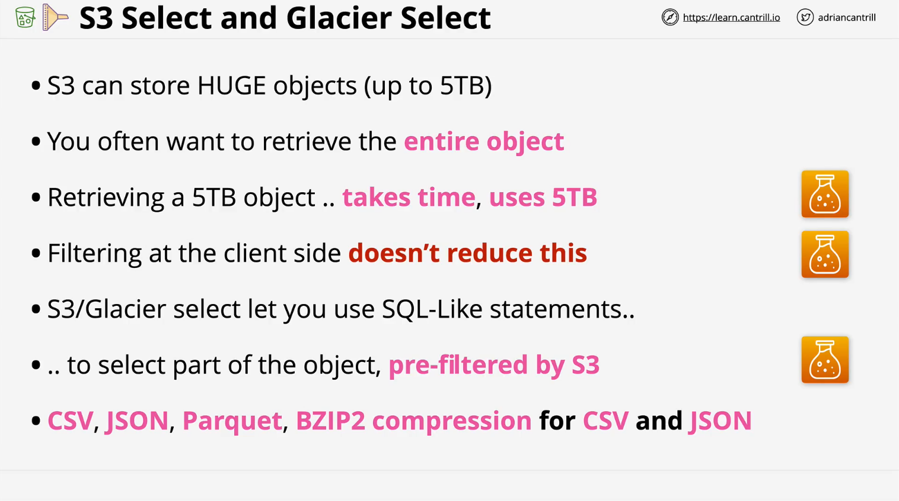
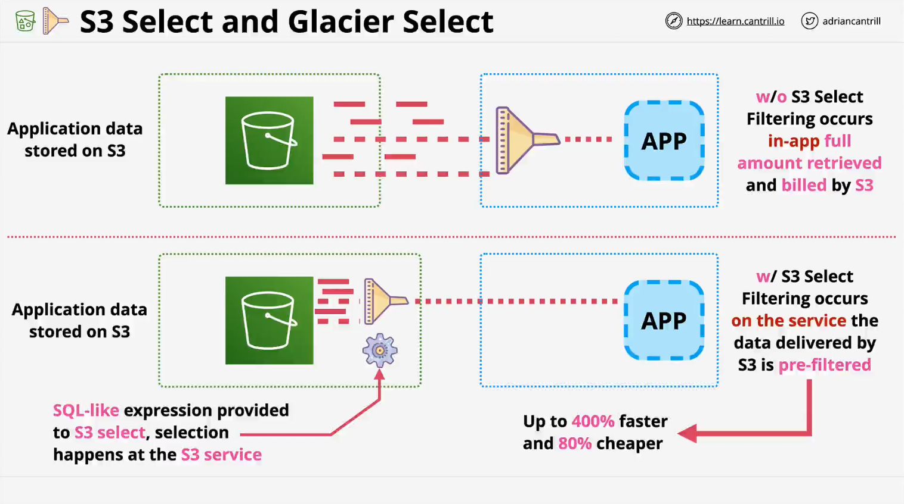

# AWS Solutions Architect (SAA-C03) - S3 Select & Glacier Select

## Overview

This lesson covers **S3 Select** and **Glacier Select**, key AWS features that allow retrieval of specific parts of objects rather than entire objects. Understanding these features is crucial for the **AWS Solutions Architect - Associate (SAA-C03)** exam, though they are likely to appear in a minor way. The focus is on **architecture and features** rather than implementation.

## **What Are S3 Select and Glacier Select?**

S3 Select and Glacier Select allow querying and retrieving **only the required portions** of an object instead of downloading the entire file. This improves efficiency in terms of both **cost and performance**.

### **Key Benefits**



- **Reduces data transfer costs** by retrieving only the necessary data.
- **Improves performance** by filtering data directly within S3/Glacier instead of on the client-side.
- **Supports various file formats** such as:
  - CSV (Comma-Separated Values)
  - JSON
  - BZ2 compressed CSV and JSON files

## **Why Is This Important?**

AWS **S3** supports storing massive objects, up to **5TB in size**, and an infinite number of such objects. Normally, retrieving a large object means **transferring the entire file**, which:

- Takes **considerable time**.
- Consumes **full bandwidth and resources**.
- Can be **filtered client-side**, but after **the full object is already transferred**.

Using **S3 Select and Glacier Select**, filtering happens **before transfer**, reducing:

- **Network transfer costs**
- **Processing time**
- **Overall system load**

## **How It Works**

1. **Without S3 Select/Glacier Select:**

   - The full object is retrieved from **S3/Glacier**.
   - The **application filters** the data after download.
   - This leads to unnecessary **data transfer costs** and **performance overhead**.

2. **With S3 Select/Glacier Select:**
   - A **SQL-like query** is sent to **S3 or Glacier**.
   - The service **pre-filters** the data before sending it to the application.
   - Only the **relevant portion** of the object is retrieved, reducing **time and cost**.

## **Visual Representation**



| Without S3 Select/Glacier Select                  | With S3 Select/Glacier Select                     |
| ------------------------------------------------- | ------------------------------------------------- |
| The full object is retrieved.                     | Only the requested data portion is retrieved.     |
| Filtering happens **on the client side**.         | Filtering happens **at the source (S3/Glacier)**. |
| **High transfer costs & longer processing time**. | **Lower transfer costs & faster performance**.    |

## **Implementation Details**

### **SQL-Like Querying**

S3 Select and Glacier Select **allow SQL-like statements** to filter the object’s content. These queries can extract relevant data directly from:

- **CSV files**
- **JSON files**
- **Compressed files (BZ2, GZIP, etc.)**

This makes it a flexible **alternative to database queries** for structured storage formats.

## **Exam Relevance**

- **Exam Focus**: These services are expected to appear **minimally** in the AWS **SAA-C03** exam.
- **Key Takeaways**:
  - **Understand the architecture** and how filtering improves efficiency.
  - **Recognize the cost and performance benefits** of retrieving only necessary data.
  - **Know that it requires explicit implementation** in applications.

## **Conclusion**

S3 Select and Glacier Select are **powerful features** that allow efficient retrieval of **partial object data**. Though not a major focus in the **AWS Solutions Architect exam**, understanding them can help design **cost-effective and high-performance** solutions.

## Examples

### **Amazon S3 Select & Glacier Select Queries**

Amazon **S3 Select** and **Glacier Select** allow you to retrieve only specific data from an object, reducing the amount of data transferred and improving query performance. Below are some sample queries.

## **1. S3 Select Queries**

S3 Select allows you to run **SQL-like queries** directly on objects stored in **CSV, JSON, or Parquet** format in S3.

### **Prerequisites**

- The object should be stored in CSV, JSON, or Parquet format.
- The `SELECT` statement should reference columns by their position (`_1`, `_2`, etc.) unless the object has a header row.

### **Example: Query CSV Data**

#### **CSV File Example (`sample.csv`)**

```csv
id,name,age,city
1,John,30,New York
2,Alice,28,Los Angeles
3,Bob,35,Chicago
4,Eve,40,San Francisco
```

#### **Query: Retrieve Names of People Older Than 30**

```sql
SELECT s._2 FROM S3Object s WHERE CAST(s._3 AS INT) > 30
```

✅ **Output:**

```
Bob
Eve
```

#### **Query: Retrieve People from New York**

```sql
SELECT * FROM S3Object s WHERE s._4 = 'New York'
```

✅ **Output:**

```
1,John,30,New York
```

### **Example: Query JSON Data**

#### **JSON File Example (`sample.json`)**

```json
[
  { "id": 1, "name": "John", "age": 30, "city": "New York" },
  { "id": 2, "name": "Alice", "age": 28, "city": "Los Angeles" },
  { "id": 3, "name": "Bob", "age": 35, "city": "Chicago" },
  { "id": 4, "name": "Eve", "age": 40, "city": "San Francisco" }
]
```

#### **Query: Retrieve Names of People from Chicago**

```sql
SELECT s.name FROM S3Object[*] s WHERE s.city = 'Chicago'
```

✅ **Output:**

```
Bob
```

#### **Query: Get ID and Name of All Users**

```sql
SELECT s.id, s.name FROM S3Object[*] s
```

✅ **Output:**

```
1, John
2, Alice
3, Bob
4, Eve
```

## **2. Glacier Select Queries**

Glacier Select allows querying archives stored in **Amazon Glacier**, but since Glacier retrieval takes time, queries can take **minutes to hours** depending on the retrieval option (Expedited, Standard, Bulk).

### **Example: Query CSV Data in Glacier**

#### **CSV File Example (`glacier-data.csv`)**

```csv
order_id,product,quantity,price
101,Keyboard,2,50
102,Mouse,1,25
103,Monitor,1,200
104,Laptop,1,1200
```

#### **Query: Retrieve Orders with Price > 100**

```sql
SELECT * FROM archive WHERE CAST(price AS INT) > 100
```

✅ **Output:**

```
103,Monitor,1,200
104,Laptop,1,1200
```

#### **Query: Retrieve Product Names with Quantity More Than 1**

```sql
SELECT product FROM archive WHERE CAST(quantity AS INT) > 1
```

✅ **Output:**

```
Keyboard
```

## **Differences Between S3 Select & Glacier Select**

| Feature               | S3 Select                                | Glacier Select                              |
| --------------------- | ---------------------------------------- | ------------------------------------------- |
| **Storage Type**      | Amazon S3                                | Amazon Glacier                              |
| **Retrieval Time**    | Fast (Milliseconds to Seconds)           | Slow (Minutes to Hours)                     |
| **Supported Formats** | CSV, JSON, Parquet                       | CSV                                         |
| **Query Language**    | SQL                                      | SQL                                         |
| **Use Case**          | Filter large S3 objects before retrieval | Extract specific data from Glacier archives |

### **Conclusion**

- **Use S3 Select** when querying structured data stored in S3 (e.g., CSV, JSON).
- **Use Glacier Select** when retrieving only relevant data from large archives in Glacier.
- Both support **SQL-like** syntax for querying data efficiently.

Would you like a real-world AWS CLI or SDK example for these queries? 🚀
