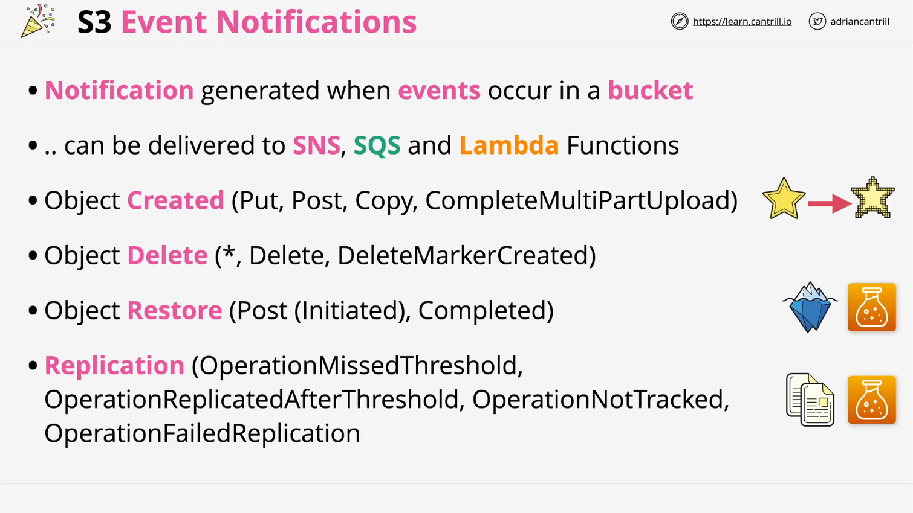
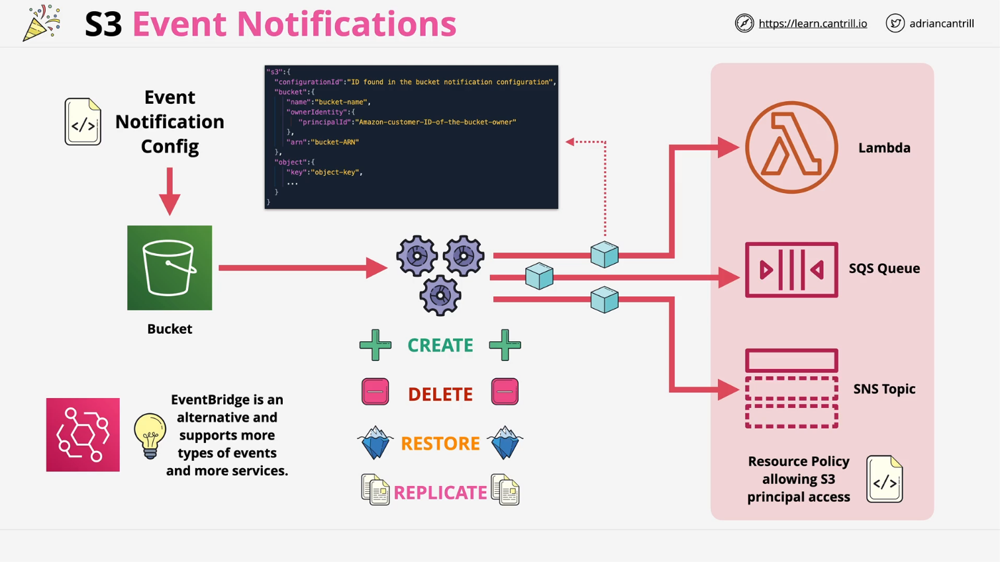

# AWS S3 Event Notifications

## Overview

Amazon S3 provides an **Event Notification** feature that allows users to configure notifications for specific events occurring within an S3 bucket. These notifications can trigger AWS services such as **SNS (Simple Notification Service), SQS (Simple Queue Service), or Lambda functions**, enabling event-driven workflows.

## How S3 Event Notifications Work

When enabled, event notifications are generated when predefined actions occur within a bucket. These notifications can be sent to different destinations, allowing automation and integration with other AWS services.

### Supported Event Types

S3 event notifications support multiple types of events, including:

1. **Object Created Events**

   - Triggered when an object is added to the bucket via **PUT, POST, COPY**, or when a multi-part upload completes.
   - Example Use Case: Automatically processing images (e.g., adding watermarks or creating pixel art versions) when they are uploaded.

2. **Object Deleted Events**

   - Triggered when an object is deleted.
   - You can use the `*` wildcard to match any delete operation, including delete markers.
   - Example Use Case: Automated security responses when files are removed from a bucket.

3. **Object Restore Events**

   - Triggered when objects stored in **Glacier or Glacier Deep Archive** are restored.
   - Notifications can be sent when a restore operation **starts** and when it **completes**.
   - Example Use Case: Notifying customers or staff when archived data becomes available.

4. **Replication Events**
   - Triggered for replication-related activities, such as:
     - Missing the **15-minute replication threshold**.
     - Successfully replicated objects.
     - Objects no longer tracked for replication.
     - Replication failures.
   - Example Use Case: Monitoring and alerting on replication issues for compliance and data integrity.

## Architectural Overview

1. **S3 Bucket Configuration**

   - An event notification configuration is applied to the bucket.
   - It specifies which events should generate notifications.

2. **Event Triggers**

   - Events occur within the S3 bucket (e.g., object creation, deletion, replication failures).

3. **Notification Delivery**

   - Notifications are sent to configured destinations such as:
     - **Lambda Functions** – For serverless processing.
     - **SQS Queues** – For message queue processing.
     - **SNS Topics** – For fan-out messaging to multiple subscribers.

4. **Permissions and Policies**
   - The **S3 service (S3 principal)** generates events.
   - Resource policies must be added to destination services (e.g., **SQS queue policies, Lambda resource policies**) to grant S3 permission to send notifications.
   - At the time of recording, **Lambda resource policies** can only be modified via the **CLI or API** (this may change in the future).

## Event Notification Data Structure

- Notifications are sent as **JSON objects**.
- If using **Lambda**, the event payload is received in the event structure and must be parsed to extract relevant data.

## Alternative: AWS EventBridge

While S3 Event Notifications are useful, they have **limited support for event types** and can only integrate with a few AWS services. **Amazon EventBridge** provides a more flexible alternative:

- Supports a **wider range of event types**.
- Can integrate with **more AWS services**.
- Recommended as the **default option** unless there is a specific reason to use S3 Event Notifications.

## Conclusion

S3 Event Notifications enable automated workflows by triggering AWS services when specific events occur in an S3 bucket. While useful, they have limitations, and **EventBridge** is often a better choice for event-driven architectures.
